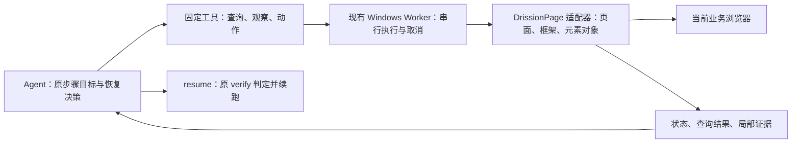

# 基于 DrissionPage 的通用 Agent 接管方案

日期：2026-09-09。状态：已落地代码与脱敏离线回归；Windows 真实应用验收尚未执行。reasoning=high 已独立生效；执行端观察修复 c5c6d57 已提交。本文替换之前围绕品牌下拉框展开的方案。

## 设计结论

接管应建立在 DrissionPage 的页面、框架和元素对象之上。执行端负责查找、操作、等待及返回事实，Agent 负责结合原步骤要求选择下一步。业务目标与最终成功条件继续由应用和原 verify 提供。

当前的主要损失发生在封装边界：观察先枚举大量 DOM，再把元素转换为 XPath；后续动作根据 XPath 重新查找。Agent 只能使用预先登记的元素或截断结果中的 target，无法主动搜索候选、查父子关系或检查遮挡。iframe 被压成一个字符串，输入框读取只返回 innerText，动作只返回 performed。DrissionPage 已经具备的对象上下文、相对定位和状态能力没有充分传到 Agent。

通用性来自可组合的浏览器能力。框架无需知道“品牌”“库存”或某个站点的组件类名。test_1 是验收样本；它不定义框架的数据模型和恢复分支。

## 一、运行结构：让 DrissionPage 对象留在执行端



沿用当前独占浏览器的 Worker 生命周期，在 DrissionPage 适配器内保存接管期间的活对象。对外只返回短引用和必要信息，业务程序及服务端不接触 DrissionPage 类型；维持项目中仅浏览器适配层导入 DrissionPage 的约定。

- 正式元素 ID：通过既有 ElementSpec 解析一次，获取实时元素对象和实际所属作用域。
- 临时引用：指向适配器中的 ChromiumElement、ChromiumFrame 或 ShadowRoot 对象，并记录其页面/框架归属。观察同一对象时复用引用，不再每次生成不同 ID。
- 动作直接使用活对象。states.is_alive 为失效判断依据之一，同时校验页面归属及目标关键属性；对象存活不等于虚拟列表中仍代表同一业务行。
- 页面重建或元素失效时，重新查询并返回新候选，不能仅凭旧绝对 XPath 命中一个位置就继续点击。
- 活引用随接管结束释放，不持久化、不跨 Worker 恢复。只有提交 locator_overrides 时才导出可复现的定位信息，并再次验证匹配范围和目标一致性。

这可以保留 DrissionPage 的对象上下文，并减少重复定位。元素状态与对象行为以锁定的 4.1.1.4 为准。[官方元素信息](https://www.drissionpage.cn/browser_control/get_ele_info/)

## 二、保留少量工具，开放原生查询能力

保留 context、credential、resume、give_up。浏览器工具收敛为 query、observe、act；等待可附在 act 上，也可用 act(wait) 单独调用。下表是拟议接口职责，不是已实现的 API。

| 工具 | 参数表达什么 | 执行端如何利用 DrissionPage |
| --- | --- | --- |
| query | 作用域、定位表达式或相对关系、结果数量/分页 | ele/eles、parent/children/next/prev、视觉相对定位、get_frame、shadow_root |
| observe | 对象引用、需要的状态/属性、周边范围、是否需要截图 | value、text、attrs、states、rect；局部 DOM 与对象截图 |
| act | 对象引用、操作、参数、可选等待条件和回读字段 | click/input/check/select/hover/scroll、键盘交互、等待新标签及下载 |

### 查询与操作分开表达

`query` 接受 DrissionPage 定位语法、CSS、XPath。查询是验证候选是否存在的过程，不要求模型事先拥有一个 target 才能发现它。业务文本可以来自原步骤要求；结构属性应来自实际 DOM。返回匹配数量、所属作用域、摘要和活引用；多匹配时由 Agent 缩小范围，不能默认点击第一项。

`act` 使用已解析的对象引用，定位表达式不能混入 target。这样既保留 DrissionPage 的表达能力，也消除“把 CSS 传成 target”一类歧义。正式元素 ID 继续可作为引用入口。

所有查询按作用域执行，结果数量只限制返回体。返回是否截断及分页信息，允许按文本、属性或相对关系细化查询。绝不能把“前 200 个节点里没有”解释为不存在。[官方定位语法](https://www.drissionpage.cn/browser_control/get_elements/syntax/)

### 周边关系通过现有元素导航

模型可从一个已定位的输入框查父容器、相邻按钮、关联标签，或从一个已知弹窗查子节点。DOM 相对关系跨不过 iframe 文档时，由作用域导航处理。视觉相对定位用于布局线索，`over()` 用于取得遮挡元素，返回后仍检查实际标签、文本和状态。[官方相对定位](https://www.drissionpage.cn/browser_control/get_elements/relative/)

## 三、iframe 与 Shadow DOM 是作用域

DrissionPage 支持通过 Frame 对象直接操作 iframe 内外元素，无需维护 Selenium 式的全局切入/切出状态。同域 iframe 可利用其跨层查找能力；跨域页面先取得 Frame 对象，再在其中查找。嵌套框架沿实际作用域关系处理，不依赖全局 iframe 序号。[官方 iframe 操作](https://www.drissionpage.cn/browser_control/iframe/)

设计上让查询结果自动携带所属作用域。已经定位到框架内部元素时，Agent 可直接观察其所属文档，无需重新获取顶层框架引用。顶层只在需要发现入口时列出框架；按需创建 Frame 对象，避免每次观察递归枚举整站 iframe。

ShadowRoot 使用相同的作用域引用方式，按实际宿主进入，不假定所有节点都能用一条顶层 XPath 访问。使用 SDK 暴露的能力，不能把闭合/不可访问结构当成成功读取。

运行态对象可支持嵌套作用域。跨接管提交定位修正时，必须能由正式定位模型表达同一条作用域路径；现有单一 frame_locator 表达不了的路径，需要在 ElementSpec 和 override 中统一扩展，不能丢掉外层框架后提交。该扩展随嵌套框架验收落地，不另外建立一套 Agent 定位语言。

## 四、一次动作包含等待和回读

Agent 应表达一次明确动作与想观察的结果。执行端在同一个调用中完成前置检查、动作、条件等待和小范围回读，然后把事实返回模型。不要把等待可点击、等待加载、回读值拆成多轮模型请求。

例如以下是拟议调用，查询得到的 e12 已被确认为当前目标，参数来自原输入：

```json
{
  "operation": "input",
  "target": "e12",
  "value": "原输入值",
  "expect": {"target": "e12", "property": "value", "equals": "原输入值"},
  "read": ["value", "enabled", "displayed"]
}
```

等待条件采用通用事实：元素出现/消失、可见/可用、停止移动、不再遮挡、value/属性/文本达到指定值、URL 改变、新标签页或下载出现。有原生 wait 方法时直接使用；其他属性比较在执行端同一截止时间内轮询，超时返回最后实际值。使用既有取消检查，不把轮询交给模型。[官方等待](https://www.drissionpage.cn/browser_control/waiting/)

需要等待新对象时，expect 可携带作用域与 query。执行前启动新标签、下载或网络事件监听，再执行动作，避免错过短暂事件。动作返回分别说明“是否发出”“条件是否满足”“实际状态”，并保留失败阶段。

点击要分别检查可点击和遮挡：SDK 的 is_clickable 本身不判定遮挡。已观察到普通遮挡层时，返回覆盖对象供处理。模拟点击、JS 点击的方式应显式记录；JS 触发成功不等于页面接受了操作。重试前先回读状态，不盲目重复可能已经生效的点击。[官方元素交互](https://www.drissionpage.cn/browser_control/ele_operation/)

通用动作与业务成功分开：value 写入、按钮点击、checkbox 改变都只是页面事实。Agent 的 expect 不能覆盖应用的 verify，也不能作为跳过步骤的理由。

## 五、观察按需获取，避免逐节点往返与空等待

当前 observe 对所有目标调用 `root.eles(..., timeout=action_timeout)`。输入框没有后代，也会走等待；随后逐个读取每个节点的属性，并固定生成整页截图。这些开销发生在模型之外，需要直接优化。

1. 精确对象读取只取请求字段。观察 input 时直接读取 value、状态和关联信息，不枚举后代；value 与 text 分开返回。凭据字段沿用现有隐藏规则。
2. 默认 observe 表示读取当前现场，候选枚举使用即时/短查询。只有明确要等待未来状态才消费等待超时。SDK 查找内置等待，不能给每个子查询都重新分配一份完整超时。[官方查找行为](https://www.drissionpage.cn/browser_control/get_elements/behavior/)
3. 小结果集直接用实时元素。大容器的静态内容可用 s_ele/s_eles 对局部 HTML 进行解析和筛选，再只为相关候选取得实时对象；静态快照不证明可点击，也不跨 frame/shadow 文档自动合并。候选动作前仍读取实时状态。这条路径先基准测试，再决定是否采用。
4. 摘要优先返回可操作元素与上下文标签，过滤资源定义。自定义可点击 SVG、无 role 的 div 仍可通过显式 query/局部观察获取，不能用标签黑名单永久屏蔽它们。
5. 截图按需，默认目标/区域截图；首次现场、DOM 与视觉不一致或失败时提供更大范围。截图、DOM 和状态标明采集顺序，避免把不同时间的证据当成同一瞬间。
6. 用实际阶段耗时评估优化：查询、状态读取、截图、网络往返、模型生成分别计时。不能把全部等待归因于模型，也不能预先承诺任意页面都能在固定秒数内完成。

## 六、按需要使用网络监听与原生控件能力

对于异步加载，DrissionPage 的 listen 能在动作前开始捕获目标请求，并提供到达/失败线索。将它作为按需诊断：请求是否发出、是否返回、是否报错。接口完成与 DOM 就绪分别判断。只返回当前任务所需的脱敏信息，不把所有响应体默认加入模型上下文。[官方网络监听](https://www.drissionpage.cn/browser_control/listener/)

原生 select 使用 SDK 的 select 能力，checkbox/radio 使用 check，键盘、hover、滚动、下载使用相应原生对象方法。自定义组件通过 query、click/input、wait 和状态回读组合完成，框架不维护各网站的 CSS 模板库。

浏览器/HTTP 混合能力适用于应用已声明的直接下载或接口操作，可在正式 BrowserActions/业务服务中使用。Agent 接管的当前步骤沿用原操作语义，不能因为 DOM 操作失败就自行改成另一个未验证的写接口。

## 七、Agent 负责决策，停止机制负责兜底

通用循环为：读取原失败上下文 → 确定作用域 → 查询/检查目标 → 执行动作并等待 → 根据实际返回继续、换策略或交回原程序。

不建立“品牌已打开”“库存筛选完成”等框架状态。Agent 只看到工具提供的查询结果、元素状态变化、目标条件结果和错误类别。面板打开、值改变或候选集更新可能为下一次决策提供新证据，但并不自动认定业务恢复有进展。

- 对同一对象/查询、相同参数、相同状态及相同错误的重复尝试给出重复反馈。新随机引用或 performed=true 不清除重复记录。
- 区分“发现新证据”和“动作目标达成”；两者可以支持下一步探索，但都不重置整轮时间、请求和 Token 预算。
- 条件等待在执行端结束；未满足时提供最后状态与失败阶段，让模型调整作用域、定位或动作。高 reasoning 用于这些选择。
- 已无有效策略时 give_up，或在总预算耗尽时由服务端停止；通过原流程确认机器人释放。
- 连续响应截断/重复文字且没有完整工具调用时，不无限续写。保存最后可用事实与具体结束原因。

撤回上一版把 8 次观察、12 次请求和 180 秒作为普遍恢复标准的建议。先利用本地等待、查询和回读减少无效调用，再按真实场景标定可配置的请求/Token预算；既有总时限继续生效。预算是兜底，不能代替工具能力或判断已恢复。

上下文保留原步骤要求、当前候选与状态、最新相关证据和必要协议历史。减少重复 DOM 和外显叙述，同时保持 reasoning、工具调用与工具结果的正确配对。

## 八、落地顺序与通用验收

### 第一批：对象、查询、状态

在 DrissionPage 适配器实现活对象引用与 query；Worker/Agent 接通 query 和按字段 observe，修正 input 的 read 语义。复用现有 BrowserActions 动作实现，让正式流程和接管共享前置检查、等待与回读。接管专用的发现能力保持在浏览器适配层，不扩成全局元素平台。

执行端上报实际加载的协议/观察能力。服务端依据能力提供工具；不支持的新版接管明确要求更新，避免模型拿着新版工具说明调用旧 Worker。测试部署必须核对 Windows 实际加载的 core，而非仅确认服务端重建成功。

### 第二批：动作内等待、框架与相对导航

完善 frame/shadow 作用域、相对查询、act(expect/read)、新标签与下载事件等待。所有等待共享截止时间并响应停止。网络诊断只在证据表明等待数据是瓶颈时加入。

### 第三批：重复反馈、上下文与预算

基于通用状态返回识别重复调用；统一请求、Token、总时限和截断退出。采集延迟与分类 Token，按验收结果确定默认预算。

### 验收矩阵

| 场景 | 需要证明的通用能力 |
| --- | --- |
| 普通表单、原生 select、checkbox | 输入值与文本区分，原生动作后回读 |
| 自定义弹出组件、挂到 body 的面板 | 相对查询、所属文档查找、候选消歧 |
| 同域/跨域/嵌套 iframe | 对象作用域正确，更新后不会点击其他框架 |
| Shadow DOM | 可访问根内查询和动作，不静默漏读 |
| 遮挡、动画、延迟加载 | 状态诊断、条件等待，正确区分遮挡和不可用 |
| DOM 重建、虚拟列表复用、重复标签 | 对象失效/语义变化检查，结果多匹配时消歧 |
| hover、滚动、键盘、新标签、下载 | 使用 SDK 原生能力及事件等待 |
| 元素不存在、无新证据、模型重复输出 | 返回具体事实，并在预算内退出 |

先做脱敏离线回归，再在当前控制台运行现有真实应用验证；不创建独立业务测试页，不用模拟成功替代真实结果。test_1 检验“自定义组件 + iframe”的组合，另一个现有应用检验查询、输入、分页/下载的复用。验收同时报告恢复成功、明确失败、错误动作、等待耗时与分类 Token，不只比较总调用数。


## 九、实施记录（2026-09-09）

本次同时修改 dashboard 和相邻 `kk-rpa-monorepo`。执行端代码位于 `packages/rpa-core/src/rpa_core/drission_browser.py` 与 `packages/rpa-executor/src/rpa_executor/worker.py`；只重建 dashboard 无法更新 Windows 应用环境中的 core。

### 已实现接口

- 固定工具为 `context/query/observe/act/credential/resume/give_up`。`query` 接受 `scope/locator/relation/limit/offset`，视觉相对查询使用 `relation=offset` 与 `x/y`。默认 scope 为 `page`，匹配数不受返回分页限制。
- `relation=document` 返回所属文档 scope；`frame/shadow` 进入实际宿主作用域；`parent/children/next/prev/over` 使用对象导航。不可访问根返回空匹配，失效或重建的作用域要求重新查询。
- 临时引用使用 `@会话前缀:序号`，与正式 ElementSpec ID 不冲突。引用在适配器内复用，记录对象、页面、作用域、文档身份和关键属性。正式元素入口要求当前唯一匹配。DOM 重建、框架文档重建、虚拟节点业务属性变化均拒绝沿旧引用执行。
- `observe(target, fields)` 区分 value/text，精确读取不遍历后代；截图首个观察默认获取，后续由 `screenshot=true` 请求，目标观察使用局部截图。失败保留更大范围截图。可访问 Shadow DOM 内的编辑字段与已知凭据文本也参与截图脱敏。
- `act` 支持 input/click/select/check/hover/scroll/key/read/wait/new_tab/download 和受原站点白名单约束的 navigate。select 对应原生控件，自定义组件由查询与动作组合完成。
- `expect` 支持引用，或 `scope+query` 定位未来元素；比较通用字段、exists、url_changed 或 new_tab。返回 `issued/condition_met/phase/actual/state/error`，超时保留最后事实。循环共享一个截止时间并调用 Worker 停止检查；不重试已发出的动作。
- 点击共享 BrowserActions 的遮挡与执行检查，输入共享写入方法。SDK 下载管理器在单次点击前挂接任务标记，Worker 同线程轮询下载开始与完成，避免 SDK 的整体阻塞等待。该内部任务标记调用封装于适配器，依赖锁定的 DrissionPage 4.1.1.4；升级 SDK 时需重新验证。
- `ElementSpec.scope_path` 和 override 使用同一数组模型：`[{"kind":"frame|shadow","locator":"..."}]`。它与旧单层 `frame` 互斥；从 frame 迁移时显式提交 `frame:null`。提交前校验各层唯一匹配与目标的实时 DOM 证据，不更改原 verify、expect_count 或 check_at。
- `recovery_started` 上报 `capabilities.protocol=2`、features、实际 core 包版本与浏览器适配器模块。服务端校验能力后分配 Agent；旧环境记录 `recovery_protocol_unsupported`，通过原停止确认流程释放机器人。
- 删除连续八次观察的硬退出。相同查询/对象、参数、状态及错误返回 repetition 提示，issued 不清除历史。连续三次输出截断且没有完整工具结果时结束，并保存具体原因。请求与 Token 累计上限由 `RECOVERY_MAX_REQUESTS/RECOVERY_MAX_TOKENS` 配置，默认 0 表示不加新额度，继续受既有 900 秒和三轮上限约束。
- 查询、状态、截图、Worker 总耗时、操作往返耗时分别记录；模型请求耗时保存在 pi 会话的 timing 条目并累计上报。操作往返包括排队和执行，不能当作纯网络延迟。Token 沿用实际输入、输出、缓存分类，推理包含在输出中，不重复加总。

调用示例（定位表达式必须来自原要求或实际 DOM）：

```json
{"scope":"page","locator":"css:input[name=search]","limit":20}
```

```json
{"operation":"input","target":"@a1b2c3d4e5f6:1","value":"原输入值","expect":{"target":"@a1b2c3d4e5f6:1","property":"value","equals":"原输入值"},"read":["value","displayed","enabled"]}
```

### 验证范围与剩余验收

离线回归覆盖完整匹配数与分页、引用复用、输入值/文本区分、重复标签、节点复用、遮挡、超时末值、停止、嵌套框架重建、ShadowRoot、原生控件、键盘、hover/scroll、新标签及下载事件、定位修正校验、能力不匹配停止和累计预算。测试替身只用于离线测试，运行接口没有模拟成功回退。

Windows 的同域/跨域行为、实际 SDK 加载路径、test_1 及另一个现有应用尚未联调，不能用离线替身证明这些场景验收通过。需在当前控制台按第八节执行，并记录成功、明确失败、错误动作、阶段耗时及分类 Token。本次未部署或运行真实业务，也未创建独立业务测试页。

静态 HTML 预筛选尚未启用，待真实大容器基准测试后决定。网络监听暂未加入工具；按第六节，仅在真实证据表明网络数据等待是瓶颈时实施。请求/Token 默认额度继续等待真实场景标定。


本次验证命令与结果：

| 检查 | 结果 |
| --- | --- |
| core 全量既有测试 + 新版接管回归 | 204 通过（188 既有 + 16 新增） |
| Worker / executor 离线测试 | 39 通过 |
| Agent 工具、实际 pi Responses 序列化与会话恢复测试 | 17 通过 |
| backend + deploy 离线测试 | 61 通过，7 跳过，4 个 subtest 通过 |
| Agent TypeScript 构建、两个仓库 diff whitespace 检查 | 通过 |

7 个跳过项为：4 个未配置 `RPA_TEST_DATABASE_URL` 的 PostgreSQL 测试、1 个真实依赖安装测试、1 个 Docker 备份恢复演练、1 个当前镜像 Compose 验证。后 3 个为显式启用的环境验收项。执行 deploy 测试使用 `uv run --project apps/backend python -m pytest apps/backend/tests deploy/tests -q -rs`，确保仓库根目录可导入。

提交隔离检查：上述 backend + deploy 的 61 项通过记录来自完整开发工作区，其中包含尚未提交的平台功能。本次推送仅包含接管改进及其相关 Agent 依赖改动；从 Git 暂存树导出的独立版本中，后端 35 项通过、2 项 PostgreSQL 测试因未配置数据库跳过，Agent 17 项通过且 TypeScript 构建通过。任务调度、应用发布、维护等其他工作区改动不随本次推送提交。
