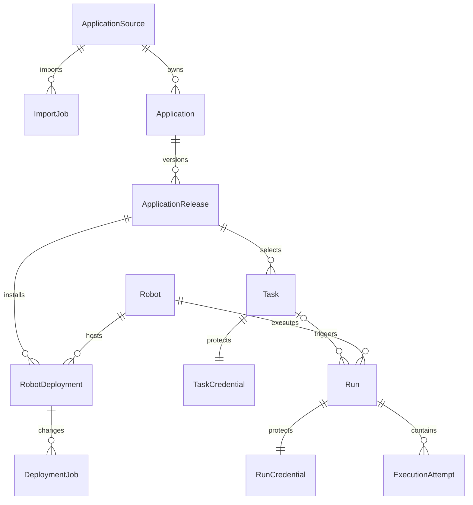
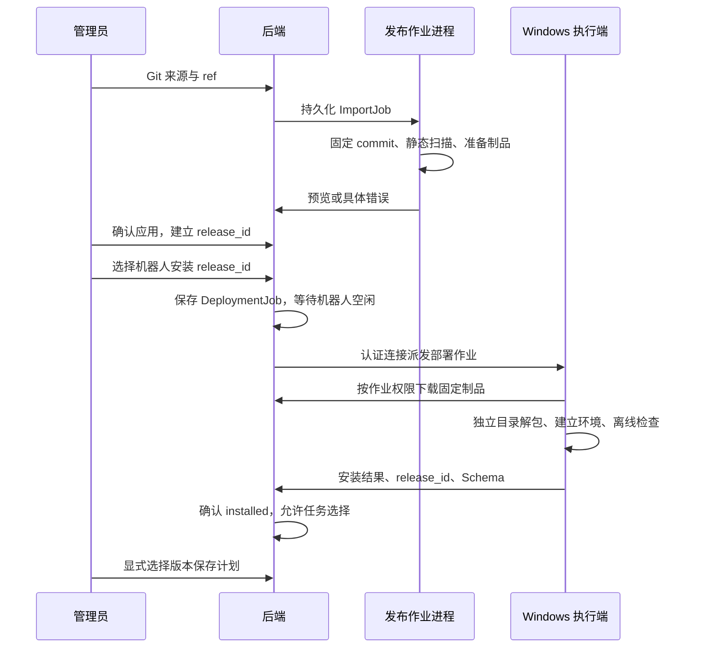

# KK RPA 下一阶段完整平台实施方案

日期：2026-09-08。状态：实施中，现场验收未完成。设计现状基线：Dashboard `a7b0853`、Monorepo `b92df4c`；后续实现仍在未提交工作区，进展见实施记录。

本文是两个仓库下一阶段实施顺序、接口变更和验收要求的统一入口。[Dashboard 技术说明](sharing/dashboard.md)、[Monorepo 技术说明](sharing/monorepo.md)和[原架构方案](rpa-console-architecture.md)保留设计基线与背景，与本文冲突时以本文为准。本地实现与隔离验证不表示目标机器已更新或能力已上线。

## 阅读导航

| 内容 | 入口 | 用途 |
| --- | --- | --- |
| 产品边界 | [目标与决策](#1-目标决策与实施边界) | 确认首版范围及不变的业务规则 |
| 数据与接口 | [统一关系表](#2-数据关系与接口演进) | 对齐两个仓库的对象、快照与接口约束 |
| 参数接入 | [参数声明与表单](#3-参数声明与真实表单接入) | 静态声明、字段交互、损坏处理及验收 |
| 计划调度 | [计划与调度](#4-可复用计划与持久调度) | 保存、凭据、日期固定、事务与停机规则 |
| Git 发布 | [导入、安装与回滚](#5-git-导入安装发布与回滚) | 固定 commit、发布时序、独立环境与版本切换 |
| 正式部署 | [部署与迁移](#6-单机正式部署与迁移) | Linux、Windows 桌面会话、升级与备份恢复 |
| 阶段验收 | [交付标准与记录模板](#7-阶段交付与验收记录) | 按代码版本和现场证据判定阶段是否通过 |

实施按参数接入 → 当前链路验收 → 计划调度 → Git 发布 → 正式部署推进。可提前完成不依赖现场的开发，但阶段通过必须满足各自验收条件；当前代码进度与验收结果分开记录。

## 实施记录（2026-09-08，本地未发布）

| 阶段 | 当前代码进度 | 验证与剩余事项 |
| --- | --- | --- |
| 1. 参数接入 | 两应用声明、执行端静态读取与上报、后端校验、损坏声明提示已实现 | 应用声明和程序约束已有离线验证；当前控制台的空值、取消与版本切换通过隔离浏览器验证。两实际应用从 Windows 上报到在线表单的联调仍待验收 |
| 2. 当前链路验收 | Mac 测试端已更新至平台版本和 0005，Windows 由操作者更新并连接 | 新版本真实导出、恢复、停止和收尾尚未验收 |
| 3. 计划调度 | Task/TaskCredential、触发去重、Cron、日期绑定、计划与临时运行入口已实现 | 持久化、日期固定、并发去重和停机规则已有后端/PostgreSQL 验证；当前页面保存、刷新、编辑、离线触发与上海时间显示通过。实际机器人执行仍待验收 |
| 4. Git 发布 | 来源、导入与部署作业、release_id、执行端安装、人工收尾及发布页面已实现 | 固定 commit 导入、两个实际应用共 3 个隔离环境安装、同包版本共存、旧解释器检查及发布页面状态通过。远端私有 Git 认证、Windows 安装/断连及真实业务回滚待验收 |
| 5. 正式部署 | 维护模式、publisher、自启与日志脚本、离线备份恢复工具已加入 | 0005 迁移及维护验证通过；3 份 PowerShell 脚本语法通过；隔离数据库与四卷恢复测试通过。Linux 正式部署、Windows 实机自启、恢复后的登录与真实安装重跑仍待验收 |

阶段 2 依赖测试服务和 Windows 更新；此前先推进不依赖现场的实现及隔离验证。下文测试数量对应各次具体改动，不累加为全平台验收数量。各阶段仍以第 7 节要求的新证据判定通过。

现场安排：已确定先使用当前 Mac/ngrok 测试端，Windows 由用户操作；正式 Linux 环境仍待安排。Mac 已更新，Windows 已有 monorepo 克隆，本轮未提交源码通过更新包同步。后续验收包括两应用真实导出与失败接管、停止/断连/收尾及 Token 记录、私有 Git 导入、Windows 安装与登录自启，以及恢复后的实际安装与重跑。Mac 测试结果不替代正式 Linux 部署验收。

### Mac 测试端升级（2026-09-08）

升级前确认两个机器人均无活跃 Run，10 条历史运行均为终态。停止三项旧服务后备份数据库、原密钥与配置、证据和 Agent 会话；旧 Docker 镜像缺失，改为保留三个旧容器的 rootfs 导出与容器配置。备份位于本机受保护目录，不提交仓库。

从当前未提交工作区构建并启动 web/backend/agent/publisher，数据库从 0002 迁移到 0005；原 10 条运行及 10 条凭据记录保留。公网健康接口和计划/临时运行页面入口返回 200，未登录访问计划与应用接口返回 401，Agent 工作接口返回 200，四服务运行且重启计数为 0。以上是服务升级检查，实际飞书登录、Windows WSS 连接和业务运行仍待现场操作验证。

### Git 发布补充验证（2026-09-08，工作区未提交）

后续实施修正了导入凭据解密失败不结束作业、安装注册表写入失败仍在内存暴露版本的问题。安装超时处理进程树；取消或收尾无法确认时报告 uncertain，保留目录和机器人占用。对应实现位于 Dashboard 的 publisher、发布接口及 Monorepo 的 installer。

本次后端全量 49 项通过，执行端全量 34 项通过。新增检查覆盖加密凭据失败结束导入、发布管理权限、机器人制品下载归属、安装重放、检查失败保留旧版、注册表写入失败、中断保留现场，以及 POSIX 下真实子进程超时停止。PostgreSQL 使用隔离容器，迁移至 0004 后 Alembic 检查无模型差异；未迁移现有服务数据库。Windows 进程树终止和真实安装仍须在目标执行机验证，不能用 POSIX 测试代替。

后续补充本地人工收尾入口：使用执行端同一把锁，要求操作者确认安装进程停止，只处理本机 uncertain 作业，隔离残留环境并持久化最终报告；重连由后端确认释放占用。操作说明见 [执行端安装收尾](../../kk-rpa-monorepo/packages/rpa-executor/README.md#发布安装中断后的收尾)。本次执行端全量 36 项、发布专项 6 项通过，覆盖未确认拒绝、活跃 Run 拒绝、残留保留、卸载注册项隔离及后端确认后重试。

实际应用安装演练发现普通 doctor 依赖本地业务账号配置；已增加 `doctor --deployment`，只检查部署条件，保留普通 doctor 和运行时原校验。核心 CLI 与执行端相关测试合计 78 项通过。隔离演练将当前应用与核心包复制到临时 Git 仓库，固定 commit 后经过真实发布扫描、独立环境安装、部署 doctor 和应用离线测试；两个应用共 3 个发布环境全部通过，包括同包版本的不同 commit 共存、共享包从本版本目录加载，以及安装新版后切回旧解释器检查。未提交业务仓库，也未运行真实浏览器业务。

重复演练命令（会安装真实依赖；`RPA_MONOREPO_PATH` 指向待验证源码工作区）：

```sh
RPA_INSTALLATION_TEST=1 RPA_MONOREPO_PATH=/path/to/kk-rpa-monorepo uv run --project apps/backend pytest apps/backend/tests/test_release_installation.py -q
```

该记录证明本地隔离安装能力，不替代私有远端 Git 认证、Windows 安装、当前页面版本切换和真实业务回滚验收。

当前页面的保存、刷新、凭据显示、版本切换、参数清空和离线触发已补充 [隔离浏览器验收](console-browser-validation.md)。测试使用当前路由与真实 API；发现并修复了计划 commit 未持久化的问题。Windows 业务执行及回滚仍未通过该测试验证。

发布页面现已展示所选机器人的部署状态，依据持久化部署与作业记录限制安装、卸载；隔离浏览器验证了未安装版本不能卸载、被引用版本卸载报错、安装排队后禁止重复下发。[当前镜像四服务验证](container-validation.md) 也已通过，覆盖新库迁移、Web 代理、Agent 轮询、publisher 作业处理及维护中的后端重启。正式 Linux 与 Windows 目标环境尚待明确并开展现场验收。

## 1. 目标、决策与实施边界

目标流程：**Git 导入应用 → 部署到机器人 → 配置计划或临时运行 → 执行与失败接管 → 查看结果 → 更新与回滚版本**。

| 事项 | 已确定的规则 |
| --- | --- |
| 页面入口 | 可复用计划与临时运行并存；开发、测试和业务联调共用当前控制台，无独立测试页，无失败回退模拟数据 |
| 填写层级 | 应用与机器人 → 参数弹窗 → 登录配置 → 触发配置 |
| 初始值 | 不预选应用、机器人或业务参数；账号密码由用户输入，不自动套用业务默认值 |
| 登录 | 企业管理员管理，其他企业成员只读；两个程序只检查登录会话，不恢复预期身份匹配 |
| 定时 | 日、周、月、五段 Cron；统一 Asia/Shanghai；停机错过计划不补跑，已有队列保留 |
| 日期 | 固定日期、当天、昨日、按天偏移；创建 Run 时固定实际日期 |
| 并发 | 单机器人串行，多机器人分别执行；机器人离线允许排队 |
| 重跑 | 新建 Run，沿用原版本、机器人、实际业务参数和加密凭据，不读取任务最新密码 |
| 导入 | 第一版仅 Git；分支/tag 解析成具体 commit，不做 ZIP 上传 |
| 发布 | 控制台下发安装，多版本并存，管理员显式切换计划版本 |
| 接管 | 沿用原 verify、最多 3 轮和累计 900 秒预算、停止与收尾确认 |
| 正式环境 | 单 Linux、Compose、单后端、单 Agent；Windows 桌面用户会话运行 |
| 文件与设置 | 业务下载保留在执行机；管理员与保留期限仍由服务配置管理 |

首版不建设多实例高可用、设置中心、业务文件归档、通用业务写入适配或新的运行引擎。不增加需求哈希、指令注册表或自动修改应用源码的接管能力。

在上述设计基线中，已存在真实 Run、机器人、操作、事件、凭据、截图和 Agent 会话；计划、应用来源、发布版本、部署作业尚未实现，动态表单仅 Dashboard 支持。后续章节的“现状”均指该基线；工作区进展统一见实施记录，不据此推断目标机器已更新。

## 2. 数据关系与接口演进



图中的 ExecutionAttempt 继续保存在现有 Run JSON 内，不为目录形式单独迁表。临时运行没有 Task，旧运行允许没有 release_id。

| 新增对象 | 必要内容与约束 |
| --- | --- |
| ApplicationSource | Git 地址、名称、受保护的只读凭据引用；不把口令放进 URL |
| ImportJob | 来源、请求 ref、解析 commit、状态、应用预览、错误和确认结果 |
| Application | 来源、稳定 app_id、名称、仓库内相对路径；同一来源的 app_id 唯一 |
| ApplicationRelease | 不可变 ID、应用、包版本、commit、源码制品引用、参数声明；同应用同 commit 重复确认返回已有版本 |
| RobotDeployment | 机器人、release_id、安装目录、安装状态、声明和确认时间；同机器人同 release_id 唯一 |
| DeploymentJob | 机器人、release_id、安装/卸载动作、状态、错误、执行端确认；与 Run 操作分开存储 |
| Task | 名称、版本选择、机器人、参数绑定、下载目录、定时规则、启用状态、next_run_at、编辑修订号 |
| TaskCredential | Task 对应的加密账号密码，独立于普通业务参数和响应 |
| Run 新增字段 | 可空 task_id/release_id、触发类型、scheduled_for、请求去重标识；现有 snapshot、Attempt、事件和 RunCredential 沿用 |

阶段 3 的 Task 可引用已上报有效 Schema 的本地部署，通过 app_id/version 固定选择。阶段 4 增加 release_id 后，管理员显式把计划切换到已安装发布版本，不自动认领旧部署。

### 管理接口清单

以下为相对设计基线新增的目标接口，现有接口未改名。返回异步作业时提供作业 ID，通过查询读取结果；工作区存在实现的接口仍须按阶段验收。

| 接口 | 行为 |
| --- | --- |
| GET/POST `/api/tasks` | 列出、创建计划；创建只保存，不运行 |
| GET/PATCH `/api/tasks/{id}` | 读取、编辑配置；PATCH 携带修订号，过期编辑返回冲突 |
| PUT `/api/tasks/{id}/schedule` | 保存 Cron 与启用状态；暂停只停止未来定时触发 |
| POST `/api/tasks/{id}/runs` | 使用已保存配置立即运行，返回 run_id；不接受临时覆盖参数 |
| POST `/api/schedules/preview` | 校验五段 Cron，返回上海时区接下来 5 次时间 |
| GET/POST `/api/application-sources` | 来源列表及 Git 来源配置 |
| GET/POST `/api/application-imports` | 查询、创建导入作业 |
| GET `/api/application-imports/{id}` | 查询固定 commit、预览、错误和状态 |
| POST `/api/application-imports/{id}/confirm` | 确认选中的应用，建立不可变发布记录 |
| GET `/api/applications`、GET `/api/applications/{id}/releases` | 已导入应用及发布版本目录 |
| GET `/api/application-releases/{id}/form` | 查询该发布版本业务 Schema |
| GET/POST `/api/robots/{id}/deployments` | 查询部署状态、提交安装作业 |
| DELETE `/api/robots/{id}/deployments/{release_id}` | 请求卸载无引用的版本，返回作业 ID |
| GET `/api/deployment-jobs/{id}` | 查询排队、安装和收尾结果 |

保留 POST `/api/runs` 临时运行以及现有读取、stop、rerun、SSE 和截图接口。任务触发和临时创建接受客户端生成的 request_id：一次点击重试复用同一个值，不同点击生成新值；后端保存对应 Run，重复请求返回已有结果，参数冲突拒绝。定时使用 task_id + scheduled_for 的数据库唯一约束。

所有新管理接口沿用后端管理员与 Origin 校验。只读成员只获得已有业务运行响应，不增加源码、凭据、机器路径和部署管理权限。业务凭据不出现在 Schema、普通 Run JSON、作业日志或模型上下文中。

## 3. 参数声明与真实表单接入

### 现状与目标

前端已从选中机器人的部署读取 input_schema 或 form_schema.properties.inputs；执行端连接目前只有 app_id/version。第一阶段补齐静态声明和上报，不等待 Git 发布系统。

每个应用在 app.toml 中新增如下引用，路径相对于应用根目录：

```toml
[console]
input_schema = "input.schema.json"
```

声明只描述业务 inputs，采用当前表单支持的 JSON Schema draft-07 子集；不引入凭据 Schema、可执行 UI 文件或远程引用。读取器只读取应用目录内的静态文件，不为展示表单导入 Python 应用。新版本声明缺失或损坏均不能发布。

| 应用字段 | 表单规则 | 程序关系 |
| --- | --- | --- |
| 聚水潭 brand_value | 必填非空白字符串 | 控制台要求显式填写，避免依赖执行机店铺配置；CLI 原有本地默认不变 |
| 京麦 target_date | 必填合法 YYYY-MM-DD 日期 | 临时运行填写固定日期；计划可保存日期绑定，触发后传普通日期字符串 |
| 两者 export_filename | 可选；填写时匹配 `[A-Za-z0-9][A-Za-z0-9._-]{0,254}` | 留空不发送该键，由原程序生成默认文件名，并通过 resolved 事件保存实际值 |

Schema 拒绝未知业务字段，提供中文 title、description，不填入 default。凭据仍在登录配置填写账号密码，下载目录沿用独立可选字段。京麦日期显式固定后，按日期派生的默认文件名不会随执行日变化。

部署上报增加可选 input_schema、schema_status（valid/missing/invalid）和裁剪后的 schema_error。旧执行端没有这些字段时视为 missing，保留 JSON 手动运行；invalid 必须展示文件/字段错误并阻止该部署的新建运行，不能静默降级。后端保存并返回这些字段；有效 Schema 在 API 创建运行时再次校验，执行端仍执行应用原校验。

应用列表可聚合展示，但任务参数必须取自选中机器人的具体部署。切换应用、机器人或声明后清空参数草稿；切换应用清空登录配置。参数弹窗取消不保存，确定只写入草稿，提交才创建 Run。缺失或损坏的声明不能创建新计划；既有历史重跑继续使用源运行参数和原程序校验。

### 实施与验收

先新增两份声明及应用测试，再实现执行端读取/上报、后端保存与校验，最后核对当前控制台。验证有效、缺失、损坏声明，未知键、纯空白品牌、非法日期与文件名；验证不自动填默认值、取消编辑、切换机器人时表单变化。合法参数须通过应用准备期校验，原正常场景与反例继续通过。

完成后经当前控制台进行真实正常导出与接管验收，证据要求见第 7 节。

## 4. 可复用计划与持久调度

### 基线现状

已有接口直接创建 Run，队列负责推进运行；没有可持久保存和反复触发的 Task。新增计划复用现有执行状态机，不重建 Attempt 或事件结构。

### 页面与保存

任务管理改为计划列表，展示选定版本、机器人、定时状态、下次触发和最近运行。新建计划提供保存，保存后详情页提供立即运行；运行记录提供临时运行入口。两者复用当前参数、登录和触发配置层级。暂不提供自动把旧 Run 转成计划的迁移或批量复制。

创建计划时管理员填写凭据。编辑页显示哪些字段已配置，不返回已存密码或账号明文；未提交凭据字段沿用原值，重新输入账号时必须一起提交密码。任务凭据与运行凭据独立加密。任务编辑采用修订号防止旧页面覆盖较新配置。

定时默认未启用；可只保存手动计划。关闭定时不禁用手动触发，也不撤销已有 Run。计划引用的部署必须已经安装且声明有效，但机器人暂时离线不阻止保存或入队。

### 参数、日期与事务

```json
{
  "input_bindings": {
    "target_date": {"kind": "relative_date", "offset_days": -1},
    "export_filename": {"kind": "literal", "value": "product-detail.xlsx"}
  },
  "schedule": {"enabled": true, "cron": "0 8 * * *", "timezone": "Asia/Shanghai"}
}
```

仅日期字段接受 relative_date，其他字段为 literal；当天/昨日分别是偏移 0/-1，不执行用户表达式。手动计划触发以服务器创建时间为基准，定时以 scheduled_for 为基准。API 保存时校验绑定结构及固定值，触发时解析并校验完整 inputs。

一次短事务锁定任务并读取配置，固定日期、版本、机器人和凭据，写入 Run 与独立 RunCredential。编辑与触发由事务次序决定读取哪次配置；成功入队后完全脱离任务当前值。应用 resolved 事件仅补充原程序派生值，接管与重跑保持原实际参数。

### 调度与异常

单后端在现有运行队列推进之外增加任务到期检查，不引入第二个队列系统。使用数据库 next_run_at，锁定任务后在同一事务创建到期 Run、写入去重标识并推进下一时间。日期和星期同时限定时遵循所选 Cron 实现的标准 OR 语义；前后端以服务器预览结果为准。

进程启动/退出维护模式时，将早于当前时间的未触发计划推进到未来，不生成停机补跑；正常循环延迟时处理该任务最近的一个已到期计划点，跳过更早积压点，随后推进至未来。已入库 Run 不受影响。这个区别以服务启动边界及到期时间记录，不根据机器人是否在线判断。

任务参数或部署状态失效时，不创建伪成功 Run；暂停该任务定时并保存可读的触发错误，由管理员修正后重新开启。数据库暂时不可用时不推进 next_run_at；恢复后按上述到期规则继续。重复调度、响应丢失或事务回滚不能产生重复 Run。

### 实施与验收

先新增 Task/TaskCredential 和触发去重约束，再实现保存及统一触发事务，随后增加调度循环、服务器预览和真实页面。验证刷新保留、并发编辑冲突、跨日解析、手动两次触发、请求重试、定时唯一性、暂停保留队列、停机不补跑、离线排队及修改密码不改变历史重跑。

## 5. Git 导入、安装发布与回滚

### 基线现状

应用由执行机本地配置和独立环境提供，控制台读取机器人上报的 app_id/version。尚无平台来源、固定 commit 的发布目录或安装作业；旧部署必须显式导入和安装后才能进入版本管理。

### 来源、制品与身份

应用中心新增 Git 来源、导入预览、版本列表及部署入口。来源只允许管理员提供的 HTTPS/SSH Git 地址，私有仓库凭据加密保存或由服务端受保护文件引用，不回显、不进入日志、不发送执行机。首版不做自动跟踪分支、webhook 发布、子模块或 Git LFS 解析；含这些未支持依赖的导入明确报错。

导入将 ref 固定为 commit，静态读取 apps/*/app.toml、pyproject.toml、uv.lock、需求、元素及参数声明，不在服务端安装或执行业务程序。预览列出每个应用的名称、路径、包版本、commit、参数和缺失文件，管理员选择有效应用确认。

发布制品保留完整仓库相对布局及共享包。只从指定 commit 的受版本控制内容生成，排除 .env、stores.local.toml、profiles、runs、runtime、.venv 和 Git 凭据；排除规则命中运行必需内容时导入报错。制品解包不得写出目标目录；不接受逃逸目录的链接。制品保存后不可原地替换。

每个 release_id 固定应用、commit、包版本与制品；同一来源、应用、commit 重复导入返回已有记录。同包版本不同 commit 可以并存，页面同时展示包版本和短 commit。不同来源相同 app_id 依靠 release_id 区分；旧 app_id/version 协议不能代替发布身份。

### 安装和通信



增加一个单实例发布作业进程，复用后端镜像与数据库，处理持久化 ImportJob；API 只登记和读取作业，不阻塞等待 Git。导入状态为 queued/fetching/ready/confirmed/failed。进程重启后未确认作业可按固定 commit 重建临时目录；确认使用唯一约束去重。

部署作业通过现有机器人认证 WSS 扩展独立消息类型，携带 job_id、release_id、应用路径和制品引用；事件携带 job_id 与递增序号，执行端持久记录、重复请求返回已有结果。制品下载使用机器人认证的 HTTP 接口，只允许该机器人读取已分配作业的制品，不开放匿名下载。

部署状态为 queued/installing/installed/failed/uncertain。后端锁定机器人，确认无活跃 Run 和其他部署后派发；安装期间不派发新 Run，新的运行仍可排队。先服务已有执行队列，再开始部署；开始安装后必须收到收尾确认才解除维护占用。

执行端在独立 release_id 目录保存完整源码，为选中应用建立独立 Python 环境，按锁定依赖安装并执行 doctor、应用离线测试和声明检查；不以安装为由运行真实登录或下载。只有全部通过且后端收到确认，才可选为已部署版本。

应用发布目录不包含运行产生的凭据和产物；继续使用现有应用相对资源路径和 Run Profile 隔离。rpa-executor 控制端仍单独维护，不在应用安装中自更新。发布协议上线时先更新服务和执行端，旧执行端未声明部署能力时禁止派发安装作业，保留旧手动执行。

### 失败、切换和卸载

安装失败清理本次临时环境，保留具体失败阶段及裁剪后的错误，旧部署不变。断连时保持维护占用，重连以 journal 和安装记录核对；结果不确定时标 uncertain，不重复执行已确认安装步骤，也不直接释放机器人。管理员重试产生新的作业，只操作同一目标版本的未完成安装。

运行快照增加可选 release_id。新发布运行按该 ID 找解释器与目录，app_id/version 仅为信息；旧 Run 没有 ID 时继续原查找逻辑。任务切换到新 release_id 时校验 Schema，清空业务参数并要求重新填写；已排队和历史 Run 不变。

回滚就是显式选回已安装旧 release_id。计划、非终态 Run 或活跃部署作业引用的版本禁止卸载；没有引用时管理员可以提交卸载。历史 Run 保留 release_id，若版本已卸载，重跑返回“需重新安装原版本”，不静默换版本。正式发布记录和源码制品首版不提供删除功能。

### 实施与验收

先实现来源、静态导入及版本目录，再增加制品传输和执行端安装作业，最后让计划与临时运行使用 release_id。验证 ref 固定、重复确认、同包版本不同 commit、错误声明、私有凭据不外泄、共享包相对依赖、机器人忙时等待、安装失败保留旧版、断连确认、切换与卸载约束、回滚及旧运行兼容。

## 6. 单机正式部署与迁移

### 基线现状

已有三服务 Compose、测试部署辅助脚本和 Windows 启动入口；Linux 正式环境、维护模式、发布作业常驻和备份恢复仍需按本节交付。部署与升级由运维执行，结果在控制台运行记录和部署作业中检查，首版不新增设置中心。

### 运行结构与配置

沿用 web/backend/agent 三服务，增加单实例 publisher 作业进程。后端仍单 Uvicorn worker，Agent 单实例；publisher 不参与浏览器指令或恢复决策。任务调度随后端运行，发布与运行作业均以 PostgreSQL 为状态来源。

| 数据或配置 | 保存与使用 |
| --- | --- |
| HTTPS/WSS | Linux 正式域名与有效证书；反向代理同源 /api、SSE、WSS；沿用内网 API 访问边界 |
| PostgreSQL | 独立应用数据库，新增表通过现有迁移机制创建 |
| 证据、Agent 会话 | 保留现有 evidence/sessions 持久目录及清理机制 |
| 发布制品 | 新增持久目录，publisher 写入，后端提供授权下载 |
| Git 工作目录 | 临时目录，与制品分开；失败可清理重建 |
| 密钥 | 原业务加密密钥持续有效；Git 凭据同样受保护，部署配置不提交仓库 |
| Windows | 每个 release_id 独立源码环境，执行端连接配置和 journal 独立保留 |

Windows 在用户登录后的交互桌面会话启动现有执行端入口，设置单实例、自启和错误日志。断网由既有重连处理；电脑重启后需要桌面用户重新登录才能恢复浏览器运行。首版不自动登录 Windows，也不采用无桌面系统服务代替浏览器会话。

已提供 [Windows 自启操作](../../kk-rpa-monorepo/packages/rpa-executor/README.md#桌面用户登录后自启)：注册当前用户的 Interactive 登录任务，复用配置与已安装环境，保留执行端文件锁，启动错误和重连诊断写入本地忽略目录。2026-09-08 的 PowerShell 7.4 容器语法检查通过；进一步执行检查遇到 ARM 主机的 x64 仿真崩溃，未据此确认 Windows 任务注册、登录触发或日志端到端通过。

### 迁移与升级

采用新增表、可空 release_id/task_id 及必要唯一约束，不改写既有业务参数、Attempt、事件、凭据或源运行关联。旧 Run 不生成 Task；旧机器人部署不自动映射发布记录。

增加持久维护模式，由部署运维设置：拒绝新手动触发，暂停定时生成与部署派发，现有活跃运行正常收尾，待执行队列保留。待所有机器人结束活跃 Run 和部署作业后，备份、迁移并更新服务，再更新执行端，验证后退出维护模式。重启及退出维护期间错过的计划不补跑。

已实现的命令、排空状态解释和首次升级边界见 [升级维护操作](maintenance.md)。维护排空后仍需停止服务写入，再取得一致备份。

数据库迁移失败则保持维护模式并恢复备份，不继续派发。正式升级回退使用匹配的服务版本、数据库和持久数据，不假定旧程序能读取任意新表结构。

### 备份、恢复与验收

备份包括数据库、原凭据加密密钥、证据目录、Agent 会话、发布制品和受保护的服务配置；数据库与目录在停止写入后取得一致备份。业务下载文件不由控制台备份，Windows journal 不能被服务器数据库备份代替。

已提供 [备份恢复工具与演练记录](backup-recovery.md)，包括停写检查、空目标恢复、原密钥核对和独立 Docker 测试。该记录覆盖数据恢复，正式环境与业务链路验收仍按下文执行。

恢复演练使用隔离服务和测试机器人：恢复数据及密钥后验证登录权限、历史运行及截图、凭据可解密重跑、发布制品可重新安装、计划下次时间正确。若数据库与 Windows journal 对不上，保持状态待确认，不重放未知业务动作。

日常从现有运行记录、部署作业与容器日志确认失败。管理员名单和默认 30 天保留期限继续通过服务配置修改；运行凭据随运行保留和清理，不能按原架构初稿在终态立即删除，否则无法满足历史重跑约定。

## 7. 阶段交付与验收记录

| 阶段 | 主要修改边界 | 通过条件 |
| --- | --- | --- |
| 1. 参数接入 | 两应用声明、executor 上报、Dashboard 校验与表单 | 正确字段、初始空值、取消编辑、切换版本、合法输入通过；损坏声明明确拒绝 |
| 2. 当前链路验收 | 当前控制台、最新两个程序和执行桥 | 两程序正常导出；聚水潭品牌干扰/定位器恢复；京麦报表已生成后仅恢复下载；原 verify、停止、断连、收尾与释放通过 |
| 3. 计划调度 | Task/凭据、触发事务、调度与当前 UI | 刷新保留、日期固定、请求和定时去重、停机不补跑、编辑隔离、离线排队、历史重跑凭据不变 |
| 4. Git 发布 | 来源与制品、publisher、部署协议、release_id | 固定 commit、声明校验、安装独立环境、失败保留旧版、断连核对、版本切换、回滚及旧部署兼容 |
| 5. 正式部署 | Linux 配置、维护模式、Windows 自启、备份恢复 | 单机正式端到端通过；重启保留队列；角色权限一致；隔离恢复演练通过 |

每阶段保存代码 commit、环境及机器人版本、测试范围与结果、实际 Run/Attempt 或作业 ID、失败原因及下一步。现场验收还记录参数范围、非空下载结果、原步骤来源、截图、最终收尾及 Token 用量；真实账号、文件路径和截图保留在受保护运行产物，不提交文档。

阶段 2 的历史 macOS 案例只提供验收场景，不代表最新 Windows + Dashboard + 模型通过。分别记录模型报告的 Token 与缺失用量，实际费用有可核实账单时再比较，不将离线文本压缩比例写成费用降幅。

离线验证使用现有前端、Agent、后端、核心与两个应用测试；新增持久事务和调度并发场景使用 PostgreSQL 测试库。浏览器联调统一走当前控制台，按已有授权和可用环境执行，未完成项记录实际阻塞原因。上线验收以本阶段新结果为准，不累加历史测试数或沿用旧结论。

### 阶段验收记录模板

每阶段单独追加记录；有待验收项时保持“待验收”，不能仅凭测试数量关闭阶段。

| 记录项 | 填写内容 |
| --- | --- |
| 阶段与日期 | 阶段编号、验收日期、执行人 |
| 代码与环境 | 两仓库 commit；未提交改动说明；服务、执行端、机器人及模型版本 |
| 场景与结果 | 对照上表逐项填写通过、失败或未执行；记录测试命令及结果 |
| 现场证据 | Run/Attempt 或导入/部署作业 ID、受保护证据位置、下载结果、停止与收尾确认 |
| Token 用量 | 模型报告的输入、输出与累计量；缺失项明确填写“未返回” |
| 未通过项 | 失败原因、后续动作与复验结果 |
| 阶段结论 | 通过或待验收；确认是否满足全部通过条件 |
