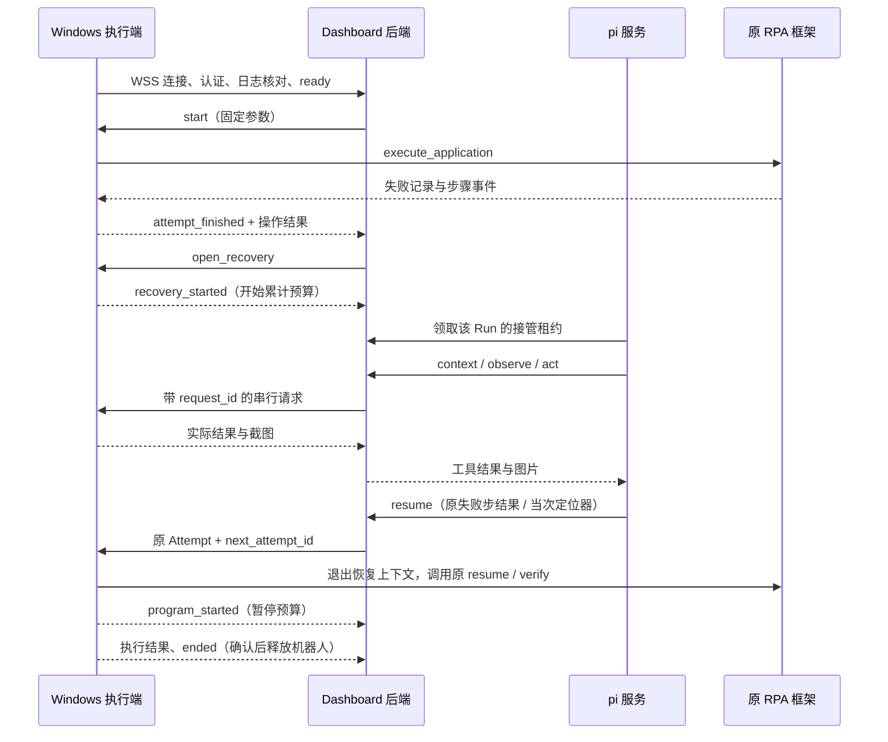

# 失败接管实施说明

实现基线：[dashboard-rpa-recovery.md](../workflows/dashboard-rpa-recovery.md)。本次提供代码与离线验证；真实业务验收必须单独记录，不能用下列测试结果代替 Windows + DeepSeek 的验收。

## 代码位置

| 位置 | 职责 |
| --- | --- |
| `apps/backend/src/rpa_console/control.py` | Run / Attempt、按机器人加锁、累计预算、请求去重、停止与终态 |
| `apps/backend/src/rpa_console/api.py` | 飞书登录、管理员/成员权限、WSS、SSE、截图、内部 Agent 接口 |
| `apps/backend/migrations` | PostgreSQL 初始迁移；业务状态以数据库为准 |
| `apps/agent/src` | pi SDK 0.85.1、每 Run 会话、串行工具与失败中断、DeepSeek Responses |
| `apps/web/src/live` | 原 `/runs/:id` 地址上的真实运行详情、停止、证据和 Attempts |
| [rpa-executor](../../kk-rpa-monorepo/packages/rpa-executor) | Windows 主动连接、SQLite 请求/事件日志、应用独立 Python 环境执行桥 |
| [rpa-core](../../kk-rpa-monorepo/packages/rpa-core/src/rpa_core) | `execute_application`、步骤边界停止、DOM 观察、截图脱敏和协作收尾 |



Agent 服务在内部网络轮询后端的接管工作，领取 30 秒可续期的服务租约；这仅用于服务进程的互斥，不是机器人的人工授权。每 3 秒核对停止状态。模型密钥只进入 Node 服务的进程环境和内存凭据存储，不写入 pi 会话或发送到 Windows。

只有 `context / observe / act / credential / resume / give_up` 六个模型工具。关闭内置工具、扩展、skills、prompt、主题和上下文文件发现。页面数据和历史对话不能扩大工具范围。SDK 与执行端均串行执行；同轮动作失败后的剩余调用被拒绝，下一轮先观察。

DOM 观察返回实际节点的 XPath、可见文本和限定属性，临时目标只保存在当前恢复上下文。提交的定位器必须有当前 DOM 观察依据，并经过原 `override_element_locators` 字段检查。原 `expect_count`、`check_at`、应用代码和 `verify` 不变。下载文件名沿用原 `export_filename`。

## 简化测试部署：现有 PostgreSQL + ngrok

Mac 只运行 Web、后端和 Agent 三个容器。数据库使用已经运行的 PostgreSQL 容器；后端加入其现有 Docker 网络，以容器名连接。ngrok 将公网 HTTPS/WSS 转发到 Mac 的 `127.0.0.1:8088`，不用 hosts、自签证书或 Windows CA 配置。外部仍经过飞书登录和机器人凭据认证。

### Mac 首次准备

前置条件：Docker Desktop、Python 3、ngrok 已安装；ngrok 已登录；现有 PostgreSQL 容器运行并有本地管理员访问能力。默认容器名为 `postgresql`。

在 dashboard 仓库根目录，终端一运行并保持：

```sh
ngrok http 8088 --inspect=false
```

终端二运行：

```sh
python3 deploy/mac.py prepare
```

脚本从 ngrok 本机接口读取当前 HTTPS 地址，检测 PostgreSQL 用户和 Docker 网络，生成权限为 `0600` 的忽略文件 `deploy/.env`。`prepare` 只准备配置，不创建数据库、不启动应用。重复执行会更新地址和网络，保留已有数据库口令、内部凭据和填写内容。

只填写 `deploy/.env` 最上方五项：

| 字段 | 内容 |
| --- | --- |
| `DEEPSEEK_API_KEY` | DeepSeek 官方 Key |
| `FEISHU_APP_ID` | 飞书企业自建应用 App ID |
| `FEISHU_APP_SECRET` | 同一应用的 App Secret |
| `FEISHU_TENANT_KEY` | 允许登录的企业 tenant_key |
| `ADMIN_OPEN_IDS` | 本应用内的管理员 open_id；多个用英文逗号分隔 |

在飞书后台设置脚本打印的回调地址 `${PUBLIC_URL}/api/auth/feishu/callback`，发布应用并将测试成员加入可用范围。`tenant_key` 与 `open_id` 可从同一飞书应用的“获取登录用户信息”接口取得。

填写后启动：

```sh
python3 deploy/mac.py up
```

启动脚本先检查五项配置，再在现有 PostgreSQL 中创建独立的 `rpa_console` 角色和数据库，最后构建并启动三个服务。不会新建 PostgreSQL 容器、重置已有角色密码、改动现有业务数据库或修改其端口。如果同名数据库已有其他属主，脚本停止并说明原因。

首次启动后，浏览器打开 ngrok 地址，通过飞书登录，在“机器人”页面创建机器人并保存一次性显示的连接凭据。ngrok 免费域名若显示访问提示页，先按页面提示进入。

自定义现有容器名：`python3 deploy/mac.py prepare --postgres-container <container>`；后续 `up` 也使用同一参数。若 ngrok 本机接口不在默认 4040 端口，可用 `--url https://实际域名` 显式传入地址。

### Windows 首次准备

安装 Google Chrome 和 uv，把本次更新后的完整 `kk-rpa-monorepo` 放到任意目录。保留 `apps` 与 `packages` 的相对结构，不复制 Mac 的 `.venv`。

未安装 uv 时：

```powershell
winget install --id astral-sh.uv -e
```

重新打开 PowerShell，在 monorepo 根目录运行：

```powershell
.\packages\rpa-executor\start.ps1
```

若 PowerShell 提示禁止运行脚本，用下面的命令启动；执行策略仅作用于这次进程：

```powershell
powershell.exe -NoProfile -ExecutionPolicy Bypass -File .\packages\rpa-executor\start.ps1
```

脚本自动为执行端和两个应用同步 Python 3.12 独立环境，首次只询问：控制台 HTTPS 地址、机器人连接凭据、聚水潭及京麦各自的用户名、密码和页面预期身份。

应用路径、版本、模块名、WSS 地址和环境变量映射由现有模板提供，不用手填 TOML。相对路径以配置文件所在目录为基准，不受 PowerShell 当前目录影响。两个应用在控制台的账号别名均为 `STORE_001`。

配置写入忽略的 `packages/rpa-executor/config.local.toml`；凭据通过 Windows DPAPI 加密写入同目录 `credentials.local.clixml`，仅创建它的 Windows 用户在同一电脑上可解密。运行时注入当前执行端的进程环境，结束后恢复调用窗口原有环境变量。日期、品牌、文件名仍在控制台发起 Run 时填写。

以后启动仍只运行同一条命令。更新地址或重新录入凭据：

```powershell
.\packages\rpa-executor\start.ps1 -ServerUrl https://新的测试域名
.\packages\rpa-executor\start.ps1 -Configure
```

首次在有桌面的 Windows 登录用户会话内联调。执行端上线后，控制台应显示“在线”、两个已部署应用版本和空闲状态。真实业务与 Windows DPAPI 的现场验收仍需在该 Windows 电脑完成。

### 日常操作与验证

```sh
python3 deploy/mac.py status
python3 deploy/mac.py down
python3 deploy/mac.py up
```

以上命令在 dashboard 根目录执行。`down` 只关闭本项目三个服务，保留证据/会话卷，不关闭共享 PostgreSQL、不删除其数据库；ngrok 在终端一用 Ctrl+C 停止。ngrok 地址变化时重新执行 `prepare`，同步飞书回调和 Windows 地址，再执行 `up`。`up` 会应用 `.env` 变更。

健康检查：`curl -H 'ngrok-skip-browser-warning: 1' https://实际域名/api/health`，应返回 `{"status":"ok","mode":"live"}`。查看日志：

```sh
docker compose --env-file deploy/.env -f deploy/compose.yaml logs --tail=100 backend agent web
```

部署脚本离线测试：`python3 -m unittest discover -s deploy/tests -v`。Windows 执行桥离线测试：在 monorepo 运行 `uv run --project packages/rpa-executor pytest packages/rpa-executor/tests`。

后端保持一个 Uvicorn worker，Agent 保持一个实例。截图和 pi 会话仍使用持久卷；Run、Attempt、预算与事件存在共享 PostgreSQL 的独立应用库中。`RETENTION_DAYS` 默认 30，仅清理达到期限的已结束运行。业务下载保留在 Windows 原目录。应用导入和定时调度仍未接入此次运行入口。

接口依据：[ngrok WebSocket](https://ngrok.com/docs/using-ngrok-with/websockets/)、[Docker 共享网络](https://docs.docker.com/compose/how-tos/networking/)、[uv 安装](https://docs.astral.sh/uv/getting-started/installation/)、[Windows 加密凭据](https://learn.microsoft.com/en-us/powershell/module/microsoft.powershell.utility/export-clixml)、[PowerShell 执行策略](https://learn.microsoft.com/en-us/powershell/module/microsoft.powershell.core/about/about_execution_policies)。

## 断连和停止语义

- 后端先持久化请求，再发到执行端；执行端先记下接受事实，再启动操作。相同 `request_id` 的不同内容被拒绝。
- 已发送且结果丢失的操作不会直接重发。只有执行端完整日志明确证明未接受过请求，才允许发送；否则补传原结果或保持“状态待确认”。
- 重连先补传事件，再发送 `ready`，随后恢复新操作。接管阶段断连与服务重启期间仍累计 900 秒预算；程序执行阶段不计时。
- 管理员停止、预算耗尽或 Agent 不可用时，停止新增动作。已开始的动作允许收尾，执行端确认 `ended` 后才释放机器人。
- 停止请求会撤销尚未发出的页面操作和 resume。SDK 取消本身不代表 Windows 停止。
- Windows 执行进程重启或浏览器收尾无法确认时保留占用。该情况不会自动重建旧动作，也没有“强制标记空闲”接口。
- 人工验证只检测、脱敏留证、结束运行。管理员完成处理后发起新 Run；原会话不等待人工。

## 验证记录

本次检查使用离线应用上下文、模拟 WebSocket 执行消息、本地 Responses 流式服务和临时 PostgreSQL 17；未登录业务网站、未调用真实模型、未下载业务报表。

| 检查 | 结果 |
| --- | --- |
| 前端构建、Agent TypeScript 构建 | 通过 |
| 前端现有测试 | 6 项通过 |
| pi 工具隔离、图片序列化、实际 SDK 流式工具循环与会话恢复 | 5 项通过 |
| 后端权限、停止竞态、预算、请求去重、WSS 接管/续跑链路 | 16 项通过 |
| PostgreSQL 并发互斥与持久化补传 | 2 项通过 |
| PostgreSQL Alembic 初始迁移 | 通过 |
| Windows 执行桥日志、中文管道编码、重连确认、操作边界与配置相对路径离线测试 | 13 项通过 |
| Mac 配置生成、凭据保留、ngrok 地址匹配与数据库初始化边界 | 6 项通过 |
| 隔离 PostgreSQL 17 的首次建库、重复初始化、容器地址认证与错误口令拒绝 | 通过；重复初始化不重置已有角色密码 |
| Windows 启动脚本 PowerShell 语法检查 | 通过；Windows DPAPI 实机验证待执行 |
| RPA 核心回归与新增公共调用/停止/verify 拒绝 | 168 项通过 |
| 聚水潭应用离线回归 | 23 项通过 |
| 京麦应用离线回归 | 21 项通过 |
| 运行详情浏览器检查 | 原运行、预算、Attempt、结论和 SSE 日志可见；使用明确标注的离线样例 |
| Docker Compose 配置与三服务镜像构建 | 通过 |
| 简化部署后的 Compose 配置、Web 镜像重建与 Caddy 配置检查 | 通过 |
| 飞书真实企业登录 | 尚未执行 |
| DeepSeek 官方视觉与 Windows 真实接管 | 尚未执行 |

重跑验证：

```sh
pnpm build
pnpm test
pnpm test:backend
uv run --project ../kk-rpa-monorepo/packages/rpa-core pytest ../kk-rpa-monorepo/packages/rpa-core/tests
uv run --project ../kk-rpa-monorepo/packages/rpa-executor pytest ../kk-rpa-monorepo/packages/rpa-executor/tests
```

PostgreSQL 测试需将 `RPA_TEST_DATABASE_URL` 指向可测试数据库；每个用例创建独立临时 schema，结束后删除。默认不配置时这两项跳过。

## 现场验收仍需完成

在配置好的 macOS Docker 服务端、Windows 机器人、企业飞书与 DeepSeek 官方模型上，按原规格完成聚水潭品牌干扰/定位器失效、京麦已生成报表仅恢复下载两个案例。每个案例保留 Run 与本地 Attempt 关联、实际截图入模、原 verify、预算、下载信息、最终结果和停止/再次接管/容器重建记录。

目前只验证了图片进入 pi 的下一次 Responses 请求，不能据此认定真实模型已正确理解截图。实验模型与页面变化的兼容性、Windows 浏览器正常关闭、证书信任与登录回调均以现场验收为准。

官方接口依据：[pi SDK](https://github.com/earendil-works/pi/blob/main/packages/coding-agent/docs/sdk.md)、[DeepSeek Responses](https://api-docs.deepseek.com/guides/responses_api/)、[Docker 网络](https://docs.docker.com/desktop/features/networking/)。
