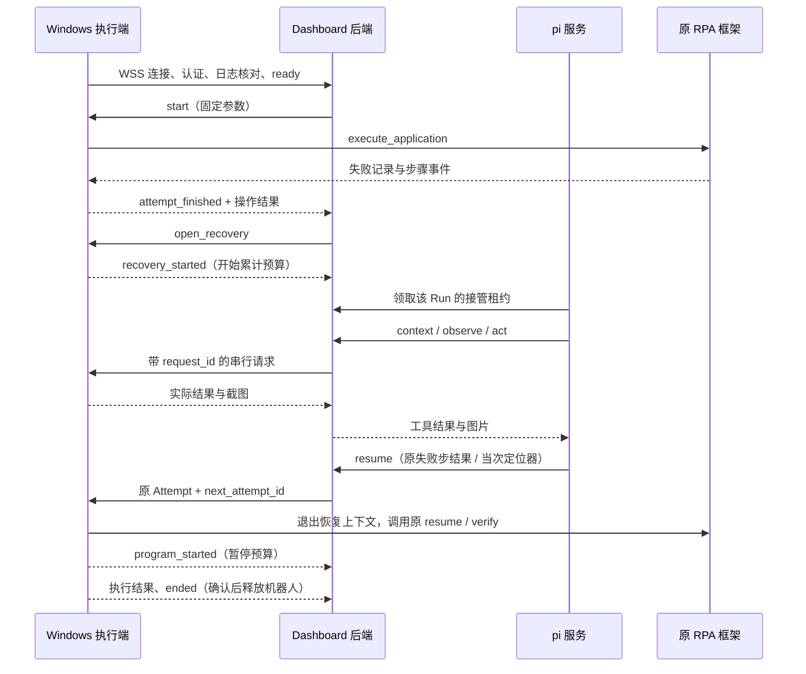

# 失败接管实施说明

实现基线：[dashboard-rpa-recovery.md](../workflows/dashboard-rpa-recovery.md)。本次提供代码与离线验证；真实业务验收必须单独记录，不能用下列测试结果代替 Windows + DeepSeek 的验收。

## 代码位置

| 位置 | 职责 |
| --- | --- |
| `apps/backend/src/rpa_console/control.py` | Run / Attempt、按机器人加锁、累计预算、请求去重、停止与终态 |
| `apps/backend/src/rpa_console/api.py` | 飞书登录、管理员/成员权限、WSS、SSE、截图、内部 Agent 接口 |
| `apps/backend/migrations` | PostgreSQL 初始迁移；业务状态以数据库为准 |
| `apps/agent/src` | pi SDK 0.85.1、每 Run 会话、串行工具与失败中断、DeepSeek Responses |
| `apps/web/src/live` | 原 `/runs/:id` 地址上的真实运行详情、停止、证据和 Attempts |
| [rpa-executor](../../kk-rpa-monorepo/packages/rpa-executor) | Windows 主动连接、SQLite 请求/事件日志、应用独立 Python 环境执行桥 |
| [rpa-core](../../kk-rpa-monorepo/packages/rpa-core/src/rpa_core) | `execute_application`、步骤边界停止、DOM 观察、截图脱敏和协作收尾 |



Agent 服务在内部网络轮询后端的接管工作，领取 30 秒可续期的服务租约；这仅用于服务进程的互斥，不是机器人的人工授权。每 3 秒核对停止状态。模型密钥只进入 Node 服务的进程环境和内存凭据存储，不写入 pi 会话或发送到 Windows。

只有 `context / observe / act / credential / resume / give_up` 六个模型工具。关闭内置工具、扩展、skills、prompt、主题和上下文文件发现。页面数据和历史对话不能扩大工具范围。SDK 与执行端均串行执行；同轮动作失败后的剩余调用被拒绝，下一轮先观察。

DOM 观察返回实际节点的 XPath、可见文本和限定属性，临时目标只保存在当前恢复上下文。提交的定位器必须有当前 DOM 观察依据，并经过原 `override_element_locators` 字段检查。原 `expect_count`、`check_at`、应用代码和 `verify` 不变。下载文件名沿用原 `export_filename`。

## 部署

### macOS Docker 服务端

需要 Docker Desktop、局域网可达的主机名或 IP、与之匹配的 TLS 证书，以及 Windows 信任的签发 CA。入口不能配置为容器 IP 或仅供 Mac 本机访问的 `127.0.0.1`。

1. 将 `deploy/.env.example` 复制为忽略的 `deploy/.env`，填写数据库口令、内部服务凭据、DeepSeek 密钥、企业飞书信息、管理员 `open_id` 和对外地址。
2. `TLS_DIRECTORY` 指向私有证书目录，内含 `server.crt` 和 `server.key`；飞书回调地址为 `${PUBLIC_URL}/api/auth/feishu/callback`。
3. 构建、启动：

```sh
docker compose --env-file deploy/.env -f deploy/compose.yaml build
docker compose --env-file deploy/.env -f deploy/compose.yaml up -d
```

后端启动时执行 Alembic 迁移。后端保持 **一个 Uvicorn worker**，Node Agent 服务保持 **一个实例**；每个服务可同时管理多台机器人。连接对象在该后端进程内，不能直接增加 HTTP worker 数。数据库记录、截图与 pi 会话各用一个持久卷，重建容器保留原卷。

Caddy 只暴露 Web 和 `/api/*`，内部 Agent 接口不发布到公网。凭据通过 Authorization 头传输，不进入 URL。机器人专属连接凭据在创建或更换时仅返回一次，服务器保存摘要。

`RETENTION_DAYS` 默认为 30。Agent 服务清理达到期限的已结束会话，再通知后端清理对应事件、截图和运行；活跃 Run 不清理。业务下载始终留在 Windows 原目录。

### Windows 执行端

使用本次修改后的 `kk-rpa-monorepo`。两个应用各自的 `.venv` 必须安装相同 checkout 的 `rpa-core` 扩展，不能只更新 dashboard。

1. 在 Windows 登录用户会话内安装两个应用的独立环境，先通过各应用原有 `doctor` 和离线 `test`。
2. 复制 [config.example.toml](../../kk-rpa-monorepo/packages/rpa-executor/config.example.toml) 为私有配置，填写应用 Python 路径、工作目录、真实业务域名与 TLS CA 文件。`package`、`module` 和 `version` 必须对应本地已部署应用。
3. 在 dashboard 创建机器人，将其连接凭据配置到 `RPA_ROBOT_CREDENTIAL`。在本机环境变量中配置对应账号的 `credentials_env`；这些字段由执行端在启动 Run 时读取一次，当前 Run 的恢复沿用这份内存值，不重新读取后来变更的账号配置。
4. 启动执行端：

```powershell
uv run --project packages/rpa-executor rpa-executor --config C:/rpa/private/executor.toml
```

执行端主进程持有 WSS 与持久请求日志，每个 Run 用所选应用自己的 Python 启动固定 `worker.py`。Node 模型循环始终在服务器。业务凭据留在 Windows 注入；本次实现不增加 dashboard 的凭据输入表单或通用凭据托管。

机器人上线并报告部署版本后，管理员可从运行列表发起运行，填写原账号别名和应用真实业务参数。日期须填写确定的实际值。应用导入、定时调度和原演示任务编辑尚未接入这个运行入口。

## 断连和停止语义

- 后端先持久化请求，再发到执行端；执行端先记下接受事实，再启动操作。相同 `request_id` 的不同内容被拒绝。
- 已发送且结果丢失的操作不会直接重发。只有执行端完整日志明确证明未接受过请求，才允许发送；否则补传原结果或保持“状态待确认”。
- 重连先补传事件，再发送 `ready`，随后恢复新操作。接管阶段断连与服务重启期间仍累计 900 秒预算；程序执行阶段不计时。
- 管理员停止、预算耗尽或 Agent 不可用时，停止新增动作。已开始的动作允许收尾，执行端确认 `ended` 后才释放机器人。
- 停止请求会撤销尚未发出的页面操作和 resume。SDK 取消本身不代表 Windows 停止。
- Windows 执行进程重启或浏览器收尾无法确认时保留占用。该情况不会自动重建旧动作，也没有“强制标记空闲”接口。
- 人工验证只检测、脱敏留证、结束运行。管理员完成处理后发起新 Run；原会话不等待人工。

## 验证记录

本次检查使用离线应用上下文、模拟 WebSocket 执行消息、本地 Responses 流式服务和临时 PostgreSQL 17；未登录业务网站、未调用真实模型、未下载业务报表。

| 检查 | 结果 |
| --- | --- |
| 前端构建、Agent TypeScript 构建 | 通过 |
| 前端现有测试 | 6 项通过 |
| pi 工具隔离、图片序列化、实际 SDK 流式工具循环与会话恢复 | 5 项通过 |
| 后端权限、停止竞态、预算、请求去重、WSS 接管/续跑链路 | 16 项通过 |
| PostgreSQL 并发互斥与持久化补传 | 2 项通过 |
| PostgreSQL Alembic 初始迁移 | 通过 |
| Windows 执行桥日志、中文管道编码、重连确认与操作边界离线测试 | 11 项通过 |
| RPA 核心回归与新增公共调用/停止/verify 拒绝 | 168 项通过 |
| 聚水潭应用离线回归 | 23 项通过 |
| 京麦应用离线回归 | 21 项通过 |
| 运行详情浏览器检查 | 原运行、预算、Attempt、结论和 SSE 日志可见；使用明确标注的离线样例 |
| Docker Compose 配置与三服务镜像构建 | 通过 |
| 飞书真实企业登录 | 尚未执行 |
| DeepSeek 官方视觉与 Windows 真实接管 | 尚未执行 |

重跑验证：

```sh
pnpm build
pnpm test
pnpm test:backend
uv run --project ../kk-rpa-monorepo/packages/rpa-core pytest ../kk-rpa-monorepo/packages/rpa-core/tests
uv run --project ../kk-rpa-monorepo/packages/rpa-executor pytest ../kk-rpa-monorepo/packages/rpa-executor/tests
```

PostgreSQL 测试需将 `RPA_TEST_DATABASE_URL` 指向可测试数据库；每个用例创建独立临时 schema，结束后删除。默认不配置时这两项跳过。

## 现场验收仍需完成

在配置好的 macOS Docker 服务端、Windows 机器人、企业飞书与 DeepSeek 官方模型上，按原规格完成聚水潭品牌干扰/定位器失效、京麦已生成报表仅恢复下载两个案例。每个案例保留 Run 与本地 Attempt 关联、实际截图入模、原 verify、预算、下载信息、最终结果和停止/再次接管/容器重建记录。

目前只验证了图片进入 pi 的下一次 Responses 请求，不能据此认定真实模型已正确理解截图。实验模型与页面变化的兼容性、Windows 浏览器正常关闭、证书信任与登录回调均以现场验收为准。

官方接口依据：[pi SDK](https://github.com/earendil-works/pi/blob/main/packages/coding-agent/docs/sdk.md)、[DeepSeek Responses](https://api-docs.deepseek.com/guides/responses_api/)、[Docker 网络](https://docs.docker.com/desktop/features/networking/)。
