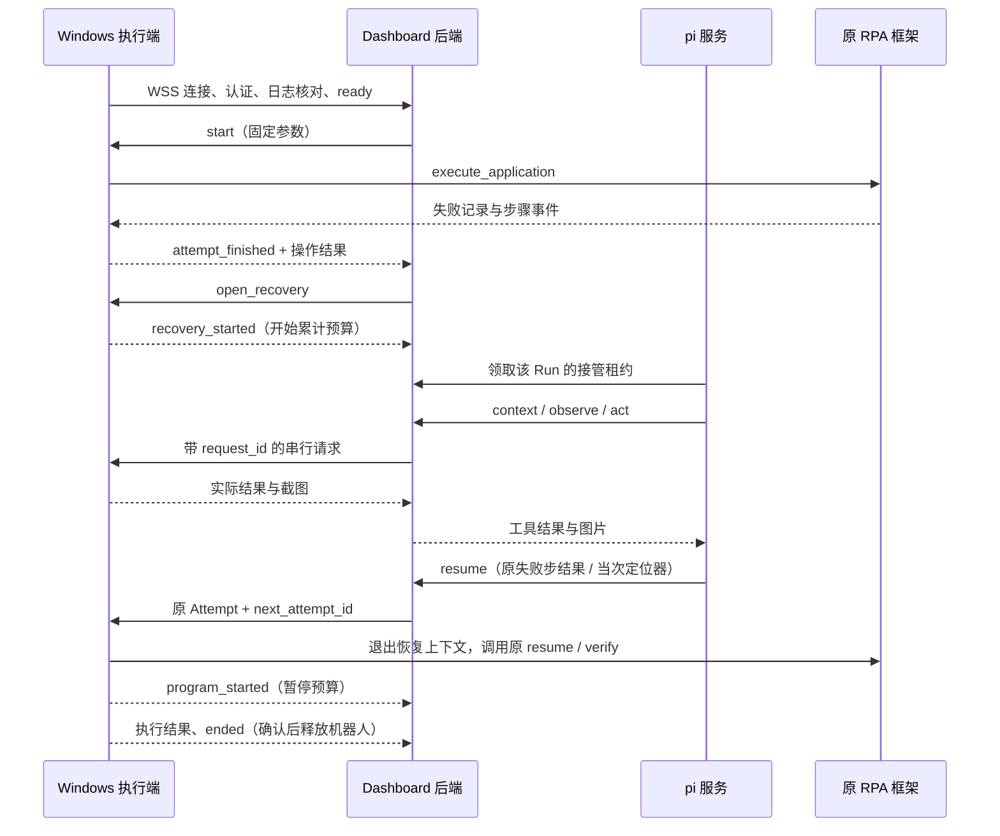

# 失败接管实施说明

实现基线：[dashboard-rpa-recovery.md](../workflows/dashboard-rpa-recovery.md)。本次提供代码与离线验证；真实业务验收必须单独记录，不能用下列测试结果代替 Windows + DeepSeek 的验收。

## 2026-09-09 接管协议更新

当前实现已升级为协议 2，具体接口与离线/真实验收边界见 [Agent 接管改进实施记录](agent-recovery-improvement.md#九实施记录2026-09-09)。新增 query，活引用保存在 core；observe 按字段读取且截图按需；act 返回等待和回读事实。八次观察硬退出已删除。旧 Windows core 的能力上报不匹配时停止接管，需更新实际应用环境。下文保留原流程与部署背景，其中旧 XPath 临时目标、固定截图和无界截断续写描述由新版记录替代。

## 代码位置

| 位置 | 职责 |
| --- | --- |
| `apps/backend/src/rpa_console/control.py` | Run / Attempt、按机器人加锁、累计预算、请求去重、停止与终态 |
| `apps/backend/src/rpa_console/api.py` | 飞书登录、管理员/成员权限、WSS、SSE、截图、内部 Agent 接口 |
| `apps/backend/migrations` | PostgreSQL 初始迁移；业务状态以数据库为准 |
| `apps/agent/src` | pi SDK 0.85.1、每 Run 会话、串行工具与失败中断、DeepSeek Responses |
| `apps/web/src/live` | 原 `/runs/:id` 地址上的真实运行详情、停止、证据和 Attempts |
| [rpa-executor](../../kk-rpa-monorepo/packages/rpa-executor) | Windows 主动连接、SQLite 请求/事件日志、应用独立 Python 环境执行桥 |
| [rpa-core](../../kk-rpa-monorepo/packages/rpa-core/src/rpa_core) | `execute_application`、步骤边界停止、DOM 观察、截图脱敏和协作收尾 |



Agent 服务在内部网络轮询后端的接管工作，领取 30 秒可续期的服务租约；这仅用于服务进程的互斥，不是机器人的人工授权。每 3 秒核对停止状态。模型密钥只进入 Node 服务的进程环境和内存凭据存储，不写入 pi 会话或发送到 Windows。

只有 `context / observe / act / credential / resume / give_up` 六个模型工具。关闭内置工具、扩展、skills、prompt、主题和上下文文件发现。页面数据和历史对话不能扩大工具范围。SDK 与执行端均串行执行；同轮动作失败后的剩余调用被拒绝，下一轮先观察。

`context` 默认读取失败步骤的完整输入、输出和成功条件、相关元素，以及原运行参数和已完成结果；需求总览保留，历史验收和长诊断按需读取。`context(step="S005")` 可读取其他步骤，`context(full=true)` 可读取完整需求、元素和诊断。内容直接从应用原 `requirement.md` 和 `elements.toml` 提取；无法识别步骤标题时返回全文。

DOM 观察在执行端保留实际节点的 XPath、可见文本和限定属性；模型默认接收 target、精简文本和非空属性。需要提交定位器修正时，用 `observe(target=目标, include_locators=true)` 获取实际路径，局部观察包含目标自身。预览截断会明确标记，精确文本通过 `act(read)` 回读。临时目标只保存在当前恢复上下文。提交的定位器必须有当前 DOM 观察依据，并经过原 `override_element_locators` 字段检查。原 `expect_count`、`check_at`、应用代码和 `verify` 不变。下载文件名沿用原 `export_filename`。

每次模型请求只携带最近两次成功观察、其中最新一张截图和最近一次上下文；更早的结果用简短提示替代，保留工具调用配对、动作结果和错误。完整观察仍保存在运行记录及 pi 工具详情中。普通接管请求默认显式设置 `reasoning.effort=none`，单次输出上限为 4096 token；需要额外推理时可配置 `DEEPSEEK_REASONING_EFFORT=low`。`none` 按 [DeepSeek Responses 参数定义](https://api-docs.deepseek.com/api/create-response/) 关闭推理，不能用省略参数代替。会话恢复后也应用当前配置。`resume` 或 `give_up` 被接受后立即停止模型循环，最终总结使用工具中的 `summary`，不再追加一次模型总结请求。

观察时不把空 XPath 注册为目标，iframe 只提供框架定位信息，再用返回的 target 观察框架内部；文本直接读取 DOM 的 innerText。观察失败保留截图，工具诊断记录错误类型、阶段和代码位置；控制台只展示简短错误类型或目标无效提示，不展示 DOM。浏览器新建或接续后先最大化窗口，再执行步骤。

业务账号、密码和预期登录身份在控制台发起运行时填写，由 backend 加密保存到独立 `run_credentials` 表。仅派发给本次 Run 的机器人；运行快照、Operation、事件和模型上下文不保存明文。Windows 请求日志使用机器人连接凭据生成 HMAC 来识别重复/冲突请求，排除业务凭据原文；工作进程结束时清理其持有的凭据。重跑沿用原凭据，Run 保留期清理时同时删除加密记录。

控制台表单与运行快照不再使用账号别名。执行桥用控制台 Run ID 生成内部 Profile 标识，同一 Run 的接管与续跑沿用该标识，不同 Run 隔离浏览器现场。

执行过程按事件时间降序展示，同一时间按序号降序。正常步骤通过原校验后和失败收尾前采集脱敏截图，立即发送独立证据事件；接管观察的截图随操作结果回传，DOM 读取失败仍可上传截图。每个 Run 只保留最新一张截图：新图与事件保存成功后删除旧图记录和文件，服务启动时也清理已有的多余截图。截图失败保留上一张可用图片并记录原因，补传已确认事件不会恢复旧图。图片地址需要鉴权。

每次分配 Agent 开始一轮完整接管，同一个 Run 最多 3 轮；轮内可有多次模型请求与工具调用。累计轮数由服务端持久化，重新分配、断连和重启不重置。Agent 通过 `resume` 或 `give_up` 的必填 `summary` 提交本轮最终总结，中断或超时时由服务端记录结束原因。执行过程将所有轮次合并在一条默认折叠的“Agent 执行情况”日志中，点击后按时间降序显示简短动作状态和各轮总结，内容超过 320px 时内部滚动。日志不展示工具参数、DOM、元素解析结果等原始返回。第 3 轮交回程序后仍可正常执行，若再失败则结束接管。900 秒累计接管时限及程序阶段暂停计时的规则保持不变。

`summary` 仅用于日志，不会变成后续步骤指令。只传 `from_step` 会完整重跑该步骤；定位修正需提交 `locator_overrides`，已完成步骤的真实输出需提交 `step_result` 并通过原 verify。模型响应因输出上限截断时，在原接管轮内继续一次模型请求，直到提交交接、停止或耗尽既有预算，不把截断的工具参数拼接成指令。无目标的 `act(wait)` 是可取消的短暂等待，有目标时仍等待元素出现。

运行详情用 Agent Token 用量替代来源运行链接。用量从 pi 全部会话记录累计，包含已压缩的历史、压缩摘要请求与缓存输入；推理 token 已包含在输出中，不重复计算。Agent 定期及结束时上报各会话的累计快照，服务端按会话与递增记录数去重；重启后从保存的会话补回历史运行。模型未返回用量的响应标为部分未统计，不估算金额。

## 简化测试部署：现有 PostgreSQL + ngrok

完整步骤已整理到 [测试部署指南与 Linux 服务端约定](test-deployment.md)，包含完整环境变量表、Mac 测试准备、Windows 配置、测试顺序、排错和 Linux 部署约定。

实际服务端是 Linux。Mac 仅用现有 PostgreSQL + ngrok 做开发测试；`deploy/mac.py` 是测试辅助脚本。Linux 使用独立 `.env`、应用数据库和正式 HTTPS 入口，直接通过 Compose 启动。完整字段示例保留在 [deploy/.env.example](../deploy/.env.example)，开发 Mac 的已知值只写入忽略的 `deploy/.env`。

## 断连和停止语义

- 后端先持久化请求，再发到执行端；执行端先记下接受事实，再启动操作。相同 `request_id` 的不同内容被拒绝。
- 已发送且结果丢失的操作不会直接重发。只有执行端完整日志明确证明未接受过请求，才允许发送；否则补传原结果或保持“状态待确认”。
- 重连先补传事件，再发送 `ready`，随后恢复新操作。接管阶段断连与服务重启期间仍累计 900 秒预算；程序执行阶段不计时。
- 管理员停止、预算耗尽或 Agent 不可用时，停止新增动作。已开始的动作允许收尾，执行端确认 `ended` 后才释放机器人。
- 停止请求会撤销尚未发出的页面操作和 resume。SDK 取消本身不代表 Windows 停止。
- Windows 执行进程重启或浏览器收尾无法确认时保留占用。该情况不会自动重建旧动作，也没有“强制标记空闲”接口。
- 人工验证只检测、脱敏留证、结束运行。管理员完成处理后发起新 Run；原会话不等待人工。

## 验证记录

本次检查使用离线应用上下文、模拟 WebSocket 执行消息、本地 Responses 流式服务和临时 PostgreSQL 17；未登录业务网站、未调用真实模型、未下载业务报表。

| 检查 | 结果 |
| --- | --- |
| 前端构建、Agent TypeScript 构建 | 通过 |
| 前端现有测试 | 6 项通过 |
| pi 工具隔离、图片序列化、实际 SDK 流式工具循环与会话恢复 | 5 项通过 |
| 后端权限、停止竞态、预算、WSS 接管/续跑及凭据加密、重启、重跑、清理 | 19 项通过 |
| PostgreSQL 并发互斥与持久化补传 | 2 项通过 |
| PostgreSQL Alembic 0001 → 0002 迁移（新增加密凭据表） | 通过 |
| Windows 执行桥日志、中文管道编码、重连确认、操作边界与配置相对路径、控制台凭据注入与日志脱敏离线测试 | 16 项通过 |
| Mac 配置生成、凭据保留、ngrok 地址匹配与数据库初始化边界 | 6 项通过 |
| 隔离 PostgreSQL 17 的首次建库、重复初始化、容器地址认证与错误口令拒绝 | 通过；重复初始化不重置已有角色密码 |
| Windows 启动脚本 PowerShell 语法检查 | 通过；Windows DPAPI 实机验证待执行 |
| RPA 核心回归与新增公共调用/停止/verify 拒绝 | 168 项通过 |
| 聚水潭应用离线回归 | 23 项通过 |
| 京麦应用离线回归 | 21 项通过 |
| 运行详情浏览器检查 | 原运行、预算、Attempt、结论和 SSE 日志可见；使用明确标注的离线样例 |
| Docker Compose 配置与三服务镜像构建 | 通过 |
| 简化部署后的 Compose 配置、Web 镜像重建与 Caddy 配置检查 | 通过 |
| 飞书真实企业登录 | 尚未执行 |
| DeepSeek 官方视觉与 Windows 真实接管 | 尚未执行 |

2026-09-07 Token 优化验证：核心 183 项、执行桥 24 项、两个应用 44 项、Agent 12 项离线测试通过，Agent TypeScript 构建与 Compose 配置检查通过。实际 SDK 流式测试覆盖多次观察后仅发送最新两次文本和一张截图、显式关闭推理、截断后继续、交接后停止请求以及恢复会话时重新应用配置。最近一次运行记录的离线文本回放中，首次步骤上下文由 18,600 降至 5,181 字符，整页观察由 62,592 降至 24,685 字符，保留全部 175 个可操作目标；这是文本体积对比，实际 Token 和费用需由真实运行用量确认。

重跑验证：

```sh
pnpm build
pnpm test
pnpm test:backend
uv run --project ../kk-rpa-monorepo/packages/rpa-core pytest ../kk-rpa-monorepo/packages/rpa-core/tests
uv run --project ../kk-rpa-monorepo/packages/rpa-executor pytest ../kk-rpa-monorepo/packages/rpa-executor/tests
```

PostgreSQL 测试需将 `RPA_TEST_DATABASE_URL` 指向可测试数据库；每个用例创建独立临时 schema，结束后删除。默认不配置时这两项跳过。

## 现场验收仍需完成

先在配置好的 Mac 测试服务端、Windows 机器人、企业飞书与 DeepSeek 官方模型上联调，再在 Linux 实际服务端验收，按原规格完成聚水潭品牌干扰/定位器失效、京麦已生成报表仅恢复下载两个案例。每个案例保留 Run 与本地 Attempt 关联、实际截图入模、原 verify、预算、下载信息、最终结果和停止/再次接管/容器重建记录。

目前只验证了图片进入 pi 的下一次 Responses 请求，不能据此认定真实模型已正确理解截图。实验模型与页面变化的兼容性、Windows 浏览器正常关闭、证书信任与登录回调均以现场验收为准。

官方接口依据：[pi SDK](https://github.com/earendil-works/pi/blob/main/packages/coding-agent/docs/sdk.md)、[DeepSeek Responses](https://api-docs.deepseek.com/guides/responses_api/)、[Docker 网络](https://docs.docker.com/desktop/features/networking/)。
