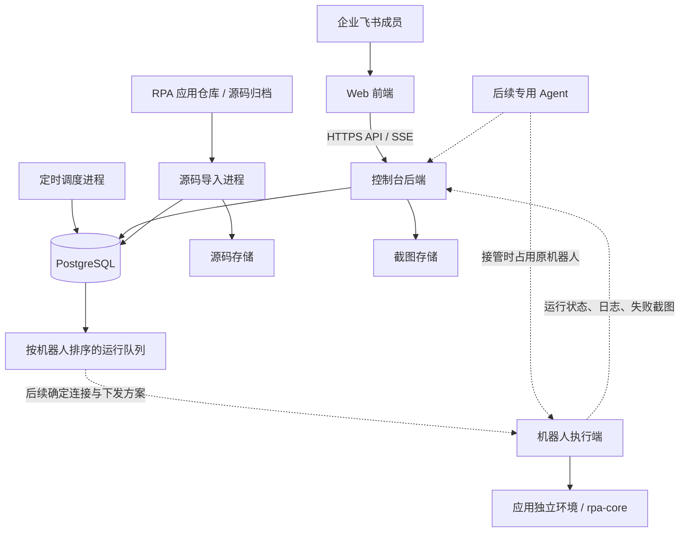
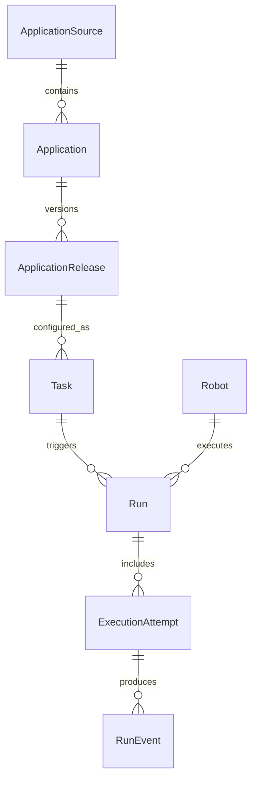

# RPA 控制台架构与应用导入方案

日期：2026-09-05

状态：架构方案，尚未实施。产品规则来自本轮已确认的设计讨论；技术选型、目录和拟增接口是实施建议。

控制台项目使用独立的 `kk-rpa-dashboard` monorepo，将 Web 前端和 Python 后端放在同一个仓库中，分别构建、运行和部署。现有 `kk-rpa-monorepo` 继续维护 RPA 应用和执行框架，作为控制台的应用来源。

本文的跨仓库链接按 `kk-rpa-dashboard` 与 `kk-rpa-monorepo` 同级存放解析。共享术语见 RPA 仓库的 [CONTEXT.md](../../kk-rpa-monorepo/CONTEXT.md)。

两者通过“应用源码、静态参数声明、现有执行契约”连接。管理员在控制台导入 `kk-rpa-monorepo`，选择识别出的应用，填写自动生成的参数表单并创建任务。程序仍在指定机器人电脑的独立环境中执行。

控制台需要应用部署能力。本方案确定应用导入内容、运行所需信息及状态边界；机器人连接方式、代码传输方式、安装发布和版本切换的具体实现另行讨论。

## 1. 已确认的产品规则

| 事项 | 约定 |
| --- | --- |
| 使用范围 | 仅本企业飞书成员可以登录 |
| 管理员 | 维护一份管理员名单，RPA 开发组成员拥有相同的全部管理权限 |
| 其他成员 | 默认只读，仅查看运行的业务日志和截图，以及定位这些内容所需的运行名称、状态和时间 |
| 应用与任务 | 一个应用可以创建多个任务，一个任务保存一套配置，可以产生多次运行 |
| 参数表单 | 每个应用声明自己的入口参数，管理员填写、保存和编辑 |
| 日期参数 | 任务保存日期规则；生成运行时解析为实际日期，排队和续跑保持原值 |
| 编辑任务 | 修改只影响之后触发的新运行；已排队、正在执行和历史运行的参数保持原值 |
| 触发来源 | 手动、定时、后续专用调度 Agent；每次有效触发独立创建运行并排队 |
| 定时 | 日、周、月和 Cron 表达式 |
| 错过定时 | 控制台停机期间错过的计划不补跑、不生成“已错过”运行；恢复后继续后续计划 |
| 执行位置 | 控制台在服务器，任务指定专用机器人电脑 |
| 并发 | 同一机器人一次执行一个任务，其余排队；不同机器人可以并行 |
| 管理操作 | 立即运行、取消排队、请求停止、从头重跑 |
| 立即运行 | 使用任务最新保存的配置，并重新解析日期规则 |
| 从头重跑 | 沿用原运行的账号和实际业务参数，从第一步执行；生成新运行并关联原记录 |
| 失败处理 | 有 Agent 接手时保留现场并交给它，接管上限 15 分钟；否则结束本次运行，继续接受后续任务 |
| 业务日志 | 实时展示中文步骤名称、进度、耗时、结果和失败原因；失败自动截图 |
| 保留期限 | 运行记录、日志和截图默认保留 30 天，管理员可以统一调整 |
| 业务文件 | 由程序按自身配置路径保存，控制台不建设报表上传、归档和下载功能 |

运行时继续遵循[核心框架设计](../../kk-rpa-monorepo/docs/rpa-framework-design.md)：有序 Step、原 `verify` 验收、准备期失败留证、账号检查和凭据隔离。控制台增加调度与管理，业务条件仍由应用负责。

## 2. 仓库、进程与部署结构

### 2.1 两个仓库的职责

| 仓库 | 维护内容 | 连接方式 |
| --- | --- | --- |
| `kk-rpa-monorepo` | `apps/*`、`rpa-core`、需求、元素、参数表单声明、各应用独立依赖与测试 | 向控制台提供可导入的源码及应用声明 |
| `kk-rpa-dashboard` | Web 前端、后端 API、导入处理、调度、队列、用户和运行记录 | 导入应用，通过后续执行端集成调用原有 RPA 程序 |

控制台数据库保存应用的索引和版本引用，应用源码继续由原仓库维护。增加应用时，为应用补齐声明后重新导入即可，控制台页面不需要为每个应用单独开发。

建议控制台目录：

```text
kk-rpa-dashboard/
├── apps/
│   ├── web/                         # React、页面、动态表单、业务日志视图
│   │   ├── src/
│   │   └── package.json
│   └── backend/                     # 一个 Python 后端项目
│       ├── src/rpa_console/
│       │   ├── api/                 # HTTP、登录、权限、SSE
│       │   ├── applications/        # 来源、静态导入、参数声明
│       │   ├── tasks/               # 任务配置、日期规则、触发
│       │   ├── runs/                # 队列、状态、执行尝试、日志
│       │   ├── scheduling/          # 定时计算与到期触发
│       │   ├── robots/              # 机器人状态与占用
│       │   ├── integrations/        # 执行端和 Agent 的集成边界
│       │   ├── storage/             # 数据库、源码与截图存储
│       │   └── entrypoints/         # API、调度、导入处理进程
│       ├── migrations/
│       ├── pyproject.toml
│       └── uv.lock
├── packages/
│   └── api-client/                  # 从后端 OpenAPI 生成的 TypeScript 客户端
├── docs/
├── deploy/                          # 控制台服务器部署配置
├── package.json
├── pnpm-workspace.yaml
└── pnpm-lock.yaml
```

`pnpm` 管理前端和生成的 API 客户端；后端使用独立的 `pyproject.toml / uv.lock / .venv`。原仓库的 RPA 应用继续保留各自环境，不加入控制台的 Python 环境。pnpm 工作区通过目录列表和 `workspace:` 引用本地包。[pnpm 工作区](https://pnpm.io/workspaces)

### 2.2 运行结构



建议服务器部署前端静态资源、后端 API、调度进程、源码导入进程、PostgreSQL，以及源码和截图存储。后端三个进程复用同一份 Python 代码和数据库：API 响应交互请求，调度进程生成到期运行，导入进程处理可能耗时的源码读取。数据库中的导入记录承载进度，HTTP 请求不等待整个源码导入过程。

前端与后端独立构建，入口可以保持同一 HTTPS 域名：`/` 提供前端，`/api/*` 转发后端。这样既保留前后端分离，也便于登录会话和 SSE 使用同源请求。生产环境使用构建后的静态资源。[Vite 静态部署](https://vite.dev/guide/static-deploy.html)

### 2.3 建议技术选型

| 部分 | 建议 | 对应需求 |
| --- | --- | --- |
| Web | React + TypeScript + Vite，Ant Design | 表格、筛选、任务编辑和运行详情 |
| 动态表单 | RJSF、Ant Design 主题、AJV 校验 | 根据导入应用的 JSON Schema 生成表单 |
| API | Python 3.12 + FastAPI | 与现有 Python 应用契约容易衔接，提供类型化 API |
| 数据访问 | SQLAlchemy + Alembic | 事务、持久化和数据库结构迁移 |
| 数据库与队列 | PostgreSQL | 任务、运行、定时状态和机器人占用共用事务 |
| 定时计算 | croniter | 计算 Cron 下一次时间；实际运行仍进入控制台队列 |
| 实时日志 | SSE + 持久化事件序号 | 页面持续接收进度，断线后按游标补读 |
| 源码和截图 | 服务端持久化存储，后端鉴权访问 | 源码导入及失败证据展示 |

RJSF 默认支持 JSON Schema draft-07，并提供 Ant Design 主题；本方案据此选择 draft-07 作为应用参数声明格式。[RJSF Schema](https://rjsf-team.github.io/react-jsonschema-form/docs/api-reference/form-props/#schema)、[Ant Design 主题](https://github.com/rjsf-team/react-jsonschema-form/tree/main/packages/antd)

后端请求和响应模型生成 OpenAPI，再生成 `packages/api-client`，前端不手工复制后端 DTO。数据库操作按事务组织，迁移脚本纳入版本管理。[FastAPI 客户端生成](https://fastapi.tiangolo.com/advanced/generate-clients/)、[SQLAlchemy 事务](https://docs.sqlalchemy.org/en/20/orm/session_transaction.html)、[Alembic 迁移](https://alembic.sqlalchemy.org/en/latest/autogenerate.html)

这里确定组件职责，不在架构文档中固定所有依赖的补丁版本；实施时选择相互兼容的稳定版本并提交各自锁文件。

## 3. 领域对象与数据归属

### 3.1 应用、任务、运行、执行尝试



| 对象 | 核心信息 |
| --- | --- |
| `ApplicationSource` 应用来源 | Git 仓库或上传来源、来源名称；访问凭据单独保护 |
| `Application` 应用 | 来源、稳定 `app_id`、名称、应用相对目录 |
| `ApplicationRelease` 应用版本 | 包版本、Git commit（若有）、源码位置、入口和该版本表单声明 |
| `Task` 任务 | 名称、选定应用版本、机器人、业务参数绑定、定时配置 |
| `Run` 控制台运行 | 来源任务、触发人/来源、计划及创建时间、应用版本、机器人、账号、实际业务参数、状态 |
| `ExecutionAttempt` 执行尝试 | 所属控制台运行、执行机本地 `run_id`、首次执行或续跑、前一次尝试及结果 |
| `Robot` 机器人 | 名称、状态、已部署版本、当前占用运行 |
| `RunEvent / Screenshot` | 执行尝试、顺序、中文业务消息、时间、结果、证据位置 |
| `User / Administrator` | 飞书企业与用户身份、展示信息、管理员名单 |
| `Settings` | 30 天保留期限、调度时区等平台设置 |

`Run` 是一次触发产生的业务执行请求；`ExecutionAttempt` 对应现有执行引擎的一次调用。现有 `resume` 每次生成新的本地 `run_id`，因此 Agent 接管后的续跑可以成为同一控制台运行下的下一次尝试。手动“从头重跑”则新建控制台运行，并记录 `rerun_of`。这样运行列表不会把一次 Agent 恢复展示成管理员又触发了一项任务。[现有续跑语义](../../kk-rpa-monorepo/docs/rpa-framework-design.md#7-agent-续跑)

控制台使用自己的 `run.id`，通过 `ExecutionAttempt.local_run_id` 关联本地记录，不覆盖原来的 `result.json`。数据库保存结构化状态、参数与事件；截图文件保存在证据存储中。

### 3.2 保存参数与凭据

任务参数分为普通业务参数与凭据。`credentials` 中的字段独立加密保存，服务端密钥与数据库分开管理；不写入普通 `Run`、业务日志、API 客户端缓存或源码包。

控制台无需账号别名，业务身份由登录凭据和预期身份校验确定。执行端按控制台 Run ID 隔离浏览器 Profile，同次接管与续跑沿用该 Profile。

管理员编辑已配置的密码时，页面显示“已配置”。未提交该字段表示沿用已保存值，显式提交新值才替换；“已配置”或星号不能作为真实密码发给程序。

生成运行时，一次事务读取任务当前配置，将实际业务参数保存到 `Run`，并为该运行保存独立加密的执行凭据。排队和执行过程中不再读取任务的新值。因此修改密码或业务配置也不会改写已经排队的请求。执行凭据仅供对应执行过程使用，终态后清除；任务仍保存用于将来运行的当前凭据。

“从头重跑”复制原账号和实际业务参数。新运行需要的凭据从当前仍属于该账号的任务凭据配置重新取得；原任务已换账号或凭据不可用时明确拒绝，不使用另一账号的密码继续执行。这是凭据加载规则，原运行的业务参数仍保持不变。

### 3.3 日期规则与固定参数

任务保存字段绑定，例如：

```json
{
  "input_bindings": {
    "target_date": {
      "kind": "relative_date",
      "offset_days": -1
    },
    "export_filename": {
      "kind": "literal",
      "value": "product-detail.xlsx"
    }
  }
}
```

建议统一使用 `Asia/Shanghai`。手动和 Agent 触发以创建运行的时间为基准；定时触发以本次计划时间为基准。解析后传给应用的仍是普通值，例如 `{"target_date": "2026-09-04", "export_filename": "product-detail.xlsx"}`。

业务日期规则与 Cron 分工明确：Cron 决定何时触发，日期规则决定报表查询哪个日期。先支持固定日期、当天、前一天及按天偏移；其他日期规则随实际应用字段加入，使用明确的类型和选项，不引入可执行表达式。

运行创建时完成表单声明的校验。机器人准备期仍执行应用原有 `load_runtime_options(RunRequest)` 校验；应用派生的最终普通参数也回传到该次运行，之后不重算。可能随时间变化的默认参数应在声明中显式表达，以便入队前固定。

## 4. 如何在控制台直接导入 RPA 仓库的应用

### 4.1 现有代码已经具备的基础

| 应用 | `app_id` | 当前包版本 | 已有普通业务输入 |
| --- | --- | --- | --- |
| 聚水潭库存导出 | `jushuitan.inventory.export_stock` | `0.5.0` | `brand_value`、`export_filename` |
| 京麦商品明细报表导出 | `jingmai.reports.export_product_detail` | `0.2.0` | `target_date`、`export_filename` |

两个应用都有 `app.toml`、`requirement.md`、`elements.toml`、独立 `pyproject.toml / uv.lock`，并导出 `program.APPLICATION`。入口均委托共享 CLI，接受 `RunRequest` 中的账号、业务输入、凭据和可选下载目录。

代码依据：[聚水潭清单](../../kk-rpa-monorepo/apps/inventory_jushuitan_export_stock/app.toml)、[聚水潭配置](../../kk-rpa-monorepo/apps/inventory_jushuitan_export_stock/pyproject.toml)、[京麦清单](../../kk-rpa-monorepo/apps/report_jingmai_export_product_detail/app.toml)、[京麦配置](../../kk-rpa-monorepo/apps/report_jingmai_export_product_detail/pyproject.toml)、[共享运行入口](../../kk-rpa-monorepo/packages/rpa-core/src/rpa_core/cli.py)。

目前缺少可供网页生成表单的静态声明。控制台可以识别这两个应用，但在补齐声明之前，应显示“缺少参数表单声明”，不能把它们标为已具备完整控制台接入能力。

### 4.2 导入内容必须保留仓库布局

当前两个应用通过 `../../packages/rpa-core` 引用本地共享包，锁文件也记录了这个相对来源；程序使用 `Path(__file__).resolve().parents[2]` 找到应用目录，再读取需求、元素和配置。只复制一个 Python 文件、一个 `apps/<name>` 目录或一个未经调整的 wheel，都不能完整承载当前应用。

导入源代码需要保留：

```text
source-root/
├── apps/
│   ├── inventory_jushuitan_export_stock/
│   └── report_jingmai_export_product_detail/
└── packages/
    └── rpa-core/
```

首版保留完整仓库源码布局，由管理员选择其中哪些应用进入控制台应用列表。机器人部署阶段再在各应用目录建立独立环境，按原锁文件同步依赖。`uv` 的相对路径依赖需要对应源码路径；将所有应用改成一个 uv workspace 会共享工作区锁文件，不符合当前应用独立环境约定。[uv 路径依赖](https://docs.astral.sh/uv/concepts/projects/dependencies/)、[uv 工作区](https://docs.astral.sh/uv/concepts/projects/workspaces/)

源码内容只包含程序、依赖声明、需求、元素、表单声明和示例配置。`.env`、`config/stores.local.toml`、`profiles/`、`runs/`、`runtime/` 和 `.venv/` 不进入导入内容。配置与凭据在任务配置或执行机本地维护。

### 4.3 管理员导入流程

主入口放在“应用 → 导入应用”：

1. 选择来源。推荐连接 `kk-rpa-monorepo` 的 Git 地址并选择分支、tag 或 commit；只有本地源码时，可以上传保留仓库布局的 ZIP。
2. 后端创建导入记录，导入进程读取源码。Git 分支或 tag 解析成实际 commit，作为此次导入的来源版本。
3. 静态扫描 `apps/*/app.toml`，读取应用身份、包版本、Python 要求、入口与表单声明。
4. 展示预览：应用名称、`app_id`、版本、参数表单预览、缺失文件或声明错误。
5. 管理员勾选应用并确认导入，建立应用及版本记录。
6. 导入完成后，可以进入应用页创建任务；实际运行需要目标机器人已有对应部署且任务配置完整。

ZIP 沿用同样的扫描和校验流程。没有 Git 信息时按包版本标识来源，界面如实显示来源为上传包；再次上传不能覆盖同一应用的已有版本，需要更新包版本。Git 来源按原生 commit 和包版本标识，不建立需求哈希、指令注册表或额外的快照锁。

同一来源下的 `app_id` 是稳定应用身份：重复导入相同版本返回已有结果，导入新版本归入原应用，不重复创建任务。不同来源的同名应用保留来源标识，不互相覆盖。

扫描阶段只解析 TOML、JSON 和普通文件，不导入应用 Python 模块、不执行构建脚本、不安装依赖或启动浏览器。读取的路径限制在此次源码根目录内；ZIP 越界条目、逃逸的符号链接和远程 Schema 引用应拒绝。源码导入只向管理员开放。

导入完成与部署完成使用不同状态。缺少机器人连接方案时可以完成真实的静态导入、表单预览和任务保存，运行入口应显示具体的部署阻塞原因。

### 4.4 后续更新应用

开发组在原仓库更新代码和表单声明，按包与 Git 管理版本。控制台重新读取来源并展示新增版本，由管理员选择任务要采用的版本。导入新版本本身不切换任务、不改变排队运行。

任务切换应用版本时重新校验已保存参数；新增必填项或被删除字段需要管理员处理后保存。源码版本、任务选定版本、机器人实际部署版本分别可见。

机器人端如何安装、切换版本以及保持 Profile 和历史运行目录，属于后续部署方案。当前程序依赖应用目录定位资源，这项约束必须带入部署设计，不能把一次源码拉取直接当成部署完成。

## 5. 应用与控制台之间的最小接入契约

### 5.1 每个应用增加静态表单声明

保留现有三个清单字段，在 `app.toml` 中增加可选的 `[console]`。以下为拟新增格式，当前两个应用还没有这些字段和文件：

```toml
app_id = "jingmai.reports.export_product_detail"
name = "京麦商品明细报表导出"
entrypoint = "report_jingmai_export_product_detail.cli:main"

[console]
contract_version = 1
application = "report_jingmai_export_product_detail.program:APPLICATION"
form_schema = "form.schema.json"
ui_schema = "form.ui.json"
```

`contract_version` 仅表示声明格式，不是应用版本。应用版本仍读取 `pyproject.toml` 和 Git。`application` 指向现有 `ApplicationDefinition` 对象，只在执行机的应用环境中加载；`entrypoint` 保持原 CLI 入口。

`form.schema.json` 声明控制台接受的 `inputs / credentials` 参数结构；内部 Profile 标识由执行桥生成。京麦示例：

```json
{
  "$schema": "http://json-schema.org/draft-07/schema#",
  "title": "京麦商品明细导出参数",
  "type": "object",
  "additionalProperties": false,
  "required": ["inputs", "credentials"],
  "properties": {
    "inputs": {
      "type": "object",
      "title": "业务参数",
      "additionalProperties": false,
      "required": ["target_date", "export_filename"],
      "properties": {
        "target_date": {
          "type": "string",
          "title": "报表日期",
          "format": "date"
        },
        "export_filename": {
          "type": "string",
          "title": "导出文件名",
          "default": "product-detail.xlsx",
          "pattern": "^[A-Za-z0-9][A-Za-z0-9._-]{0,254}$"
        }
      }
    },
    "credentials": {
      "type": "object",
      "title": "登录配置",
      "additionalProperties": false,
      "required": ["username", "password", "expected_identity"],
      "properties": {
        "username": {
          "type": "string",
          "title": "登录账号",
          "minLength": 1,
          "writeOnly": true
        },
        "password": {
          "type": "string",
          "title": "登录密码",
          "minLength": 1,
          "writeOnly": true
        },
        "expected_identity": {
          "type": "string",
          "title": "预期登录身份",
          "minLength": 1,
          "writeOnly": true
        }
      }
    }
  }
}
```

`form.ui.json` 只补充界面行为：

```json
{
  "inputs": {
    "target_date": {
      "ui:field": "DateBindingField",
      "ui:options": {
        "allowedRules": ["fixed", "relative_date"]
      }
    }
  },
  "credentials": {
    "password": {
      "ui:widget": "password"
    }
  }
}
```

`DateBindingField` 是拟在控制台实现的字段组件：编辑时保存第 3.3 节的固定值或日期绑定；生成运行时转换成 Schema 要求的普通日期字符串。它不是 RJSF 自带的日期规则引擎。应用只能引用控制台支持的组件名称，不能从源码包向网页注入任意 JavaScript。

聚水潭采用相同结构，将 `inputs` 改为 `brand_value / export_filename`，其 `application` 为 `inventory_jushuitan_export_stock.program:APPLICATION`。表单字段定义随应用一起维护，不集中到控制台中手工登记。

### 5.2 声明与原有校验的职责

- Schema 负责字段形状、类型、必填项、基本约束和敏感标记；UI 文件负责显示与日期规则选择。
- 保存任务时校验固定值和日期绑定类型；生成运行时解析日期，再校验完整实际参数。
- 执行机使用应用原有 `load_runtime_options` 完成业务参数与运行配置校验，随后按原 `execute / verify` 执行。
- `writeOnly` 和密码控件只是声明与显示提示。后端还必须实施加密存储、响应过滤和日志脱敏。
- `requirement.md` 继续是可读需求基线；Step 输出、成功条件和元素仍由原应用维护，不另建步骤注册表或执行语言。

已有任务编辑时，服务端先合并未修改的受保护字段，再校验有效配置。浏览器只收到哪些字段“已配置”，不会拿到已保存的凭据。

接入测试应检查声明键与应用实际接受的键一致，以及合法表单参数能够通过应用准备期校验。字段变化时同步修改声明和原校验，不能靠网页放宽规则。

### 5.3 执行映射与需要补齐的核心能力

执行适配层将控制台运行映射为已有入口的数据：

```python
request = RunRequest(
    account_id="RUN_" + console_run.id.replace("-", "").upper(),
    inputs=console_run.resolved_inputs,
    credentials=decrypted_run_credentials,
)
```

下载目录继续由应用配置解析。控制台既不提供通用文件归档路径，也不要求程序把业务文件上传回来。运行结果中可以保留实际路径作为管理员诊断信息，只读业务视图不展示机器路径。

现有公共入口支持 CLI 与恢复上下文，完整运行准备封装在 `rpa_core.cli._execute` 中。后续应从这里整理一个供执行适配层调用的公共运行入口，复用配置加载、浏览器生命周期、`Runner` 和失败记录；CLI 继续调用同一实现。具体函数签名在实施时确定。

还需补齐三项框架能力：

| 能力 | 实施位置与要求 |
| --- | --- |
| 中文业务进度 | 从已有 `StepSpec.name` 发出步骤名称、序号、总数和结果，供事件展示；不增加第二份步骤定义 |
| 请求停止 | 在步骤边界读取停止请求，当前步骤完成执行与校验后不进入下一步；保留已完成结果 |
| 失败自动截图 | 在失败收尾、浏览器仍可用时截图；准备期没有浏览器或截图失败时记录原因，不改变原失败结论 |

这些是待实现的接入能力。当前 `rpa-core 0.8.0` 的运行状态只有 `running / succeeded / failed`，不能直接宣称已经支持控制台的取消、停止与接管状态。

## 6. 调度、队列和运行状态

### 6.1 统一触发

手动、定时和 Agent 都调用同一段后端业务逻辑：读取任务 → 固定参数 → 创建 `Run` → 排队。Agent 以独立的服务身份接入，只能在授权应用与任务范围内触发和查询；其内部规划与接管实现留待后续。

每个独立操作创建新的触发标识。网络重发同一次请求复用该标识，避免一次点击产生两项运行；两次主动点击、不同定时点或不同 Agent 调用均创建独立运行。定时触发以 `task_id + scheduled_for` 保证同一计划点只入队一次。这些标识用于请求去重，不是一次性运行授权。

任务选择明确的应用版本。创建运行时保存该版本和机器人引用，已排队运行不随任务编辑、应用导入或版本选择而切换。从头重跑建议同时沿用源运行的应用版本和机器人；不可用时显示原因，由管理员处理对应部署，避免静默换环境。

### 6.2 定时规则

建议首版采用五段 Cron：`分 时 日 月 星期`，调度与业务日期统一按 `Asia/Shanghai` 解释。日、周、月表单生成相同的 Cron 配置，高级模式直接填写表达式，保存前展示接下来五个触发时间。

例如每日 08:00 为 `0 8 * * *`，每周一 08:00 为 `0 8 * * 1`，每月 1 日 08:00 为 `0 8 1 * *`。使用 croniter 校验与计算时间，保留标准 Cron 的日期与星期匹配语义；界面预览帮助管理员确认实际触发日期。[croniter 文档](https://github.com/pallets-eco/croniter/blob/main/README.rst)

调度进程在同一事务中创建到期运行并推进下一次时间。重启时从当前时刻重新计算后续计划，不遍历停机期间的历史计划、不生成补跑或“已错过”记录。已经入库排队的运行继续保留，这与停机期间未触发的计划不同。

关闭定时只影响未来计划，已经入队的运行由“取消排队”处理。

### 6.3 单机器人占用

PostgreSQL 保存队列和 `Robot.active_run_id`。领取运行时在短事务中锁定机器人行，确认没有占用，再选择该机器人最早入队的一项运行并同时写入占用和状态。长时间的业务执行不持有数据库事务。

任务按入队序号排序，同一机器人串行，不同机器人分别领取。即使使用 `SKIP LOCKED` 跳过其他消费者锁定的队列项，也必须独立维护机器人占用；单独锁运行行无法证明同一机器人没有其他正在执行的运行。这是本方案的并发设计。[PostgreSQL 行锁与队列用途](https://www.postgresql.org/docs/current/sql-select.html#SQL-FOR-UPDATE-SHARE)

执行端对同一控制台运行必须识别重复下发，不能因重试通信再启动一份程序。通信中断、启动答复丢失或 Agent 结束状态未确认时，先核对现场状态，不把“没有收到消息”视为机器人空闲。这些是后续连接方案需要满足的状态契约，本轮不选具体传输协议。

### 6.4 状态与操作

| 状态 | 含义与管理员操作 |
| --- | --- |
| 排队中 | 尚未执行；可以取消排队 |
| 启动中 | 已占用机器人，正在准备应用；可记录停止请求 |
| 运行中 | 执行程序；可以请求停止 |
| 停止中 | 停止请求已记录，等待当前步骤结束和执行端确认 |
| Agent 接管中 | 保留现场，机器人仍由原运行占用，接管预算最多 15 分钟 |
| 成功 | 最终执行尝试通过原 `verify` |
| 失败 | 准备或执行失败，且没有接管成功 |
| 已取消 / 已停止 | 分别表示取消排队或执行期间按请求停止 |
| 状态待确认 | 无法确认执行是否已经结束，继续保持占用直至核对完成 |

从头重跑新建 `Run`，原运行不覆盖。请求停止采用步骤边界协作停止，不能把请求已接收显示为已停止；操作触发前运行已结束时，保留已经确定的终态。

### 6.5 失败与 Agent 接管

1. 某次执行尝试失败，写入原失败记录并尝试截图。
2. 有可用 Agent 且实际接手时，将控制台运行转为接管中，保持同一机器人占用。
3. Agent 使用原接管和续跑契约处理现场；每次 `resume` 的本地结果归入新的 `ExecutionAttempt`。
4. 接管成功由原步骤 `verify` 和最终执行结果判定，Agent 的文字说明不能直接标记成功。
5. 没有 Agent、Agent 放弃或达到 15 分钟上限时，结束接管并收尾本次会话；确认本次执行已结束后释放机器人，继续队列。

15 分钟限制的是 Agent 接管工作预算。若执行端无法确认已经停止，进入“状态待确认”，避免下一次运行与旧 Agent 同时操作。具体的停止确认、连接恢复和现场清理方式在机器人方案中落实。

独立 CLI 的失败保留浏览器语义继续有效。控制台决定不接管时，由执行适配层结束其管理的失败会话；不在核心层增加自动写入补偿或无条件业务重试。

## 7. 登录、业务日志与截图

### 7.1 飞书登录和权限

采用飞书授权码登录：后端验证登录 `state`，交换用户令牌并获取身份，校验 `tenant_key` 属于配置的企业，然后建立控制台会话。用户身份使用企业与 `open_id`，不使用邮箱域名代替企业归属判断。[飞书网站登录](https://open.feishu.cn/document/common-capabilities/sso/web-application-end-user-consent/guide)、[用户身份字段](https://open.feishu.cn/document/server-docs/authentication-management/login-state-management/get)

会话使用服务端管理的安全 Cookie；前端不保存飞书访问令牌或应用密钥。管理员名单在后端维护，其他通过企业校验的成员默认只读。首次部署从服务端配置写入初始管理员，之后通过页面管理名单。

只读权限同时落实到 API、SSE 和截图读取。提供独立的业务视图响应，只包含运行名称、状态、时间、业务进度和截图。任务配置、凭据、源码、部署信息、机器路径、原始诊断及写操作仅向管理员开放。

### 7.2 日志数据流

执行端继续保存本地 `result.json / events.jsonl`，同时按顺序上报事件；后端持久化后通过 SSE 推给页面。每条事件包含控制台运行、执行尝试、本地事件标识、步骤、时间及业务消息，同一事件重传不重复显示。

SSE 使用事件序号作为游标，断线重连后补读缺失事件，再继续实时显示；关键状态以数据库和执行结果为准。SSE 的 `id` 与重连机制适合这类单向进度展示。[SSE 事件与重连](https://developer.mozilla.org/en-US/docs/Web/API/Server-sent_events/Using_server-sent_events)

业务日志示例为“选择品牌：开始”“下载报表：完成，耗时 12 秒”“登录检查：失败，当前身份不符合任务要求”。实际参数、完整返回对象、密码和异常堆栈不能直接拼入只读消息。

截图由执行端在失败时生成并传到控制台证据存储。截图通过鉴权的证据接口读取，不暴露任意文件路径；产生截图前处理可见凭据。无法安全生成截图时记录缺少截图的原因。业务下载文件不进入这条通道。

### 7.3 保留和清理

默认从运行进入终态起保留记录、日志与截图 30 天，管理员统一修改保留天数。活跃运行保留至结束，清理不删除任务定义、应用来源、任务当前凭据或业务下载文件。

清理覆盖控制台自身的数据库记录和截图；仍在保留期的新运行不因其源运行过期而被级联删除，来源关联显示已过期。执行机本地证据如何同步清理作为后续执行端集成职责确认，不将程序的下载目录纳入清理范围。

## 8. 前端页面与后端 API

### 8.1 页面结构

| 页面 | 管理员功能 | 只读成员 |
| --- | --- | --- |
| 总览 | 运行、排队、失败和机器人状态 | 进入业务运行列表 |
| 应用 | 导入来源、预览应用及表单、查看版本；部署入口后续实现 | 无 |
| 任务 | 创建、编辑保存、指定机器人、定时启停、立即运行 | 无 |
| 运行记录 | 筛选、参数、尝试明细、日志和截图；取消、停止、重跑 | 业务日志和截图视图 |
| 机器人 | 状态、当前占用、排队列表、已部署版本 | 无 |
| 管理设置 | 管理员名单、记录保留期限 | 无 |

创建任务的主流程为“选择应用与版本 → 填写表单 → 指定机器人 → 配置定时 → 保存”。保存完成不立即执行，使用独立的“立即运行”按钮触发。编辑保存和启动运行均由服务端校验。

### 8.2 拟增 API

以下路径是控制台接口建议，均尚未实现：

| 接口 | 职责 |
| --- | --- |
| `GET /api/auth/feishu/login`、`GET /api/auth/feishu/callback` | 飞书登录 |
| `GET /api/me` | 当前身份和权限 |
| `POST /api/application-imports` | 创建 Git 或源码包导入 |
| `GET /api/application-imports/{id}` | 进度、应用预览、声明错误 |
| `POST /api/application-imports/{id}/confirm` | 确认选中的应用进入应用列表 |
| `GET /api/applications`、`GET /api/applications/{id}/releases` | 应用与来源版本 |
| `GET /api/application-releases/{id}/form` | 该版本的表单声明 |
| `POST /api/tasks`、`PATCH /api/tasks/{id}` | 创建与编辑任务 |
| `POST /api/tasks/{id}/runs` | 手动或 Agent 触发，使用任务配置 |
| `GET /api/runs`、`GET /api/runs/{id}` | 管理员运行视图 |
| `POST /api/runs/{id}/cancel`、`POST /api/runs/{id}/stop` | 取消排队、请求停止 |
| `POST /api/runs/{id}/rerun` | 复制原账号及实际业务参数，从头重跑 |
| `GET /api/business/runs`、`GET /api/business/runs/{id}` | 只读业务视图 |
| `GET /api/business/runs/{id}/events` | 按权限过滤的实时业务事件 |
| `GET /api/business/screenshots/{id}` | 鉴权读取截图 |
| `GET /api/robots`、`GET /api/robots/{id}/queue` | 管理员机器人与队列视图 |
| `GET /api/admins`、`PUT /api/admins/{user_id}` | 管理员名单维护 |
| `GET /api/settings`、`PATCH /api/settings` | 平台设置 |

“触发任务”接口不接受临时改写业务参数；需要改配置时先保存任务。“重跑”接口从源运行读取参数，不相信浏览器重新提交的历史参数。所有写接口都验证身份与权限。

执行端和恢复 Agent 的私有接口本轮只明确职责：确认部署版本、领取已分配运行、报告状态与事件、接收停止或接管结束要求。它们的路径和传输协议随机器人连接方案确定。

## 9. 实施顺序与验收

| 阶段 | 交付 | 验收重点 |
| --- | --- | --- |
| 1. 应用导入契约 | 两个应用补齐 `[console]` 与表单声明；静态读取与校验 | 识别两个真实 `app_id`；展示正确字段；不启动应用；缺依赖路径或声明时报出具体原因 |
| 2. 控制台基础 | 前后端 monorepo、飞书登录、管理员名单、应用导入与任务表单 | 企业外身份拒绝；普通成员只能读业务视图；任务参数可保存；凭据不回显 |
| 3. 任务与运行 | 固定参数、日周月 Cron、队列、运行记录、实时业务日志页面 | 两次有效触发独立排队；已排队参数不随编辑改变；跨天重跑保留原日期；重启不补跑错过计划 |
| 4. 执行框架接入 | 公共运行调用、中文事件、步骤边界停止、失败截图、尝试关联 | 原 `verify` 保持有效；准备失败留证；停止不进入下一步；Agent 续跑结果正确归入原控制台运行 |
| 5. 机器人与发布 | 在后续讨论确定的方案上实现部署、连接与任务下发 | 真实机器人安装指定应用版本；单机互斥；失败收尾与 15 分钟接管；断连后核对状态 |

阶段 1–4 可以先用受控测试执行端验证控制台流程，页面应明确测试环境；这些结果不作为真实机器人部署或浏览器运行通过的证据。正式执行依赖阶段 5 完成，不以“已导入”代替“已部署”。

RPA 应用仓库（`kk-rpa-monorepo`）后续需要修改的范围：

- 两个应用的 `app.toml` 以及新增的 `form.schema.json / form.ui.json`；字段与各自业务输入对应。
- `rpa-core` 的运行公共入口、事件、停止检查和失败截图；保留现有 CLI 与接管验收契约。
- 应用生成规则增加控制台参数声明要求，使以后生成的应用能直接走同一导入流程。
- 对应的离线验收：表单与程序输入一致、无凭据泄漏、原正常与反例场景仍有效。

控制台侧验收还应覆盖：修改任务后排队请求不变、请求重发不重复入队、同时领取不占用同一机器人、只读 API/SSE/截图权限一致、接管超时后旧执行不能继续操作、保留期清理不影响活跃运行和业务文件。

当前仅完成本架构文档与术语整理。源码导入器、Schema 文件、Web/API、部署及执行端集成都尚未实施。下一步可以先落实应用导入契约和静态导入预览，为机器人连接与发布方案提供明确输入。
