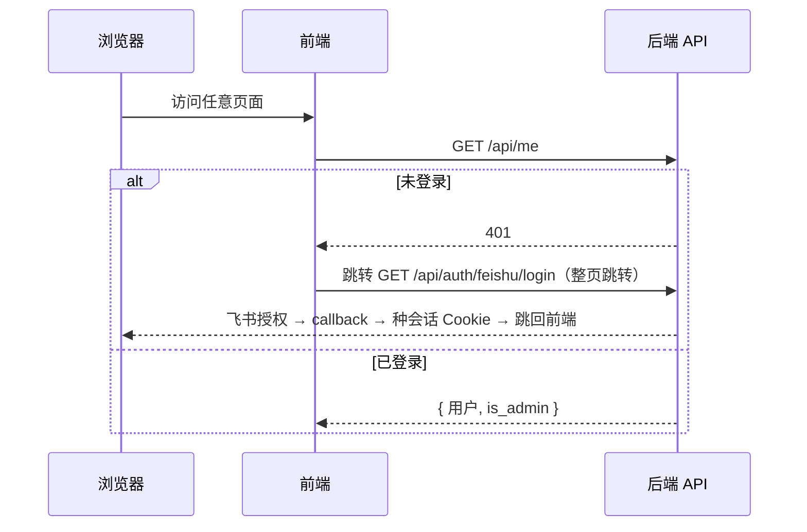
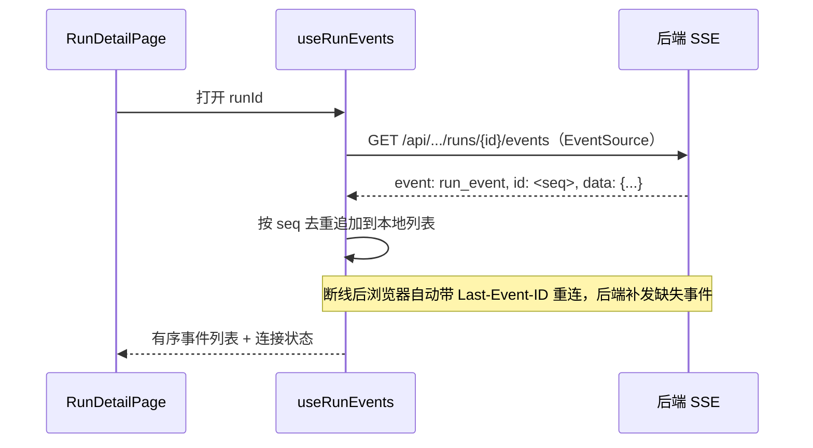
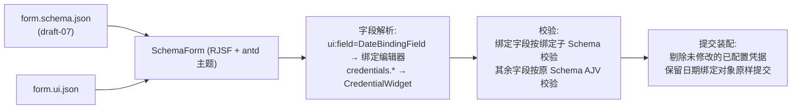

# RPA 控制台前端方案

日期：2026-09-05

状态：前端设计方案，尚未实施。范围限定在 [RPA 控制台架构与应用导入方案](rpa-console-architecture.md) 第 2、7、8 节已定内容：React + TypeScript + Vite + Ant Design、RJSF 动态表单、同源部署、飞书会话 Cookie、SSE 实时日志。本文不新增产品规则，只把架构文档中的页面与接口落成前端结构；架构未定的事项（机器人连接协议、执行端接口路径）在前端只保留占位状态，不做假设性设计。

## 1. 范围与前提

| 前提 | 来源 | 对前端的约束 |
| --- | --- | --- |
| 同源部署 | 架构 §2.2 | `/` 静态资源、`/api/*` 后端；会话 Cookie 与 SSE 均走同源请求，前端不处理令牌 |
| 两种角色 | 架构 §1、§7.1 | 管理员全量页面；普通成员只有业务运行视图。权限以服务端为准，前端只做路由与控件级隐藏 |
| 页面清单 | 架构 §8.1 | 总览、应用、任务、运行记录、机器人、管理设置六组页面，外加只读业务视图 |
| 接口清单 | 架构 §8.2 | 前端只消费列出的接口；凭据字段遵循 `writeOnly` 与“已配置”语义 |
| 表单声明 | 架构 §5.1 | JSON Schema draft-07 + `form.ui.json`；只允许引用控制台内置组件，不执行源码包中的任何代码 |
| 日期规则 | 架构 §3.3 | 任务保存绑定对象，前端不解析日期；首版只支持固定日期与按天偏移 |

## 2. 技术选型

| 依赖 | 用途 | 理由 |
| --- | --- | --- |
| React 18 + TypeScript + Vite | 应用骨架 | 架构已定 |
| Ant Design 5 + `@ant-design/icons` | 组件库 | 表格、筛选、表单、Steps 导入向导；中文语境成熟 |
| `@rjsf/core` + `@rjsf/antd` + `@rjsf/validator-ajv8` | 动态表单 | 架构已定；AJV8 校验 draft-07 |
| React Router 6 | 路由 | 角色路由守卫、嵌套布局 |
| TanStack Query | 服务端状态 | 列表缓存、轮询、变更失效；不引入 Redux |
| `openapi-typescript` + `openapi-fetch` | API 客户端 | 从后端 OpenAPI 生成类型，配合极小的 fetch 封装；客户端本体不手抄 DTO |
| 原生 `EventSource` | SSE | 同源 Cookie 天然可用，`Last-Event-ID` 自动带游标重连，符合架构 §7.2 |
| `cron-parser` | Cron 预览 | 在浏览器计算接下来五个触发时间，带 `tz: 'Asia/Shanghai'`；保存时仍由后端 croniter 校验，服务端是最终依据 |
| `dayjs` | 时间展示 | Ant Design 5 默认依赖，统一 `Asia/Shanghai` 展示 |
| Vitest + Testing Library + MSW | 测试 | 组件与数据变换逻辑 |

刻意不引入：Redux/Zustand（服务端状态由 TanStack Query 承载，本地状态极少）、Tailwind（Ant Design 5 cssinjs 足够）、图表库（总览页首版只用统计卡片与表格，不做趋势图）。

`packages/api-client` 的生成产物保持架构原意（OpenAPI → TypeScript），但只生成**类型**加 `openapi-fetch` 泛型客户端，不生成每个端点的封装函数。 hooks 层在 `apps/web` 内手写，约二十个接口的样板量可控，且变更失效逻辑（如触发运行后失效运行列表）需要在 hooks 层显式表达，生成的代码不适合承载。

## 3. 目录结构

```text
apps/web/
├── index.html
├── vite.config.ts                  # dev 代理 /api → 后端
├── package.json
└── src/
    ├── main.tsx                    # ConfigProvider(zhCN) + QueryClient + Router
    ├── api/
    │   ├── client.ts               # openapi-fetch 实例、错误归一化
    │   ├── queries/                # 按领域划分的 query/mutation hooks
    │   │   ├── applications.ts
    │   │   ├── tasks.ts
    │   │   ├── runs.ts
    │   │   ├── robots.ts
    │   │   └── admin.ts
    │   └── sse.ts                  # useRunEvents / useBusinessRunEvents
    ├── auth/
    │   ├── session.ts              # useMe()，GET /api/me
    │   └── guards.tsx              # RequireAdmin / RequireMember 路由守卫
    ├── form/
    │   ├── SchemaForm.tsx          # RJSF 封装：主题、校验、提交值装配
    │   ├── DateBindingField.tsx    # 固定日期 / 按天偏移绑定编辑器
    │   ├── CredentialWidget.tsx    # “已配置”密码控件
    │   ├── binding-schema.ts       # 校验用 Schema 变换
    │   └── submit.ts               # 提交值装配：剔除未改凭据、保留绑定对象
    ├── schedule/
    │   ├── ScheduleEditor.tsx      # 日/周/月/高级 Cron 编辑
    │   └── cron.ts                 # 表单值 → Cron、接下来五次触发计算
    ├── pages/
    │   ├── overview/OverviewPage.tsx
    │   ├── applications/
    │   │   ├── ApplicationListPage.tsx
    │   │   ├── ApplicationDetailPage.tsx    # 版本列表、表单预览
    │   │   └── import/
    │   │       ├── ImportWizardPage.tsx     # Steps 向导
    │   │       └── ReleaseFormPreview.tsx
    │   ├── tasks/
    │   │   ├── TaskListPage.tsx
    │   │   ├── TaskCreatePage.tsx           # 选择应用版本 → 表单 → 机器人 → 定时
    │   │   └── TaskEditPage.tsx
    │   ├── runs/
    │   │   ├── RunListPage.tsx
    │   │   └── RunDetailPage.tsx            # 参数、尝试明细、日志、截图、操作
    │   ├── business/
    │   │   ├── BusinessRunListPage.tsx
    │   │   └── BusinessRunDetailPage.tsx    # 只读：进度、日志、截图
    │   ├── robots/RobotListPage.tsx
    │   └── settings/SettingsPage.tsx        # 管理员名单、保留期限
    ├── components/                 # RunStatusTag、TriggerSourceTag、TimeText 等纯展示
    └── routes.tsx
```

`form/`、`schedule/`、`api/` 不依赖具体页面，页面只负责数据装配与布局。

## 4. 会话、路由与权限

### 4.1 登录流程



- 未登录不做前端路由内拦截页，直接整页跳转 `/api/auth/feishu/login`，callback 完成后回到原路径（`next` 参数由后端校验白名单）。
- `useMe()` 是全局唯一的身份来源，Query 缓存 key `['me']`；401 一律视为未登录并触发跳转，不在页面内分别处理。
- 前端不保存任何令牌；登出调用后端登出接口后清 Query 缓存并跳转登录。

### 4.2 路由结构

```text
/                        → 总览（管理员）/ 重定向到 /business/runs（普通成员）
/applications            → 应用列表          ┐
/applications/import     → 导入向导          │
/applications/:id        → 应用详情          │
/tasks                   → 任务列表          │ RequireAdmin
/tasks/new               → 创建任务          │
/tasks/:id/edit          → 编辑任务          │
/runs                    → 运行记录          │
/runs/:id                → 运行详情          ┘
/robots                  → 机器人            ┐ RequireAdmin
/settings                → 管理设置          ┘
/business/runs           → 业务运行列表      ┐ RequireMember（两种角色均可访问）
/business/runs/:id       → 业务运行详情      ┘
```

- `RequireAdmin`：`useMe()` 返回 `is_admin=false` 时重定向到 `/business/runs`，不渲染页面骨架，避免闪现无权内容。
- 普通成员的导航只保留“业务运行”一项；管理员导航含全部七项。
- 路由隐藏只是体验层；API、SSE、截图的权限以后端为准（架构 §7.1），前端不假设“页面看不到即安全”。

## 5. API 访问层

### 5.1 客户端

`packages/api-client` 由后端 OpenAPI 生成 `schema.d.ts`；`apps/web/src/api/client.ts` 用 `openapi-fetch` 创建实例，统一处理：

- `credentials: 'same-origin'`，不设置任何 Authorization 头。
- 错误归一化：非 2xx 解析后端错误体，抛出带 `status / code / message` 的 `ApiError`；401 触发登录跳转，403 由页面渲染“无权限”提示。
- mutation 统一走 TanStack Query `useMutation`，成功后按领域失效相关 query key（如 `runs.create` 失效 `['runs']` 与 `['robots']`）。

### 5.2 触发幂等

架构 §6.1 要求每个独立触发操作携带新标识、网络重发复用同一标识。前端实现：

- “立即运行”点击时生成一次 UUID 作为触发标识，放入请求体字段；本次点击后续的自动重试复用该值。
- 再次点击生成新 UUID，对应一次新的有效触发。
- React Query 的 `retry` 对写接口关闭（`retry: false`），重试只由用户显式操作或 fetch 层对网络错误的一次同标识重发构成，避免客户端悄悄放大语义。

### 5.3 列表与轮询

- 运行列表、机器人列表这类状态会变的页面用 TanStack Query `refetchInterval` 低频轮询（运行列表 10 秒，机器人 15 秒），仅补足状态变化；进度日志不走轮询，走 SSE。
- 运行详情页在运行处于非终态时轮询运行本身（状态、尝试明细），终态后停止。

## 6. 实时日志（SSE）

### 6.1 数据流



- 原生 `EventSource`，同源 Cookie 鉴权；不引入需要自定义 Header 的 SSE 库——`EventSource` 不支持自定义 Header，而同源会话 Cookie 已满足鉴权，这是选型上的有意约束。
- 管理员视图用 `GET /api/runs/{id}/events`，只读成员视图用 `GET /api/business/runs/{id}/events`（架构 §8.2），两条路由共用同一 hook，只换 URL。
- hook 内维护 `lastSeq`，按 `id` 去重排序；连接状态（连接中/已断开重连中）展示在日志区顶部，终态收到后主动 `close()`。
- 运行状态本身（排队中→运行中→成功）仍以 §5.3 的运行轮询为准，SSE 只承载事件流；SSE 消息不用于改写运行终态，避免断线期间错过状态。

### 6.2 日志渲染

- 事件按架构 §7.2 的中文业务消息逐条渲染：步骤名称、进度（当前步骤/总步骤）、耗时、结果；失败条目红色并关联截图缩略图。
- 自动滚动：用户停留底部时跟随新事件，向上滚动后解除跟随并显示“回到底部”按钮——长任务日志的常规处理方式。
- 截图通过 ``（或管理员侧对应路径）同源带 Cookie 加载，不经过 fetch 转 blob；加载失败显示占位与原因提示。

## 7. 动态表单

这是前端最复杂的部分，对应架构 §5.1 的 `[console]` 声明。

### 7.1 装配流程



### 7.2 日期绑定字段

- 任务层数据模型与架构 §3.3 一致：`input_bindings` 中日期字段保存 `{kind: 'fixed', value: 'YYYY-MM-DD'}` 或 `{kind: 'relative_date', offset_days: n}`，普通字段保存 `{kind: 'literal', value}`。表单内部对 literal 直接编辑裸值，提交时统一包装。
- `DateBindingField` 渲染为一个 Segmented（固定日期 / 相对日期）加对应输入：固定日期用 `DatePicker`，相对日期用“今天 ± N 天”的 `InputNumber`（首版只开放按天偏移，负数为向前）。可选规则受 `ui:options.allowedRules` 限制。
- 编辑已有任务时，从任务的 `input_bindings` 还原绑定对象；创建时默认 `relative_date, offset_days: -1`（对应最常见的“跑前一天”），默认值在字段组件内定义，不写死在页面里。
- 相对日期旁静态提示“生成运行时解析为实际日期”，不尝试在前端演示未来某次的解析结果——解析基准（手动触发按创建时间、定时按计划时间，架构 §3.3）在前端无法预知，演示会误导。

### 7.3 Schema 校验变换

原 Schema 把日期字段声明为 `"type": "string", "format": "date"`，而任务表单提交的是绑定对象，直接用原 Schema 校验绑定对象必然失败。处理：

- 提交前校验分两段：
  1. **绑定结构校验**：遍历 ui schema，凡 `ui:field: DateBindingField` 的字段，用一个前端内置的绑定子 Schema（`fixed | relative_date`，`offset_days` 限定整数范围）校验。
  2. **业务形状校验**：把绑定对象中的 literal 值与固定日期还原成普通值，组装出一份“假设今天解析”的普通参数，再用原 Schema 走 AJV8。这样 `required`、`pattern`、枚举等业务约束仍在前端即时反馈。
- 相对日期跳过第二段中该字段的格式校验（无实际值可验），其最终校验发生在后端生成运行时（架构 §3.3）。两段校验的报错统一汇入 RJSF 的 `extraErrors`，展示位置与普通字段一致。
- 后端保存任务时仍以服务端校验为准；前端校验只为即时反馈，不承担安全职责。

### 7.4 凭据字段（“已配置”语义）

架构 §3.2：已配置的凭据不回显，未提交表示沿用，显式提交才替换，“已配置”字样不能作为真实密码下发。

- `CredentialWidget`：编辑已保存任务时，服务端在任务详情中对已配置字段返回 `{configured: true}` 标记（不返回值）。控件渲染为禁用态输入框 + “已配置”占位 + “修改”按钮；点击后变为可输入的新密码框，并提供“取消修改”回到沿用态。
- 提交装配（`form/submit.ts`）时，凡仍处于沿用态的凭据字段**从提交体中剔除**，只有显式输入新值的字段才出现在 `credentials` 中。前端任何代码路径都不会把占位文本写进提交值——装配函数对凭据对象按字段白名单重建，不接受表单数据透传。
- `writeOnly` 字段不会出现在 GET 响应中，这一约束由后端保证；前端在类型层把任务详情中的凭据字段标为可选标记类型，使“拿响应里的密码填表”在编译期就不成立。

### 7.5 导入预览中的表单

应用导入向导第 4 步（架构 §4.3）复用同一 `SchemaForm` 只读渲染表单预览，校验错误（Schema 非法、引用了未知 `ui:field`）以 Alert 列出。预览不提交、不渲染凭据控件的交互态。

## 8. 定时配置编辑

- `ScheduleEditor` 四个档位：每日（选时间）、每周（选星期几+时间）、每月（选日期+时间）、高级（直接填五段 Cron）。前三档生成对应 Cron（`0 8 * * *` / `0 8 * * 1` / `0 8 1 * *`），与架构 §6.2 的示例保持一致；切换档位保留可保留的字段。
- 所有档位都展示“接下来五次触发时间”，用 `cron-parser` 以 `tz: 'Asia/Shanghai'` 在浏览器计算，标注“实际触发以后端调度为准”。非法表达式即时提示，不进入保存。
- 定时开关（启停）与 Cron 是两个独立控件：关闭定时只影响未来计划（架构 §6.2），界面上开关旁注明“已入队的运行不受影响”。
- 编辑任务时已排队的运行参数不变（架构 §1），编辑页顶部固定提示“修改只影响之后触发的新运行”，避免管理员误以为改完即刻生效于队列。

## 9. 页面设计要点

### 9.1 总览

四张统计卡片（今日运行、排队中、失败、在线机器人）加“最近失败运行”与“机器人状态”两张表。数据来源复用 `GET /api/runs`（按状态筛选计数）与 `GET /api/robots`，不新增聚合接口——首版数据量下客户端计数足够，避免提前设计。

### 9.2 应用

- 列表：`app_id`、名称、来源、最新版本、任务数。缺少表单声明的应用显示“缺少参数表单声明”标签且禁止创建任务（架构 §4.1）。
- 导入向导用 Ant Design Steps 四步：**选择来源**（Git 地址+分支/tag/commit，或上传 ZIP）→ **导入中**（轮询 `GET /api/application-imports/{id}` 进度；HTTP 不等待导入完成，架构 §2.2）→ **预览**（识别出的应用表格，可勾选；每个应用可展开 §7.5 的表单预览与声明错误）→ **确认**（`POST .../confirm`，结果页列出建立的应用与版本）。
- 详情页：版本列表（包版本、commit、导入时间、来源类型）+ 选中版本的表单预览 + “基于该版本创建任务”入口。上传来源的版本如实显示“上传包”（架构 §4.3）。

### 9.3 任务

- 创建页按架构 §8.1 主流程组织为单页分区的表单（选择应用与版本 → 参数表单 → 机器人 → 定时 → 保存），不用多步向导——分区表单便于编辑页复用同一组件。切换应用版本时清空参数区并提示重新填写。
- 机器人选择用下拉（名称+当前状态），不展示排队详情。
- 保存后停留在编辑页并提示“已保存，可点击立即运行触发”；“立即运行”是独立按钮（架构 §8.1），点击后确认一次再触发，成功 toast 给出新运行链接。
- 列表页：名称、应用、机器人、定时摘要（如“每日 08:00”）、下次触发时间、启用状态、操作（编辑/立即运行/启停）。

### 9.4 运行记录（管理员）

- 列表：状态、任务名、触发来源（手动/定时/Agent）、计划时间、创建时间、机器人、耗时；支持按任务、状态、时间范围筛选。
- 详情页自上而下：
  1. 头部：状态标签 + 操作区。操作按状态渲染（架构 §6.4）：排队中显示“取消排队”，启动中/运行中显示“请求停止”，终态显示“从头重跑”；“停止中”“状态待确认”“Agent 接管中”只展示说明不显示操作按钮，接管中额外显示接管剩余时间。
  2. 信息区：应用版本、机器人、账号别名、触发来源、`rerun_of` 关联链接；实际业务参数只读展示（日期已是解析后值）。
  3. 尝试明细：每次 `ExecutionAttempt` 一行（第几次、本地 run_id、结果、耗时），Agent 接管产生的续跑尝试归入同一运行下（架构 §3.1）。
  4. 日志区：§6 的 SSE 实时日志。
  5. 截图区：失败截图缩略图，点击放大。
- “从头重跑”不预填参数表单——架构 §8.2 明确重跑从源运行读取参数，前端只发 `POST /api/runs/{id}/rerun`，弹确认框说明将沿用原账号与实际业务参数；失败时展示后端返回的拒绝原因（如账号已更换）。

### 9.5 只读业务视图

- 与管理员运行详情共用日志与截图组件，但数据源是 `/api/business/*`，页面只含：运行名称、状态、时间、业务进度、日志、截图。不出现参数、机器人、机器路径、操作按钮（架构 §7.1）。
- 业务列表只有状态/时间筛选，默认按时间倒序。

### 9.6 机器人与管理设置

- 机器人页：状态、当前占用运行（链接）、已部署版本、该机器人队列（`GET /api/robots/{id}/queue`，按入队序号排列）。
- 设置页：管理员名单（增删，展示飞书用户名）与保留期限天数。删除管理员与改保留天数都弹确认，说明即时生效。

## 10. 构建、开发与部署

- Vite dev server 配置 `server.proxy`：`/api` → 本地后端（默认 `http://127.0.0.1:8000`），SSE 路径走同一代理（`EventSource` 受同源策略约束，开发环境也必须经代理保持同源）。
- 生产构建输出 `apps/web/dist`，由部署层静态托管并与 `/api/*` 同域（架构 §2.2）；前端不感知域名。
- 全局 `ConfigProvider`：`locale=zhCN`，dayjs 中文与 `Asia/Shanghai` 时区展示；所有时间在渲染层统一格式，数据层保留 ISO 原值。
- 环境差异只通过构建时的 `import.meta.env` 读取 API 前缀（默认 `/api`），不维护多份环境配置文件。

## 11. 测试策略

只测“会算错的东西”，不测 Ant Design 与 RJSF 自身行为：

| 测试对象 | 内容 |
| --- | --- |
| `form/submit.ts` | 沿用态凭据被剔除、显式新值保留、literal 包装、绑定对象原样提交 |
| `form/binding-schema.ts` | 固定/相对日期绑定校验、业务 Schema 还原校验（required、pattern） |
| `schedule/cron.ts` | 日/周/月生成 Cron 与架构示例一致、接下来五次触发（固定时钟） |
| `api/sse.ts` | 乱序/重复 `id` 去重排序、断线游标续传（MSW 模拟流） |
| 路由守卫 | 普通成员访问管理员路由被重定向 |

运行详情页、导入向导做一轮手工冒烟即可，不写重 E2E；待阶段 3 页面稳定后再评估是否补 Playwright。

## 12. 实施顺序（前端视角）

对齐架构 §9，前端在每个阶段的交付：

| 阶段 | 前端交付 |
| --- | --- |
| 1. 应用导入契约 | `SchemaForm` + `DateBindingField` + `CredentialWidget` + 导入预览渲染（可用本地假数据先行开发） |
| 2. 控制台基础 | 登录流程、路由守卫、应用列表/导入向导/详情、任务创建与编辑页（表单真实落库） |
| 3. 任务与运行 | 定时编辑器、运行列表/详情、SSE 日志、只读业务视图、截图展示 |
| 4. 执行框架接入 | 尝试明细区、停止/重跑操作、接管状态展示 |
| 5. 机器人与发布 | 机器人页、队列视图；部署阻塞原因的占位展示替换为真实状态 |

## 13. 待确认问题

1. **Cron 预览是否由后端出接口**：本文采用浏览器 `cron-parser` 计算并标注“以后端为准”。若后端愿提供 `POST /api/schedules/preview`（入参 Cron，返回未来五次时间），前端切换过去即可，组件已隔离。倾向维持前端计算，不加接口。
2. **任务详情中“已配置凭据”的响应形状**：本文假设后端按字段返回 `{configured: true}` 标记。需要后端在任务详情 DTO 中落实该形状，否则 `CredentialWidget` 的沿用态无从判断。
3. **管理员侧 SSE 路径**：架构 §8.2 只列了 `GET /api/business/runs/{id}/events`，管理员运行详情同样需要事件流。本文按“存在对应管理员路径 `GET /api/runs/{id}/events`”设计，需后端补齐；hook 已按 URL 参数化，届时只改调用处。
4. **导入进度轮询频率**：导入记录承载进度（架构 §2.2），前端按 1 秒轮询 `GET /api/application-imports/{id}`；若后端后续提供进度 SSE 再替换，轮询逻辑收敛在单个 hook 内。
