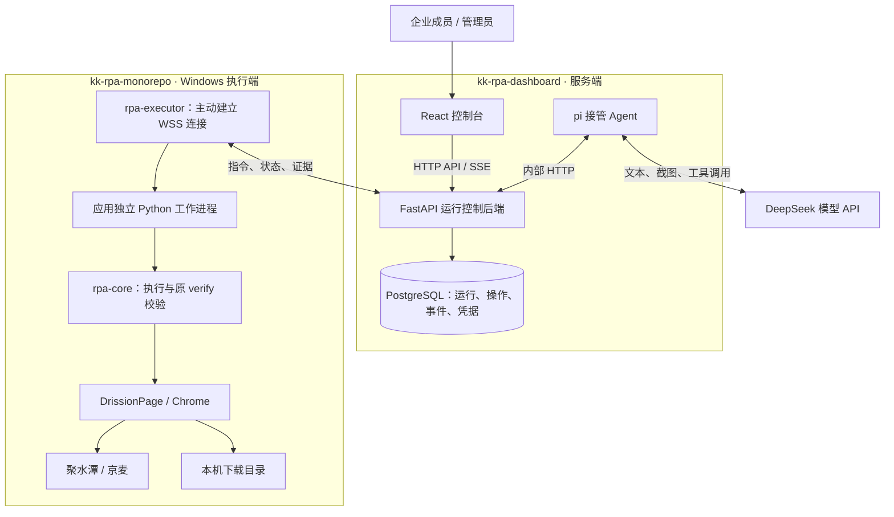

# KK RPA 技术分享导读

更新日期：2026-09-07。适合研发、业务和运维共同交流，也可按本文顺序组织约 20 分钟的技术分享。

KK RPA 分为两个配套仓库：`kk-rpa-monorepo` 负责将业务需求交付为可执行、可校验、可续跑的 Python 应用；`kk-rpa-dashboard` 负责集中发起运行、管理机器人、展示结果，并在失败后组织 Agent 接管。

## 文档入口

| 文档 | 主要内容 | 适合读者 |
| --- | --- | --- |
| [Monorepo 技术说明](monorepo.md) | 应用结构、Python 框架、浏览器操作、步骤校验、执行端、已实现与待实现内容 | RPA 开发者、框架维护者 |
| [Dashboard 技术说明](dashboard.md) | Web / API / Agent 架构、技术选型、运行与接管流程、数据模型、产品完成度与部署 | 前后端开发者、业务负责人、运维 |

两篇文档均可独立阅读。代码链接按两个仓库同级存放解析，本文档集统一保存在 dashboard 仓库的 `docs/sharing/`。

## 总体架构

图中表示当前代码已经接入的运行链路。完整的应用导入、可复用任务配置和定时触发仍在后续范围内。

## 当前进展

| 范围 | 已有能力 | 当前边界 |
| --- | --- | --- |
| RPA 应用 | 聚水潭库存导出、京麦商品明细日报导出 | 目前两个浏览器下载应用 |
| 执行框架 | 有序步骤、结果校验、反例测试、运行留证、失败续跑、临时定位器 | 外部系统业务写入适配尚未落地 |
| 控制台真实模式 | 企业登录接入、机器人管理、运行排队、停止、重跑、事件和最新截图 | 现场联调验收仍需完成 |
| 失败接管 | 六种受限工具、同一 Run 内续跑、900 秒累计预算、最多 3 轮 | Windows 与真实模型的端到端效果待验收 |
| 产品演示 | 应用中心、Git/ZIP 导入向导、任务编辑、日期规则、Cron 预览、设置 | 使用浏览器内存数据，尚未接入真实后台 |
| 部署 | 三服务 Compose、Mac 测试辅助脚本、Windows 启动脚本 | Linux 正式环境验收待完成 |

这里的“已实现”表示存在对应代码。文档同时引用已有的离线验证和 macOS 业务验收记录；它们的范围分别列在两篇说明中。本次文档编写核对了当前工作区、依赖锁文件和已有记录，未重新执行测试或现场验收。当前工作区包含开发中改动，文档不代表已发布版本。

## 建议分享顺序

| 时间 | 讲什么 | 核心问题 |
| --- | --- | --- |
| 0–3 分钟 | 总体架构与两个业务场景 | 系统解决什么问题，两个仓库如何分工？ |
| 3–8 分钟 | Monorepo 的应用、Step、Element 和验证机制 | 如何让程序执行结果可判断、失败后可继续？ |
| 8–14 分钟 | Dashboard 的运行状态、机器人队列和 Agent 接管 | 页面失败以后，谁处理、谁验收、谁释放机器人？ |
| 14–17 分钟 | 技术选型和部署 | 为什么按这些边界拆分进程和环境？ |
| 17–20 分钟 | 完成度和下一阶段 | 哪些可以演示，哪些需要现场验证或继续开发？ |

讲解恢复能力时，可使用两个已有案例：聚水潭在品牌选择阶段处理页面引导并提交 S003 的真实结果；京麦在报表已生成后从 S006 恢复下载。macOS 已有这两个案例的验收记录，Dashboard + Windows + 真实模型的自动接管仍需单独验收。

## 交流时需要区分的概念

| 容易混淆的内容 | 本项目的具体含义 |
| --- | --- |
| monorepo 与 dashboard | 是两个仓库；dashboard 本身也用 pnpm workspace 管理多个应用 |
| 应用、任务、运行 | 应用是代码交付物；任务保存可复用配置；运行是一次执行请求。当前真实后台主要落地了运行 |
| 续跑与从头重跑 | 续跑增加原控制台 Run 的 Attempt；从头重跑创建新的控制台 Run |
| 模型工具返回成功与业务成功 | 工具调用完成只代表该动作的结果；业务结果仍须通过原应用的 `verify` |
| 本机恢复与自动接管 | 原框架/macOS 恢复案例已有验收；服务端 Agent 驱动 Windows 的完整链路仍待现场验收 |
| 演示与真实模式 | 默认开发入口为演示模式；`VITE_RUNTIME=live` 选择真实模式，两者使用不同页面入口 |
