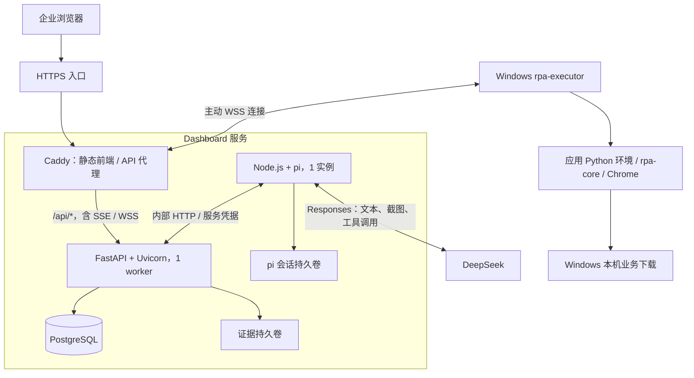
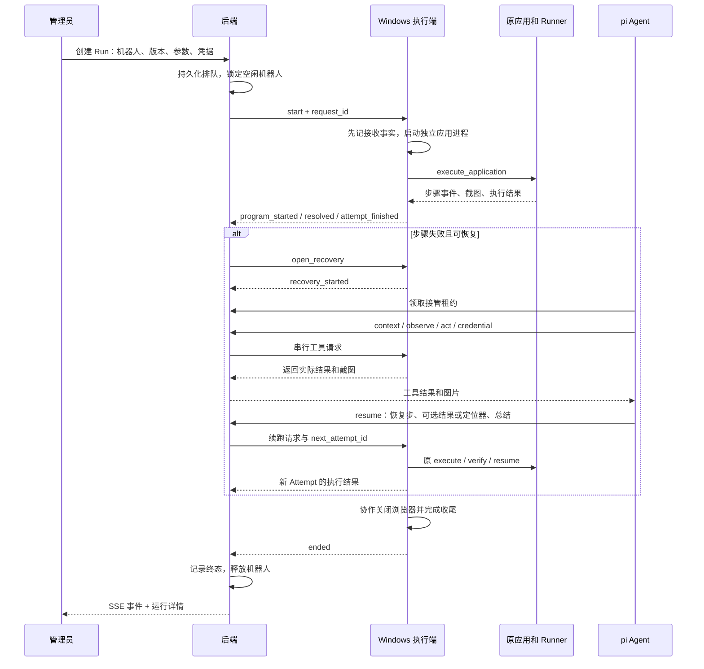

# KK RPA Dashboard 技术说明

更新日期：2026-09-07。面向技术分享、方案交流和开发交接。配套阅读：[分享导读](README.md)、[Monorepo 技术说明](monorepo.md)。

本文依据当前工作区、依赖锁文件和已有实施记录编写。当前项目已落地真实运行控制与失败接管代码，应用导入、任务配置和定时管理仍保留前端演示。代码存在、离线验证通过、现场验收完成在文中分别说明。

## 1. 项目定位

`kk-rpa-dashboard` 为企业成员提供 RPA 运行入口：管理员选择机器人和已部署应用版本，填写本次业务参数与凭据，发起运行；成员查看业务日志与截图。程序失败后，由独立 Agent 服务通过原执行端处理现场，再提交原应用续跑。

当前真实入口直接创建 Run。可重复使用的 Task、应用来源、应用版本目录和计划任务属于完整产品设计中的后续能力。

### 与 Monorepo 的职责划分

| 职责 | Dashboard | Monorepo |
| --- | --- | --- |
| 业务流程和成功条件 | 记录结果、展示状态 | 应用 Step 与 `verify` |
| 运行发起和排队 | 保存 Run，按机器人派发 | 接收当前 Run 并启动应用 |
| 浏览器操作 | Agent 发起受限工具请求 | 本地执行工具及正常业务步骤 |
| 失败恢复 | 分配 Agent、预算、轮次、停止与总结 | 原上下文恢复、临时定位器、原校验续跑 |
| 数据与产物 | 运行、操作、事件、凭据、最新截图、Agent 会话 | 应用源码、本地运行证据和业务下载文件 |
| 应用发布 | 自动导入与分发尚未实现 | 当前由本机部署配置和独立环境提供版本 |

## 2. 架构与部署



Web、后端和 Agent 分别构建和运行。浏览器访问同一域名：`/` 返回前端，`/api/*` 转发后端；Agent 使用容器网络访问后端的 `/internal/*`。Windows 主动连接服务端，不要求服务端直接访问 Windows 入站端口。

当前 Compose 启动 `web`、`backend`、`agent` 三个服务，连接外部已有 PostgreSQL 网络。后端启动前执行 Alembic 迁移，证据与 Agent 会话分别使用持久卷。

| 环境 | 当前安排 | 验收状态 |
| --- | --- | --- |
| Mac 开发测试服务端 | 现有 PostgreSQL + 三服务 Compose + ngrok HTTPS/WSS | 已有构建和部署检查记录；真实业务联调待验收 |
| Linux 实际服务端 | 独立配置、应用数据库、正式 HTTPS 入口和相同三服务 | 尚未在目标 Linux 服务器部署验收 |
| Windows 机器人 | 桌面用户会话、Chrome、uv、Monorepo 执行端 | 离线执行桥已有验证；真实环境待验收 |

源码依据：[Compose](../../deploy/compose.yaml)、[后端镜像](../../deploy/Dockerfile.backend)、[Web/Agent 镜像](../../deploy/Dockerfile.node)、[Caddy 路由](../../deploy/Caddyfile)。操作步骤见 [测试部署与 Linux 约定](../test-deployment.md)。

## 3. 技术选型与理由

下表应用库版本取自当前锁文件；运行时版本取自项目或镜像声明，不表示所用组件的最新版本。

| 部分 | 当前选型 / 版本 | 在项目中的用途与取舍 |
| --- | --- | --- |
| Web | React `18.3.1`、TypeScript `5.8.3` | 页面组件与数据类型；真实模式和演示模式分入口 |
| 构建与包管理 | Vite `6.4.3`、pnpm `10.15.1` | 前端开发与静态构建，统一管理两个 Node 应用 |
| 路由 | React Router `6.30.6` | 运行列表、详情、机器人和演示页面路由 |
| UI | Ant Design `5.29.3` | 表格、表单、弹窗和运行详情组件 |
| Schema 表单 | RJSF `5.24.13` + Ant Design 主题 + AJV8 | 已用于演示表单；真实应用 Schema 接入待完成 |
| 日期和 Cron | dayjs `1.11.23`、cron-parser `5.10.0` | 演示日期编辑及下 5 次触发预览；不生成后台定时运行 |
| API | Python 3.12、FastAPI `0.141.1`、Uvicorn `0.52.4` | HTTP 接口、输入校验、WebSocket 连接、SSE 输出 |
| 数据访问 | SQLAlchemy `2.0.52`、psycopg `3.3.5`、Alembic `1.19.2` | PostgreSQL 事务、机器人行锁和表结构迁移 |
| 凭据加密 | cryptography `50.0.1` 的 Fernet | 业务凭据单独加密保存；解密依赖原稳定密钥 |
| Agent | Node.js 24、pi SDK / pi-ai `0.85.1`、TypeBox `1.3.7` | 模型会话、工具循环、参数声明和 Token 统计 |
| 模型连接 | DeepSeek Responses，默认配置 `deepseek-v4-flash-vision-exp` | 发送页面文本与截图；实际模型效果需现场验收 |
| 交付 | Docker Compose + Caddy 2 | 分进程部署、同源访问、SSE / WebSocket 代理 |
| 测试 | Vitest `3.2.7`、Node test、pytest | 前端逻辑、Agent 会话与工具、后端状态与执行桥联调 |

选择依据与当前约束：

- **React 与 Ant Design** 承接以表格、表单和日志为主的管理界面；真实数据目前通过手写 `fetch` 客户端和 React hooks 读取。
- **RJSF** 将参数定义和页面渲染连接起来，适合不同应用声明各自字段。当前实际使用固定演示 Schema，真实表单仍需补上声明、导入和校验链路。[RJSF 官方主题说明](https://github.com/rjsf-team/react-jsonschema-form/tree/main/packages/antd)
- **FastAPI** 同时提供管理 HTTP 接口和机器人 WebSocket 入口。使用同一后端处理权限、状态和传输便于保持运行约束一致。[FastAPI WebSocket 文档](https://fastapi.tiangolo.com/advanced/websockets/)
- **PostgreSQL 事务与行锁** 让“判断机器人空闲”和“分配 Run”在同一事务中完成；队列由持久化 Run 和后端循环推进。
- **独立 Node Agent 服务** 使用 pi 的会话和自定义工具能力，Python 后端继续负责状态决策与持久化。工具调用经后端转发，模型不直接持有 Windows 控制连接。[pi SDK 文档](https://github.com/earendil-works/pi/blob/main/packages/coding-agent/docs/sdk.md)
- **SSE 与 WSS 分工**：页面单向接收执行事件，机器人通过双向连接接收操作并返回状态；运行摘要另按 3 秒间隔轮询。

默认模型名来自代码配置。官方 Responses 文档说明该视觉实验模型支持图片输入；这只确认接口用途，不代表本项目已经完成真实截图理解与恢复验收。[DeepSeek Responses 文档](https://api-docs.deepseek.com/guides/responses_api/)

依赖依据：[pnpm 锁文件](../../pnpm-lock.yaml)、[Python 锁文件](../../apps/backend/uv.lock)。

## 4. 工程组织

```text
kk-rpa-dashboard/
├── apps/web/
│   └── src/
│       ├── live/              # 真实登录、运行、机器人、日志和用量
│       ├── pages/             # 演示产品页面
│       ├── mock/              # 浏览器内存数据与状态
│       ├── form/              # Schema 表单、日期绑定与提交装配
│       └── schedule/          # Cron 编辑与预览
├── apps/backend/
│   ├── src/rpa_console/
│   │   ├── api.py            # HTTP / WSS / SSE / 登录 / 内部接口
│   │   ├── control.py        # 运行状态、队列、预算、停止、操作去重
│   │   ├── storage.py        # 数据表和事务
│   │   └── credentials.py    # 业务凭据加解密
│   └── migrations/           # 0001 初始表、0002 运行凭据
├── apps/agent/src/           # pi 会话、工具、接管任务与用量统计
├── deploy/                  # 三服务镜像、Compose、Caddy、Mac 脚本
└── docs/                    # 原设计、实施、部署与本分享文档
```

pnpm workspace 通过 `apps/*` 管理 Web 与 Agent；后端拥有独立 `pyproject.toml`、`uv.lock` 和 Python 环境。当前没有实现原架构方案中独立的导入进程、Cron 调度进程或 `packages/api-client`。

## 5. 领域对象与实际数据模型

产品设计使用“应用 → 版本 → 任务 → 运行 → 执行尝试”的关系。当前后端首先实现运行控制所需的数据：

| 对象 / 表 | 保存内容 | 当前实现特点 |
| --- | --- | --- |
| Robot / `robots` | 名称、连接凭据摘要、当前占用、部署版本声明 | 同一机器人由一个 Run 占用 |
| Console Run / `runs` | 参数快照、状态、阶段、恢复预算、Attempt 列表、结论、用量 | 大部分运行结构存入 JSON `data` 字段 |
| Execution Attempt | 本地 `run_id`、开始结束时间、结果和来源 | 保存在 Run JSON 中，尚无独立 Attempt 表 |
| Operation / `operations` | `request_id`、动作、参数、发送状态、结果 | 区分请求已登记、已发送与结果已确认 |
| Event / `events` | Run 内单调递增序号和事件正文 | 支持去重、顺序检查和 SSE 补读 |
| RunCredential / `run_credentials` | 加密业务凭据 | 与运行快照、操作和事件分开保存 |
| LoginSession / `login_sessions` | OAuth state、用户身份和会话期限 | 管理员身份由配置名单判断 |
| Evidence / `evidence` | 图片 ID、Run 归属、格式 | 文件在持久卷；每个 Run 仅保留最新截图 |

**续跑**在原 Console Run 内产生新的 Attempt，每个 Attempt 关联一个 Monorepo 本地运行记录。**从头重跑**创建新 Console Run，以 `rerun_of` 关联原记录，沿用原已解析参数和业务凭据。

创建 Run 时保存输入快照；应用首次执行还会解析默认值和实际下载目录，经 `resolved` 事件补入快照。此后续跑必须匹配原值。真实入口要求填写实际日期；通用的“昨日”等任务日期规则尚未接入后台触发。

源码依据：[数据模型](../../apps/backend/src/rpa_console/storage.py)、[状态控制](../../apps/backend/src/rpa_console/control.py)。

## 6. 正常执行与失败接管



正常程序阶段使用固定业务流程。失败后，Agent 根据当前页面选择有限的恢复动作，提交的输出仍通过原应用 `verify`。配置解析、环境启动等准备期失败没有可恢复业务步骤时，按失败收尾。

### 六种模型工具

| 工具 | 用途 | 边界 |
| --- | --- | --- |
| `context` | 读取失败记录、原参数、步骤契约和元素 | 凭据仅提供字段名；可按步骤读取或请求全文 |
| `observe` | 读取页面文本、DOM 目标和截图 | 返回当前观察到的 target，定位修正可按需读取定位器 |
| `act` | 导航、点击、输入、选择、读取、等待、下载、切换新页签 | 使用正式元素或当前观察目标，操作受应用页面范围约束 |
| `credential` | 在指定输入目标代填原账号凭据字段 | 模型不接触凭据明文 |
| `resume` | 指定恢复步骤，可附真实结果和临时定位器 | 接收请求后仍等待原程序执行与校验 |
| `give_up` | 提交原因、已尝试事项、证据和后续处理 | 结束接管并进入执行端收尾 |

Agent 禁用内置工具、扩展、skills 和上下文文件自动发现，只暴露上述六种工具。动作串行执行；当前模型轮次中的一个动作失败后，剩余调用被拒绝，后续先重新观察。恢复期间不会通过模型工具改写应用源码。

每个 Run 最多分配 **3 轮接管**，累计接管时间 **900 秒**。一轮可以包含多次模型请求；输出截断后的继续请求仍在本轮内。预算从执行端报告 `recovery_started` 起累计，程序实际续跑时暂停，接管阶段的断连和服务重启不重置预算。

pi 会话按 Run 保存，当前上下文处理包含按需读取步骤契约、精简页面观察和减少重复历史图片。Token 用量从持久会话累计，包括压缩请求和缓存用量；服务端按会话和递增版本去重。未上报用量的响应单独标记，当前没有金额计算。

源码依据：[Agent 工具](../../apps/agent/src/tools.ts)、[会话配置](../../apps/agent/src/session.ts)、[Agent 任务循环](../../apps/agent/src/main.ts)、[Token 统计](../../apps/agent/src/usage.ts)。

## 7. 可靠性与权限设计

### 7.1 先确认事实，再推进状态

| 场景 | 当前处理 | 设计目的 |
| --- | --- | --- |
| 多个运行等待同一机器人 | PostgreSQL 锁定机器人行，按创建顺序派发 | 保持一个 Run 对浏览器现场的占用 |
| 操作发送前 | 后端先保存 Operation 和发送事实 | 重启后能够区分未发送与结果未知 |
| 执行端收到请求 | SQLite 先记录，再执行 | 相同请求能返回原结果，冲突参数被拒绝 |
| 连接重建 | 对照请求记录，补传事件，再报告 ready | 完成核对后才接收新动作 |
| 已发出但结果丢失 | 默认不重发；只有完整日志证明未接收时才允许发送 | 降低重复点击、重复导出的风险 |
| 管理员停止 | 撤销未下发操作，停止新增动作，等待已开始动作和收尾 | 页面停止请求对应可确认的执行结果 |
| 进程丢失或关闭无法确认 | 保持 `uncertain` 和机器人占用 | 避免现场未知时并发启动新 Run |

当前实现提供请求去重与不确定状态处理，不承诺外部业务动作“恰好执行一次”。程序通过 `verify` 后仍需执行端 `ended` 确认才能释放已派发运行的机器人；取消尚未派发的排队请求可以直接结束。

后端在线连接保存在进程内存，部署固定为一个 Uvicorn worker；Agent 保持一个实例。多实例协调、横向扩容与高可用切换尚未完成。

### 7.2 权限与凭据按职责分开

- 飞书 OAuth 登录检查企业 `tenant_key`，管理员按 `ADMIN_OPEN_IDS` 配置；其他企业成员读取业务运行、日志与截图。
- 管理接口在后端校验权限，写请求额外检查 Origin。业务只读接口返回裁剪后的运行信息。
- 机器人连接凭据只在创建或轮换时返回明文，后端保存摘要；Agent 使用单独的内部服务凭据。
- 业务账号、密码、预期身份通过专用字段提交，使用独立密钥加密保存，仅派发给承担本次 Run 的认证机器人。
- 模型密钥只进入 Agent 服务环境和内存凭据存储；截图由执行端脱敏，访问截图需通过企业登录。

当前只读权限按企业成员划分，尚无按应用、任务、团队或记录分配的细粒度授权。凭据加密密钥必须与数据库备份配套保管，否则历史运行无法解密重跑。

### 7.3 运行记录与业务文件分开保存

运行、Attempt、操作、事件、预算和凭据以数据库为准。控制台每个 Run 只展示最新截图，新图保存成功后删除旧图；本地应用仍保留自己的运行证据。

默认保留已结束 Run 30 天，由 `RETENTION_DAYS` 配置；当前清理由 Agent 工作循环驱动，先清理对应 pi 会话，再调用后端清除运行及关联记录。业务报表留在 Windows 应用下载目录，控制台没有报表归档与下载功能。

实现：[API、鉴权、事件和清理](../../apps/backend/src/rpa_console/api.py)、[业务凭据](../../apps/backend/src/rpa_console/credentials.py)。

## 8. 已实现与待实现清单

| 功能 | 当前状态 | 具体边界 |
| --- | --- | --- |
| 飞书企业登录、管理员和只读接口 | 已接入真实后端 | 真实企业登录现场验收待完成；名单来自配置 |
| 机器人创建、轮换、撤销、在线状态、占用 | 已接入真实后端 | 部署列表由执行端上报，自动安装与发布尚未实现 |
| 手动发起 Run、排队、取消、停止、从头重跑 | 已接入真实后端 | 按本机已部署版本执行，手工填写业务参数 JSON |
| 执行尝试、中文事件、SSE、最新截图 | 已接入真实后端 | 运行摘要通过轮询更新；控制台只保留最新截图 |
| Agent 接管、原校验续跑、预算、轮次、总结 | 已实现服务及执行桥 | Windows + 真实模型端到端效果待现场验收 |
| Token 用量 | 已实现 | 有累计用量及缺失提示，没有费用计算 |
| 运行保留期清理 | 已实现 | 使用服务配置，依赖 Agent 清理循环；设置页面未接入 |
| 工作总览、统计卡片 | 演示 | 使用静态/内存样例，没有真实聚合指标 |
| 应用中心、版本详情、标签 | 演示 | 没有真实应用来源和版本目录存储 |
| Git / ZIP 导入 | 演示 | 不拉取 Git、不读取 ZIP、不上传源码 |
| Schema 参数表单 | 部分实现 | RJSF 演示使用固定声明；真实入口未按应用 Schema 渲染 |
| 任务创建、编辑和保存 | 演示 | 无 Task 表及真实 CRUD；刷新恢复样例数据 |
| 日/周/月/Cron 编辑与下次预览 | 演示交互已实现 | 无后端到期触发与持久调度；`api.py` 的 scheduler 仅推进运行队列 |
| 相对日期规则 | 演示 | 未实现创建 Run 时统一解析任务日期规则 |
| 管理员名单和保留期设置页面 | 演示 | 页面操作不会变更真实后端配置 |
| OpenAPI 客户端生成 | 尚未实现 | 当前使用手写 TypeScript 类型和 fetch；自动生成仍在方案中 |
| Linux 正式部署、多实例运行 | 前者待验收，后者未实现 | 当前约定单 worker 后端和单 Agent 实例 |

真实模式由 `VITE_RUNTIME=live` 选择，`App.tsx` 直接进入 `LiveConsole`，只提供运行与机器人相关页面。默认演示模式进入 `DemoApp`；其管理员切换、数据修改和导入结果仅存在浏览器内存中。

源码依据：[模式切换](../../apps/web/src/App.tsx)、[真实页面](../../apps/web/src/live/LiveConsole.tsx)、[演示导入](../../apps/web/src/pages/ImportWizard.tsx)、[固定 Schema](../../apps/web/src/form/SchemaForm.tsx)、[Cron 预览](../../apps/web/src/schedule/cron.ts)。

## 9. 验证范围与后续顺序

### 已有验证记录

| 层次 | 已有记录覆盖 | 尚不能证明的内容 |
| --- | --- | --- |
| 前端 / Agent | 构建、表单/Cron、日志展示、工具隔离、会话恢复、模拟 Responses 工具循环 | 真实模型恢复页面的效果 |
| 后端 | 权限、预算、停止竞态、加密凭据、WSS 续跑、重跑、清理 | 飞书真实登录、生产网络和 Windows 行为 |
| PostgreSQL | 临时 PostgreSQL 17 下的并发互斥、持久化补传和迁移 | Linux 目标库的部署和备份恢复 |
| 执行端 / 部署 | 请求日志、事件补传、中文管道、配置、启动脚本语法、Compose 和镜像 | Windows DPAPI、Chrome 生命周期及真实业务端到端 |

上述结果来自 [失败接管实施记录](../recovery-implementation.md)，其中测试数量对应其记录时点。本次只生成文档，没有重跑这些测试。新代码的回归和现场联调需要另行记录。

### 建议推进顺序

1. **完成真实运行验收**：企业飞书登录 → Windows 注册 → 正常业务运行 → 聚水潭品牌选择恢复 → 京麦只恢复下载 → 停止、断连和重启 → Linux 实际服务端验收。
2. **打通应用和任务配置**：应用静态声明、Git/ZIP 导入、应用与版本持久化、按真实 Schema 渲染表单、Task 保存与版本关联。
3. **接入真实定时调度**：按任务生成固定输入的 Run，明确时区、日期解析、编辑生效范围、停机错过计划等规则。
4. **补齐管理和运维能力**：真实总览、管理员/保留期设置、应用发布流程；按运行规模评估分页、数据查询和多实例方案。

以上是基于当前缺口的建议顺序，不是已排期承诺。原方案中的“停机错过计划不补跑”“编辑任务只影响后续触发”等规则，应在实现定时与 Task 时落地验收。

## 10. 演示和开发入口

在 dashboard 仓库根目录运行：

```sh
pnpm install
pnpm dev
```

该入口展示产品演示页面。连接已配置后端的真实模式使用：

```sh
VITE_RUNTIME=live pnpm dev
```

Vite 将 `/api` 代理到 `127.0.0.1:8000`。完整后端、模型、飞书和 Windows 配置见 [部署说明](../test-deployment.md)；此命令本身不启动后端或执行端。

仓库提供 `pnpm build`、`pnpm test` 和 `pnpm test:backend`。其中 PostgreSQL 专项测试需要单独的测试数据库配置，默认不配置时跳过。

分享时可先用演示模式说明完整产品方向，再用真实模式解释目前已落地的运行链路。涉及自动接管效果、节省时间或成功率，应使用完成现场验收后的数据。
