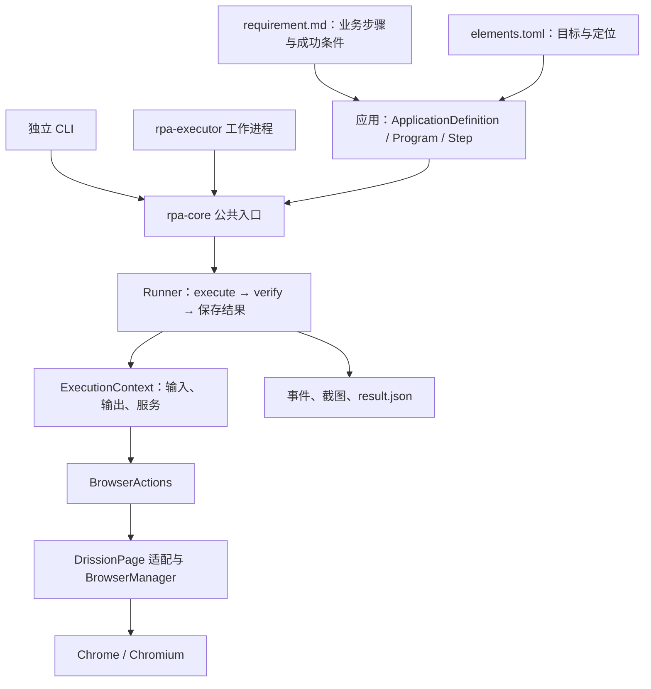
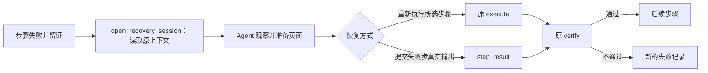

# KK RPA Monorepo 技术说明

更新日期：2026-09-08。面向技术分享、方案交流和开发交接。配套阅读：[分享导读](README.md)、[Dashboard 技术说明](dashboard.md)。

下文保留 Dashboard `a7b0853`、Monorepo `b92df4c` 基线的技术说明；工作区后续改动与待验收事项统一见 [实施记录](../platform-implementation.md#实施记录2026-09-08本地未发布)。
本文依据上述 `kk-rpa-monorepo` 基线编写。“已实现”表示代码存在；真实运行结果仅引用已有验收记录，不将历史验收扩展为当前所有代码或 Windows 环境均已通过。

## 1. 项目定位与业务场景

`kk-rpa-monorepo` 将一份业务需求组织为一个独立 Python RPA 应用，统一提供浏览器操作、步骤执行、结果验证、运行证据和失败续跑。业务流程、参数和页面目标保留在应用内，共用能力由 `rpa-core` 提供。

目前交付两个应用，每个应用包含 6 个业务步骤：

| 应用 | 包版本 | 流程 | 主要业务参数 |
| --- | --- | --- | --- |
| 聚水潭库存导出 | `0.5.0` | 登录并检查会话 → 库存模块 → 商品库存 → 选择品牌 → 搜索并检查筛选 → 导出库存 | `brand_value`、`export_filename` |
| 京麦商品明细报表导出 | `0.2.0` | 登录并检查会话 → 商品明细报表 → 选择日期 → 创建报表 → 打开下载页 → 匹配并下载 | `target_date`、`export_filename` |

聚水潭步骤编号为 S000–S005，京麦为 S001–S006。登录账号和密码通过独立的 `credentials` 传入；两个程序已取消预期可见身份匹配，旧 `expected_identity` 字段仍可被接收但不参与匹配，下载目录通过 `download_dir` 指定。京麦当前支持单日范围，未指定日期时由应用按上海时区计算启动日的昨日。

当前登录步骤检查会话可用，不证明登录后的预期身份匹配；后续成功判定覆盖品牌或日期、正确报表、下载完成及文件非空。文件内的业务数据核对不在当前实现范围内。

业务依据：[聚水潭需求](../../../kk-rpa-monorepo/apps/inventory_jushuitan_export_stock/requirement.md)、[京麦需求](../../../kk-rpa-monorepo/apps/report_jingmai_export_product_detail/requirement.md)。

## 2. 仓库组织与框架

```text
kk-rpa-monorepo/
├── apps/
│   ├── inventory_jushuitan_export_stock/
│   └── report_jingmai_export_product_detail/
├── packages/
│   ├── rpa-core/             # 公共执行框架和浏览器适配
│   ├── rpa-executor/         # 对接控制台的 Windows 执行端
│   └── rpa-integrations/     # 外部业务系统接入约定，尚无正式适配器
├── docs/                    # 框架设计、实施与验收说明
├── llm-wiki/                # Agent 可读取的约定、库文档和历史决策
├── CONTEXT.md               # 共享术语
└── AGENTS.md                # 应用生成与开发规则
```

每个应用保留以下交付内容：

| 文件或目录 | 作用 |
| --- | --- |
| `app.toml` | 稳定的 `app_id`、应用名称、CLI 入口 |
| `requirement.md` | 需求来源、步骤输入输出、成功条件、未决问题和验收事实 |
| `elements.toml` | 应用正式流程依赖的页面目标、定位方式和阶段检查要求 |
| `pyproject.toml` / `uv.lock` / `.venv` | 应用自己的依赖、锁定版本和执行环境 |
| `src/` / `tests/` | 普通 Python 业务程序与离线测试 |
| `config/stores.example.toml` | 可分享的配置示例；实际配置另存本地忽略文件 |
| `runs/<run_id>/` | 执行后产生的事件、截图、结果及恢复诊断 |

本仓库采用“同仓管理、各项目独立环境”的结构，根目录没有统一的 Python workspace 锁文件。应用通过本地路径依赖共享 `rpa-core`；更新核心后，需要验证各应用兼容性，并同步目标机器的环境。uv 的 workspace 模式使用共享锁文件，本仓库保留了独立锁文件的做法。[uv workspace 文档](https://docs.astral.sh/uv/concepts/projects/workspaces/)

### 分层关系



CLI 与控制台执行桥复用同一套应用和 Runner。控制台下发运行请求后，仍由应用代码决定具体业务步骤和成功条件。

## 3. 技术选型与取舍

下表版本来自项目声明；框架用途同时对照实际导入与调用位置。

| 层次 | 当前选型 | 选择对应的需求 | 取舍 |
| --- | --- | --- | --- |
| 语言 | Python `>=3.12,<3.13` | 业务条件、循环和数据处理直接写 Python | 开发与执行机器需保持兼容环境 |
| 浏览器引擎 | DrissionPage `4.1.1.4` | 页面定位、交互、页签和下载处理 | 浏览器与页面变化仍需真实验证 |
| 公共框架 | 自建 `rpa-core 0.8.0` | 统一步骤、校验、留证和恢复语义 | 需要维护应用契约与核心回归 |
| 依赖管理 | uv + 各项目锁文件 | 每个应用独立安装、运行和升级 | 共享核心变化需逐应用验证 |
| 页面目标配置 | TOML 元素库 | 业务目标与当前定位方式集中维护 | 临时恢复结果需要后续整理为正式代码 |
| 测试 | pytest + FakeBrowserActions | 离线构造正常场景与结果反例 | 无法替代真实页面和 Windows 验收 |
| 执行端连接 | Python `websockets`，声明范围 `>=15,<18` | Windows 主动建立持久控制连接 | 需处理断连、重连与结果不确定 |
| 执行端持久化 | SQLite，WAL / FULL 同步 | 接收记录和事件先落盘，再执行或发送 | 本地日志连续性是恢复核对的依据 |
| Windows 启动 | PowerShell + DPAPI | 初始化环境、保存机器人连接凭据 | 依赖实际 Windows 用户会话 |

DrissionPage 提供浏览器、标签页及元素控制能力；本项目将相关调用集中在 `drission_browser.py` 和 `browser_manager.py`。业务通过 `ctx.browser` 使用少量具有等待、回读或下载职责的操作。[DrissionPage 官方项目](https://github.com/g1879/DrissionPage)

源码依据：[核心依赖](../../../kk-rpa-monorepo/packages/rpa-core/pyproject.toml)、[执行端依赖](../../../kk-rpa-monorepo/packages/rpa-executor/pyproject.toml)、[浏览器操作接口](../../../kk-rpa-monorepo/packages/rpa-core/src/rpa_core/browser.py)。

## 4. 核心设计思路

### 4.1 业务步骤同时定义动作和验收

`Step` 提供三个方法：

| 方法 | 负责什么 | 示例 |
| --- | --- | --- |
| `execute(context)` | 执行动作并返回结构化输出 | 重置筛选，选择目标品牌，返回选择结果 |
| `verify(context, result)` | 检查输出与当前页面是否满足原成功条件 | 输出品牌和页面选中品牌集合都等于原输入 |
| `counterexamples()` | 给出应被拒绝的场景 | 仍混入其他品牌、文件为空、报表名称不符 |

Runner 按顺序执行步骤，只有 `verify` 严格返回 `True` 才记录成功并进入下一步。校验返回 `False`、报错或超时，都会保留失败结果。

这种设计让“点击完成”和“业务条件满足”分别可观察。聚水潭 S003 即使执行了点击，也必须回读选中集合；京麦 S006 必须先匹配目标文件名和“已生成”状态，再检查实际下载产物。

实现：[运行器](../../../kk-rpa-monorepo/packages/rpa-core/src/rpa_core/runtime.py)、[聚水潭步骤](../../../kk-rpa-monorepo/apps/inventory_jushuitan_export_stock/src/inventory_jushuitan_export_stock/steps.py)。

### 4.2 元素库描述稳定业务目标

元素使用稳定 ID 表示业务含义，定位字段描述当前如何找到它。`expect_count` 和 `check_at` 声明在特定页面阶段应满足的匹配数量，例如某按钮只有打开弹窗后才应出现。

正常流程依赖的目标集中维护在应用的 `elements.toml`。接管时临时出现的引导、浮层等，可以根据当次真实 DOM 建立临时目标并留证；需要长期使用时，再整理进正式元素库和测试。

定位器覆盖只改变当前续跑中的定位字段。目标身份、匹配数量、检查阶段和业务 `verify` 保持原契约。覆盖不会自动写回应用文件，也不会自动继承到下一次续跑。

实现：[元素与覆盖规则](../../../kk-rpa-monorepo/packages/rpa-core/src/rpa_core/elements.py)。

### 4.3 业务输入固定，凭据独立传递

`RunRequest` 接收 `account_id`、`inputs`、`credentials` 和 `download_dir`。应用自己的 `load_runtime_options` 校验参数并解析默认值，产生 `RuntimeOptions`；Runner 从 `ExecutionContext` 读取本次实际输入。

日期和品牌进入运行记录，恢复时沿用原值。例如京麦跨午夜续跑，仍下载原目标日期报表。凭据从本次调用或本地配置加载，不写入 `inputs` 或本地结果记录。

独立 CLI 使用账号别名标识 Profile；控制台执行桥使用 Console Run ID 生成内部 Profile 标识，同次接管和续跑沿用，不同控制台 Run 分开。

实现：[公共入口与参数](../../../kk-rpa-monorepo/packages/rpa-core/src/rpa_core/cli.py)、[执行桥](../../../kk-rpa-monorepo/packages/rpa-executor/src/rpa_executor/worker.py)。

### 4.4 恢复沿用原步骤的验收逻辑



恢复可以选择失败步骤，也可以选择更早步骤重建页面；选中步骤之前必须已有成功输出。提交 `step_result` 时，只能提交源失败步骤的输出，由原 `verify` 独立验收。

`open_recovery_session` 准备浏览器、原输入、已完成输出和服务，不执行步骤，也不覆盖源 `result.json`。退出接管上下文后，再调用 `resume`。每次本地续跑生成新的本地 `run_id`，记录 `resumed_from`；在控制台中，它被关联为同一个 Console Run 的新 Attempt。

### 4.5 用结果反例检验校验器

所有步骤共用应用的 `build_test_context`：先证明正常样例能够执行并通过，再运行反例。动作错误需要明确声明预期异常；校验器本身出错视为测试故障。

每一步至少有一个“动作执行成功，但 `verify` 返回 `False`”的反例。例如在下载动作完成后把测试文件置空，可以直接检验非空条件是否生效。这样能够发现校验被改成恒真、只检查动作异常等问题。

实现：[可证伪校验测试](../../../kk-rpa-monorepo/packages/rpa-core/src/rpa_core/verification.py)。

## 5. Windows 执行端如何接入控制台

`rpa-executor` 是本机控制连接和应用环境之间的桥梁：

1. `start.ps1` 同步执行端及两个应用的独立 Python 环境，保存控制台地址和机器人连接凭据。
2. `client.py` 主动建立 WSS 连接，上报本机配置的应用版本、当前占用和请求日志。
3. 收到运行指令后，根据本机部署配置选择 Python、工作目录和应用模块，启动工作进程。
4. `worker.py` 核对实际安装包版本和应用 ID，调用原 `execute_application`。
5. 步骤事件、执行结果和脱敏截图经 SQLite 日志回传；失败时可打开原恢复上下文。
6. 确认浏览器及工作现场完成收尾后，回传 `ended`，由控制台释放机器人。

同一个机器人一次承接一个 Run。所有浏览器动作在应用工作进程的主线程串行执行；读取控制消息的线程只更新停止和连接标志。重复 `request_id` 会核对原请求并补传已有结果；执行进程丢失时保留“状态待确认”，不会自动重建已开始的页面动作。

连接凭据在 Windows 使用 DPAPI 保存。业务凭据由后端加密存储、随本次运行下发，在工作进程使用；SQLite 请求日志用 HMAC 保留重复请求检查能力，同时排除业务凭据原文。

版本列表来自本机部署声明。当前没有控制台自动分发源码、安装包、发布或回滚的流程，新增应用仍需更新本机配置和环境。

实现：[执行端说明](../../../kk-rpa-monorepo/packages/rpa-executor/README.md)、[连接管理](../../../kk-rpa-monorepo/packages/rpa-executor/src/rpa_executor/client.py)、[本地日志](../../../kk-rpa-monorepo/packages/rpa-executor/src/rpa_executor/journal.py)。

## 6. 已实现内容

| 能力 | 当前实现 | 验证依据 |
| --- | --- | --- |
| 两个独立应用 | 参数校验、登录会话检查、目标筛选、下载结果验证 | 应用代码、离线测试、2026-09-05 macOS 导出记录 |
| 统一执行入口 | `doctor`、`test`、`verify-elements`、`run`、`resume`，以及公共 Python 调用 | CLI 与核心测试 |
| 步骤执行与留证 | 有序执行、步骤耗时、结果记录、失败诊断、准备期失败记录 | 核心实现与测试 |
| 浏览器生命周期 | Profile 隔离、锁和端口管理、页签切换、失败保留、成功关闭 | 核心测试与 macOS 记录 |
| 下载管理 | 默认下载目录、指定目录、保留旧文件、重名改名、返回实际路径 | 核心与应用测试、macOS 记录 |
| 原上下文续跑 | 原输入与前序输出保留，失败步结果经原校验，临时定位器限于当次 | 核心测试、两个应用恢复案例 |
| 控制台执行桥 | WSS、独立应用进程、请求日志、事件补传、停止和收尾确认 | 已有执行桥离线验证与现场调试记录；最新完整流程待验收 |
| 接管观察 | DOM、截图、临时目标、受限动作及原程序续跑 | 执行桥实现；真实自动接管效果待验收 |

2026-09-05 的原框架验收记录包括：聚水潭处理真实页面引导后完成 S003，并由程序继续导出；京麦在 S004 已生成报表、S006 下载前失败后，只恢复 S006 下载。后者验证了恢复时保留原日期和已完成结果的价值。

这些记录来自 macOS 原框架与接管入口，不构成 Dashboard Agent 自动控制 Windows 的验收结论。详细记录见 [Agent 实施说明](../../../kk-rpa-monorepo/docs/rpa-agent-implementation.md)。

## 7. 尚未实现、待验证与既定边界

| 类型 | 项目 | 当前状态与下一步 |
| --- | --- | --- |
| 待现场验证 | Windows 实机完整流程 | 需要验证系统下载目录、Profile 锁、DPAPI、浏览器收尾及真实接管 |
| 当前测试行为 | 两个程序取消预期身份匹配 | 已按用户要求改为检查登录会话；最新修改待真实业务回归 |
| 已知待完善 | 聚水潭专用人机验证标识 | 尚未捕获；当前登录受阻时留证并报错，执行桥另有页面文本检测 |
| 尚未实现 | 真实飞书、数据库、Excel 业务写入适配 | 已有 `build_services` 与 `ctx.feishu / ctx.db / ctx.excel` 入口；适配器待具体写入应用落地 |
| 尚未实现 | 应用静态参数 Schema 与自动发现接入 | 应用参数由 Python 校验；两个应用缺静态 Schema，执行端目前仅上报 app_id/version。Dashboard 已能读取 Schema 并渲染表单 |
| 尚未实现 | 自动发布、安装和回滚 | 执行端按本地配置选择已安装版本；后续由控制台部署能力衔接 |
| 由调用方负责 | 定时调度 | 应用不内置调度器；Dashboard 真实定时触发也尚未实现 |
| 当前业务范围外 | 报表内部数据校验、通用写入补偿 | 当前检查目标与下载结果；写入事务需由对应业务服务定义 |
| 明确约定 | CAPTCHA、滑块、短信验证 | 检测、留证、结束本次处理，由管理员处理后重跑 |

`rpa-integrations` 当前只有接入说明。后端已经使用 PostgreSQL 和飞书登录，并不代表 RPA 业务侧的数据写入适配已经完成。

跨仓库实施顺序和验收统一见 [完整平台实施方案](../platform-implementation.md)。新增共享业务抽象以实际应用中的重复需求为依据。

## 8. 开发与交流入口

开发过程按“需求基线 → 应用参数与元素 → Step 动作与校验 → 正常场景与反例 → 真实页面验收 → 部署配置”推进。开发 Agent 可以辅助生成、维护代码；运行时接管 Agent 的职责是处理当前失败现场。两者对应不同阶段。

以下命令在目标应用目录执行：

```sh
uv sync --locked
uv run rpa-app doctor
uv run rpa-app test
```

`doctor` 和 `test` 用于离线检查。`verify-elements`、`run`、`resume` 会操作真实浏览器，操作方式见 [Monorepo README](../../../kk-rpa-monorepo/README.md) 和应用说明。Windows 接入见 [执行端说明](../../../kk-rpa-monorepo/packages/rpa-executor/README.md)。

技术交流建议重点讨论三个问题：现有 `verify` 是否足以证明业务目标；恢复是否能够保留原输入和已完成的外部动作；新增应用需要扩展哪些实际公共能力。这些问题可以直接用需求、源码和验收记录核对。
