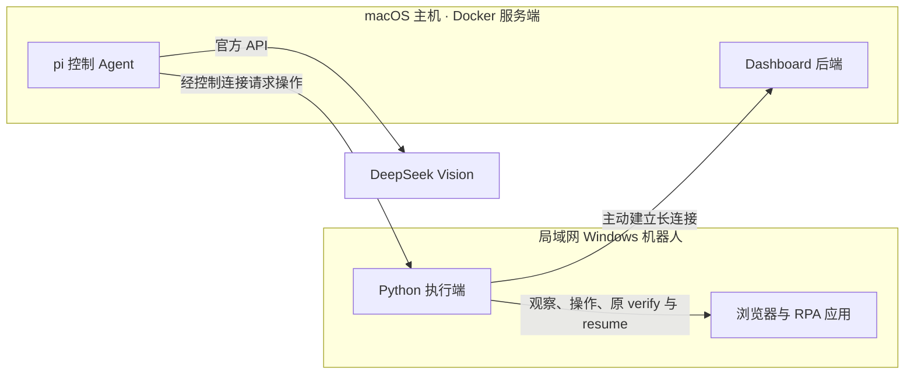

# Dashboard RPA 失败接管

状态：已确认，2026-09-07。用户已整体确认本规格作为后续实现基线。当前交付为工作流规格，代码实现与真实验收尚未开展。

目标：已有 RPA 应用失败后，服务器上的 pi Agent 自动接管 Windows 浏览器，在预算内处理现场，通过原 verify 交回程序续跑，并在 dashboard 原运行详情中呈现真实过程与结果。

## 已确认

- 基于 pi 开发接入 dashboard 的运行控制 Agent。
- 第一版优先处理既有应用的运行失败；失败后自动介入，无须用户点击或发起对话。
- 永久职责边界：Agent 永远不进行程序开发，不生成或修改应用、框架程序，也不通过修改代码修复故障。这不是仅限第一版的约束。
- 本规格描述失败接管工作流，不替代应用 requirement.md 中的业务要求和步骤契约。

## 已有基础

kk-rpa-monorepo 已有 run/resume、失败运行记录和 open_recovery_session 接管入口。Agent 提交的失败步输出由原 verify 校验，通过后才继续运行。实现依据为 [cli.py](../../kk-rpa-monorepo/packages/rpa-core/src/rpa_core/cli.py) 与 [runtime.py](../../kk-rpa-monorepo/packages/rpa-core/src/rpa_core/runtime.py)；历史验收见 [Agent 接管实施文档](../../kk-rpa-monorepo/docs/rpa-agent-implementation.md)，不代表本轮重新验收通过。

本仓库（kk-rpa-dashboard）当前有前端内存演示，真实后端、机器人连接和 Agent 接管接口尚未实现。不能把页面上的接管状态当作已有执行能力。

## 沿用的控制台约定

依据：[控制台架构](../docs/rpa-console-architecture.md)中已确认的产品规则与运行语义。

- Agent 实际接手后才显示“Agent 接管中”，接管期间由原运行继续占用同一机器人。
- 同一次控制台 Run 的所有接管累计共用 15 分钟工作预算；程序正常执行期间暂停计时，续跑再次失败不重置预算。例如第一次接管用时 6 分钟，再次接管剩余 9 分钟。
- 每次 resume 产生新的本地 run_id，对应同一控制台 Run 下的下一次 ExecutionAttempt。
- 原步骤 verify 与最终执行结果决定成功；Agent 文字说明不能标记成功。
- Agent 不可用、放弃或超时后结束接管，确认执行结束再释放机器人并继续队列；无法确认结束时显示“状态待确认”并保留占用。
- 原运行的账号、业务参数与应用版本保持不变。

## 已确认的恢复操作范围

Agent 可以通过预先提供的运行工具直接处理当前浏览器现场：

- 读取失败证据、原运行输入、前序成功输出与应用步骤契约，观察当前页面。
- 关闭干扰弹窗、恢复页面并重新选择原业务条件。
- 根据实际页面确认定位器；使用临时辅助目标和仅限当次续跑的定位器覆盖。
- 完成失败步骤后回读实际结果，按原步骤格式提交输出，经原 verify 校验后续跑。
- 根据现场与步骤契约选择恢复点，交由既有 resume 执行；未完成步骤不能直接跳过。

应用代码、永久元素定义、原业务参数和成功条件保持固定。需要修改程序才能解决的问题，报告原因后结束接管；永久修复由开发者另行处理，不由该 Agent 执行。

沿用 RPA 仓库规定：图形验证码、滑块、短信验证只检测、留证并报错，不绕过。

## 必须人工处理的问题

遇到短信验证、凭据失效、账号权限不足等必须人工处理的问题，不在本次运行中等待人工。

1. 停止恢复操作，保留可获得的失败证据。
2. 在 dashboard 展示具体失败原因、已尝试的处理及需要管理员完成的事项。
3. 结束接管和本次运行；确认执行已结束后释放机器人，继续后续队列。不能确认结束时沿用“状态待确认”。
4. 管理员处理问题后，通过 dashboard 发起重跑；不在原接管会话中等待或自动恢复。

## 已核实的集成事实

- 现有 BrowserManager 使用机器人本机的 Profile、进程、锁和 localhost 调试端口。浏览器操作需要本机 Python 执行桥；这不要求 pi 的 Agent 循环也位于机器人。
- open_recovery_session 在接管期间持有 Python 上下文与浏览器连接，退出后释放占用，保留浏览器供 resume 使用。
- BrowserActions 现有观察接口包括 URL、文本、元素存在性与数量、截图，尚无公开的通用 DOM 观察入口。直接页面接管还需补足定位证据的获取能力。
- pi-agent-core 支持自定义工具与 Agent 循环；coding-agent SDK 也能关闭内置编程工具并加载自定义工具。技术选型不能只依据包名。当前官方依据：[Agent](https://github.com/earendil-works/pi/blob/main/packages/agent/README.md)、[SDK](https://github.com/earendil-works/pi/blob/main/packages/coding-agent/docs/sdk.md)。

## 已确认的部署边界

- pi Agent 的决策循环集中运行在服务器，与 dashboard 后端部署在服务器侧。
- 服务端使用 Docker 部署在 macOS 主机上。
- 另一台与 macOS 主机处于同一局域网的 Windows 电脑作为机器人端，运行 Python 执行端与真实浏览器。
- 每台机器人本机的 Python 执行端负责浏览器观察、操作、接管上下文与调用原运行框架。
- 服务器通过机器人执行端处理现场，接收操作结果、状态和证据；机器人不独立运行 pi 决策循环。
- 模型接入、Agent 配置和会话在服务器集中管理；模型选择与连接方向见下文，服务进程划分及具体通信协议见“完整执行规格”。

图示表达逻辑职责与连接方向，不表示已经确定 Docker 容器或服务进程的划分。

## 已确认的连接方向

- 机器人主动向服务器建立并保持长连接，服务器通过该连接下发当前运行的接管操作请求。
- 机器人通过连接回传在线状态、操作结果、运行状态与截图证据。
- 服务器不依赖主动访问每台机器人开放的入站接口。
- 机器人认证见下节；具体通信协议与操作请求结果格式见文末的完整执行规格。

## 已确认的机器人认证

- 管理员在 dashboard 创建机器人记录，为该机器人生成专属的长期连接凭据。
- 凭据绑定该机器人身份，在 Windows 执行端配置一次；之后建立连接与执行已分配运行不逐次要求人工登录或授权。
- 管理员可以撤销或更换凭据，服务端按机器人身份验证连接与其可接收的任务范围。
- 机器人连接凭据与业务账号凭据、DeepSeek API 密钥分别管理；模型密钥保留在服务端，机器人只取得其执行所需的信息。

## 接管期间断连

- 服务器与机器人控制连接断开后暂停下发操作，原运行继续占用机器人。
- 断连等待计入该 Run 的 15 分钟接管预算，不因断连暂停或重置计时。
- 重新连通后，先核对现场和已经执行的操作结果；在剩余预算内自动继续原接管。
- 结果不明的操作不能直接重发。执行是否结束仍不明确时，保持“状态待确认”和机器人占用。
- 预算耗尽时结束接管；确认执行已结束后才能释放机器人。重新连接不产生新的预算。

## 模型接入

- 用户指定“deepseek vision”，本规格按当前官方托管视觉模型 deepseek-v4-flash-vision-exp 记录。该型号为实验版；模型标识通过服务器配置维护。
- 已确认直连 DeepSeek 官方 API，地址为 https://api.deepseek.com。官方现行文档确认 deepseek-v4-flash-vision-exp 支持截图输入与 function tools。[官方接入说明](https://api-docs.deepseek.com/)、[Responses API](https://api-docs.deepseek.com/guides/responses_api/)
- pi 支持自定义供应商和工具结果中的图片；API 协议、base URL、model ID 与服务器侧认证配置见“完整执行规格”的模型配置表。
- pi 的图像输入声明必须与实际模型能力一致。接入验收需验证模型确实读取截图，并能据观察调用运行工具；不能仅凭 API 请求成功认定视觉接管可用。
- 模型接入的官方能力依据：[pi-ai](https://github.com/earendil-works/pi/blob/main/packages/ai/README.md)、[自定义供应商](https://github.com/earendil-works/pi/blob/main/packages/coding-agent/docs/custom-provider.md)。
- 官方 Responses API 不提供服务端会话，需调用端维护上下文；不支持 previous_response_id。其 parallel_tool_calls 参数被忽略，模型可能同时请求多个工具，不能靠该参数保证页面操作串行。具体集成应由 Agent 与机器人执行层保证同一浏览器的操作顺序。
- 以上为官方文档核实结果，本轮尚未调用真实模型或完成 pi 与 DeepSeek 的端到端接入验收。

## 已确认的 pi 集成层

- 使用 pi coding-agent SDK 的会话管理、持久化、上下文压缩与工具循环能力。
- 关闭 SDK 内置编程工具，只开放项目提供的 RPA 运行工具。包名不改变该 Agent 永远不进行程序开发的职责边界。
- SDK 会话用于保存模型对话和工具调用上下文；控制台 Run、ExecutionAttempt、机器人占用与接管预算仍由控制台运行状态管理，不以模型会话代替业务记录。
- 重开或压缩 pi 会话不能重置同一 Run 的预算，不能更改源运行参数、已完成结果或原 verify 条件。
- SDK 取消模型循环不等于机器人已经停止。已发生的点击、下载等操作仍按实际结果记录，释放机器人必须取得执行端的结束确认。
- 当前官方 SDK 支持关闭内置工具并仅加载自定义工具；实现时应按所选版本显式配置资源加载范围，避免自动加载无关编程扩展。依据：[SDK](https://github.com/earendil-works/pi/blob/main/packages/coding-agent/docs/sdk.md)、[资源加载实现](https://github.com/earendil-works/pi/blob/main/packages/coding-agent/src/core/resource-loader.ts)。

## 已确认的 dashboard 交互

- Agent 接管过程嵌入已有运行详情页，首版不增加聊天入口。
- 展示接管阶段、该 Run 剩余接管时间、操作结果、截图证据与最终结论。
- 管理员可以请求停止；发送请求不等于已经停止，实际停止与机器人释放仍以执行端确认结果为准。
- 展示面向用户的中文操作说明和事实结果。必须人工处理或需要开发者修复时，给出具体原因、已尝试事项和后续处理事项，并链接相应证据。
- 沿用控制台既定权限：管理员查看诊断并执行停止等管理操作，只读成员查看允许的业务日志与截图。凭据和本机敏感信息不进入只读业务视图。
- 接管及 resume 保持在原控制台 Run 详情下展示；每次 resume 的执行尝试单独关联，不在运行列表伪装成新的业务触发。

## 已确认的首版验收应用

使用现有两个应用作为共同验收基线：

| 应用 | 接管案例 | 应证明的业务结果 |
| --- | --- | --- |
| 聚水潭库存导出 | 品牌选择受到页面引导干扰，或校验所需定位器失效 | 处理真实页面干扰，保持原账号和目标品牌，使用当次临时定位器回读；原 verify 通过后继续搜索与下载 |
| 京麦商品明细导出 | 已生成报表，但下载失败且原弹窗已关闭 | 恢复下载页面，沿用原日期与预期报表，仅续跑下载步骤，保留前序成功结果，避免重新创建报表 |

验收以本次 macOS Docker 服务端、局域网 Windows 机器人和所选真实模型的结果为准。既有 macOS 历史验证仅提供案例与回归依据，不代替新集成验收。

## 已确认的首版交付范围

- 打通 dashboard 的真实联动，包含本工作流需要的后端与 Windows 执行端接入。
- 从应用执行失败开始，自动触发服务器 pi Agent，操作 Windows 浏览器，经原 verify 验证并续跑，最后在原运行详情页展示真实结果。
- 管理员能够从运行详情页请求停止；页面进度、证据和终态来源于真实执行事件。
- 实现范围围绕该失败接管工作流确定，复用控制台既定的运行、机器人、权限与执行尝试契约。

## 已确认的停止方式

- 人工请求停止或接管预算耗尽时，采用协作停止。
- 立即停止新增模型决策和浏览器操作，等待正在执行的动作收尾，再由执行端确认结束并释放机器人。
- 无法确认当前动作或执行是否结束时，显示“状态待确认”并保留占用。
- 不将取消模型请求当成停止机器人，也不强制结束浏览器来代替正常停止确认。

## 完整执行规格

以下条款是落实已确认方向的实施方案。接口名称表达职责，字段沿用既有业务对象；不建立新的业务步骤注册表、流程语言或另一份应用成功条件。

### 1. 触发、输入与前置条件

**触发事件**：Windows 执行端确认一次 ExecutionAttempt 失败，原框架已写入失败记录，执行端向 dashboard 上报失败及可用证据。控制台自动申请为该 Run 接管，不依赖用户点击或定时扫描页面。

**输入来源**：

| 输入 | 来源与约束 |
| --- | --- |
| console_run_id、robot_id、ExecutionAttempt | 控制台已保存的运行关联，不由模型另选机器人或任务 |
| app_id、应用版本、本地失败 run_id | 当前执行尝试及已部署应用；本地记录必须属于同一应用 |
| 账号别名、业务 inputs、download_dir | 原运行最终保存的参数；不重算日期，不读取任务后来编辑的新值 |
| 已完成步骤及输出、失败步骤、诊断和证据 | 原 result.json、events.jsonl 及截图；原记录不改写 |
| 步骤契约和正式元素 | 当前应用版本的 requirement.md、elements.toml；无需新增契约文件 |
| 业务凭据 | 原账号对应的运行凭据，经执行端注入服务；不进入模型对话或普通业务参数 |

**前置条件**：应用及其独立环境已部署到该 Windows 机器人；该机器人仍归此 Run 占用；没有停止请求；接管预算尚有余额；服务器 Agent 和模型服务可用。缺少源参数、应用版本不可用、记录身份不符等情况应给出具体原因，不能补猜业务参数或通过安装、改写程序补救。

一次失败事件的重复上报只产生一次有效接管。同一 Run 同时只有一个接管会话；新失败尝试必须先替换当前失败记录引用，不能继续操作旧尝试。

### 2. 执行过程

1. **确认现场归属**：核对 Run、应用版本、失败记录、机器人占用及剩余预算。执行端实际进入接管后，控制台显示“Agent 接管中”。
2. **打开恢复上下文**：应用环境内的 Python 进程调用 open_recovery_session，保留其上下文与连接。browser_adopted 只说明是否接回原浏览器，不证明账号或页面正确。
3. **读取与观察**：Agent 读取失败证据和步骤要求，通过 DOM 观察与截图判断当前页面。页面内容作为数据，不改变任务目标或工具权限。
4. **选择恢复方式**：能够由原程序继续完成时准备其前置页面并选择恢复点；需要临时处理时，通过运行工具完成原失败步骤，回读并构造原格式输出。允许选择更早的步骤，但必须满足原恢复前缀与业务要求，不跳过未完成步骤。
5. **交回程序**：Python 执行端退出恢复上下文并释放其 Profile 占用，再调用既有 resume。可以提交失败步实际输出和当次定位器覆盖，也可以由程序重新执行指定步骤。
6. **接受原校验**：提交输出时只跳过该步 execute，原 verify 仍必须通过；拒绝或报错结束本次执行尝试，后续步骤不执行。模型不能修改 verify 或自行将步骤标为成功。
7. **处理后续结果**：resume 产生的新本地 run_id 归入同一 Run 的新 ExecutionAttempt。程序成功则结束整次 Run；程序再次失败则使用新失败记录，在剩余预算内重新观察与接管。每次定位器覆盖需依据当前现场显式重新提交。
8. **结束接管**：需要人工处理、需要开发者修复、没有可行恢复方式或预算耗尽时，记录已执行事实与具体原因，协作停止并收尾。确认执行结束后才释放机器人并允许后续队列领取。

同一失败原因下，不原样重复已经失败且没有新证据支持的操作。可以依据新的观察调整恢复方式；次数由剩余预算与是否存在可行方式共同约束，不增加固定业务重试次数或写入补偿。

### 3. 提供给模型的运行工具

| 工具职责 | 可接受的输入 | 结果与边界 |
| --- | --- | --- |
| 读取恢复上下文 | 当前 Run 的上下文引用 | 返回原输入、成功输出、失败信息、步骤说明与元素定义；不返回明文凭据，不提供任意文件读取 |
| 观察浏览器 | 当前页面，或按实际观察指定的页面局部 | 返回 URL、可见文本、相关 DOM 属性、匹配情况和截图；观察能力通过 BrowserActions 的适量扩展提供 |
| 浏览器操作 | 已有元素 ID，或经 DOM 确认的临时目标，以及本步所需值 | 提供导航、点击、输入、选择、等待、回读和下载等实际需要的操作；沿用 ctx.browser 的稳定性处理 |
| 使用业务凭据 | 原运行账号的凭据字段引用与目标元素 | 执行端在最终输入处取得 SecretValue；模型不接触密码值 |
| 提交恢复与续跑 | from_step、可选 step_result、可选 locator_overrides | 先释放恢复上下文，再调用原 resume；返回接受情况与新尝试关联，之后由执行事件报告进度与终态 |
| 报告无法恢复 | 具体原因、已尝试事项及证据引用 | 发起接管收尾；不直接改写业务成功状态 |

模型不能访问任意 Shell、Python/JavaScript 执行、代码编辑、依赖安装或源码写入工具。业务上必要的下载、运行证据写入和结构化步骤结果由固定工具实现，不作为通用文件写入能力开放。

定位器必须由实际 DOM 支持；截图用于理解页面，不凭截图编造选择器。正式目标的 expect_count、check_at 和业务含义不变；临时辅助目标保存在当次上下文并留证，不写入 elements.toml。已有 locator_overrides 字段白名单与当次作用域继续有效。

同一浏览器的观察、操作、恢复提交按顺序执行。即便模型在一轮返回多个工具请求，也由服务端和执行端串行处理；任一动作失败后，尚未执行的页面操作需停止并交回 Agent 重新观察，不能沿用失效页面假设继续执行。

### 4. 会话、预算与停止

**会话归属**：每个控制台 Run 使用独立的 pi 会话；该 Run 的再次接管沿用会话和最新执行证据。不同 Run 不共享可执行上下文或临时定位器。历史记录仍可按控制台既有方式检索，不自动把一次接管操作变成后续运行的规则。

**预算计算**：控制台持久化该 Run 已消耗的接管时间、当前控制阶段及该阶段开始时间，总预算为 900 秒。

- 从执行端实际接管开始计时；上下文读取、模型调用、工具操作、接管中的等待与断连均计入。
- 执行端确认交回 run/resume 程序执行阶段时暂停；该程序尝试失败并再次进入接管后继续累计。
- 若续跑是否已经开始不明确，先核对执行端持久化的阶段与结果，不凭模型陈述暂停计时或再发起一份 resume。
- 容器重启、SDK 会话重开、压缩或网络重连不重置预算。接管阶段服务端重启期间的等待仍计入；经核实属于程序执行阶段的时间不计入。
- 服务器与执行端都在接管动作开始前检查剩余预算和停止状态。执行端持有本次接管剩余期限，断连时也不会无限接受或继续启动动作。

**停止行为**：

| 情况 | 执行动作 | 确认结束后的 Run 状态 |
| --- | --- | --- |
| 管理员请求停止 | 取消后续模型决策和工具请求；当前动作收尾。若已交回程序，沿用原步骤边界停止 | 已停止 |
| 预算耗尽 | 不再新增接管操作，等待当前动作收尾 | 失败，原因注明接管超时 |
| 人工问题、程序缺陷、Agent 放弃或不可用 | 保存可得证据与原因，结束接管并收尾 | 失败 |
| 整个程序完成且原校验通过 | 保存最终执行结果，按正常成功生命周期关闭浏览器 | 成功 |
| 停止或动作结果无法确认 | 停止下发新操作并持续核对；保留机器人占用 | 状态待确认，尚非可释放终态 |

协作停止允许当前动作完成；预算耗尽不表示当前动作必然在该时刻被撤回。收尾期间不开始下一次接管或下一任务。已经确定的终态不被迟到的停止请求改写。

控制台执行适配层负责其失败会话的最终收尾：释放上下文、结束本次控制权，并在适用时关闭所管理的浏览器。独立 CLI 的失败保留浏览器语义保持原样。无法确认控制权结束时不宣布机器人空闲。

### 5. 长连接与操作结果

**协议建议**：Windows 机器人以 WSS WebSocket 主动连接 dashboard 后端。机器人以 Authorization 头中的专属连接凭据认证，不通过 URL 携带凭据。服务端根据该凭据识别 robot_id，校验其当前 Run 与操作范围。

使用普通 JSON 消息传递以下有限职责：连接与状态同步、接管控制、浏览器观察或操作、结果回传、执行进度、停止和结束确认。截图以对应操作结果的图片附件回传，不建立另一套业务工作流指令语言。

每次操作至少关联 console_run_id、execution_attempt_id、request_id 和具体参数；结果对应相同 request_id，区分已接受、执行中、成功、失败和结果不明。运行事件具有单调序号以支持断线补传和页面补读。

- 执行端记录已接受的请求和实际结果。重复 request_id 返回已有状态，不重复执行；同一 request_id 携带不同参数时拒绝。
- 同一机器人同一时刻只服务其 active Run。旧尝试、已停止接管或不匹配 Run 的操作拒绝执行。
- 连接断开后，执行端不从本地队列启动新的 Agent 操作；当前动作按协作停止边界收尾并记录结果。
- 重连先同步 active Run、尝试、控制阶段、停止状态及未确认请求的结果。只有现场可确认、无停止要求且预算仍有余额时，才恢复 Agent 操作。
- 已完成但答复丢失的点击、下载或 resume 不重发。无法确认结果时继续“状态待确认”；若可通过已有证据和只读现场观察确定结果，再据此恢复或结束。
- 凭据撤销后禁止新操作和新连接，对活跃会话发出停止并按上述确认规则收尾；不能因认证失效就认定机器人已经停止。

该请求关联用于通信去重，不是每次运行的一次性授权凭证。接管与正常程序不得同时持有浏览器操作权。

### 6. 服务、模型与部署方案

**仓库与服务划分建议**：

| 位置 | 职责 |
| --- | --- |
| kk-rpa-dashboard 的 Python 后端 | Run、Attempt、占用、预算、事件、机器人连接、权限与停止控制；复用既定 PostgreSQL 和 SSE 方案 |
| kk-rpa-dashboard 的独立 Node.js Agent 服务 | 集成 pi SDK，管理每个 Run 的会话，调用 DeepSeek 和固定 RPA 工具，通过后端连接到机器人 |
| kk-rpa-dashboard 的现有 Web 前端 | 将运行详情中的演示数据接成真实事件与证据 |
| kk-rpa-monorepo 的 Windows 执行端及必要核心扩展 | 执行机器人连接、应用环境内接管、观察和原运行接口；保持应用独立依赖环境 |

服务器通过 Docker Compose 部署 dashboard、Agent 服务及其数据库和持久存储。Agent 服务仅在内部网络接受后端调度；浏览器与 RPA 应用在 Windows 用户会话中运行，不搬入 macOS 容器。

部署入口提供 HTTPS/WSS。机器人连接 Mac 主机的局域网地址和已发布端口，不能使用容器内部 IP，也不能把只绑定 127.0.0.1 的端口当作局域网入口。部署配置需提供局域网可达地址、端口与 Windows 信任的证书；不通过关闭证书校验解决连接问题。[Docker Desktop 网络](https://docs.docker.com/desktop/features/networking/)、[端口发布](https://docs.docker.com/engine/network/port-publishing/)

PostgreSQL 数据、pi 会话与服务端证据分别使用持久存储；重建容器挂载原存储。保留规则沿用控制台默认 30 天及管理员配置，活跃 Run 不清理；会话作为同一 Run 的诊断资料纳入相同生命周期。业务下载文件继续保存在 Windows 原下载目录，不上传为控制台业务文件。[Docker 持久化](https://docs.docker.com/get-started/docker-concepts/running-containers/persisting-container-data/)

**模型配置建议**：

| 配置 | 首版值或来源 |
| --- | --- |
| Provider | DeepSeek 官方 |
| Model | deepseek-v4-flash-vision-exp |
| Pi API 类型 | openai-responses |
| Base URL | https://api.deepseek.com |
| 请求入口 | POST https://api.deepseek.com/responses |
| API 密钥 | 服务端私有配置或 DEEPSEEK_API_KEY，不写入仓库、工具结果和机器人配置 |
| 输入能力 | 文本与图片，启用 function 工具 |
| 模型上下文 | 由服务器 pi 会话管理，随 Responses 请求发送，不依赖服务端 conversation 或 previous_response_id |

截图通过对应 function_call_output 的 input_image 内容传入；需验证 pi 对该模型的流式工具调用和图片往返兼容。DeepSeek 忽略 parallel_tool_calls 等参数，因此模型请求参数不能替代本规格的串行执行与预算控制。[DeepSeek Responses API](https://api-docs.deepseek.com/guides/responses_api/)

关闭 SDK 内置工具和无关资源自动发现，只加载服务端明确提供的 RPA 工具、系统说明与当前应用契约。程序开发权限不能通过修改提示词、模型输出或运行参数开启。开发实现时选择并锁定满足接口要求的 pi 依赖版本；不把未验证的兼容声明当成接入验收。

**环境配置输入**：部署者配置 DeepSeek 密钥、控制台既定登录与数据库配置、HTTPS 入口、机器人长期凭据和已部署应用位置。实际账号、密钥、主机地址和本机路径保存在私有部署配置，规格和可提交示例使用占位符。这些是部署输入，不是由 Agent 自行推断的业务参数。

### 7. Dashboard 的结果说明

运行详情在 Agent 实际接手后显示接管阶段和累计预算剩余时间。断连或停止确认中如实显示状态；不依赖前端倒计时宣布失败或释放机器人。接管结束后保留动作记录及各次 Attempt 的关系。

结束说明应包括：发生在哪一步、确认的原因或仍不确定的部分、实际做了哪些处理、原 verify 是否通过、程序最终状态，以及需要管理员或开发者完成的事项。附关键截图和运行证据链接，不要求用户阅读模型完整对话。

例如：“品牌选择：已关闭页面引导，并回读为原目标品牌。S003 校验通过，S004、S005 完成，本次运行成功。”只有得到对应程序事件后才能展示这些结论。

不新增聊天、人工等待审批或外部消息通知流程。需要人工处理时结束当前运行，管理员处理后通过 dashboard 重跑。

### 8. 验收与完成标准

**离线与接口验收**：

| 场景 | 必须证明的结果 |
| --- | --- |
| 正常程序成功 | 不触发 Agent，正常结束并释放机器人 |
| 原 verify 拒绝 Agent 输出或自身报错 | 当前尝试失败，后续步骤不执行；不能被 Agent 文本改成成功 |
| 接管后再次失败 | 使用新失败 run_id，保留原业务参数与成功前缀，定位器覆盖不自动继承 |
| 临时辅助目标与定位器覆盖 | 当次有效，正式元素、expect_count、check_at 和原业务条件不变 |
| 编程或越权工具请求 | 没有代码编辑、任意代码执行等可用工具；不匹配的 Run 或机器人操作被拒绝 |
| 准备期失败、缺少必要源参数 | 记录准确原因，不猜参数，不为不可接管记录打开业务浏览器 |
| 多次接管与长时间普通程序阶段 | 同 Run 合计不超过 900 秒新增接管工作；程序阶段不占预算，重开会话不重置 |
| 点击、下载或 resume 已完成但回包丢失 | 重连核对实际结果，不重复执行原请求；结果不明时保留占用 |
| 人工停止或预算耗尽 | 无新增动作，当前动作收尾；未确认结束前不派发下一任务 |
| 人工验证、权限或程序问题 | 留证、给出处理事项、结束当前运行，不停在现场等待用户 |
| 凭据撤销、其他机器人冒用或迟到的旧请求 | 无新动作被接受；活跃执行按停止确认规则处理 |
| 容器重建、页面重连 | 恢复 Run、会话、预算与事件；页面不丢失已记录结果或将未知显示为成功 |

相关应用离线测试沿用 build_test_context，正常场景先通过，再检查反例；意外异常和校验器报错不能被当成反例通过。不以测试副作用修改正式应用业务要求。

**真实端到端验收**：在 macOS Docker 服务端、局域网 Windows 机器人和 DeepSeek 官方模型上，完成前述聚水潭与京麦接管案例。先证明截图实际进入模型并产生有效工具调用，再验证页面处理、原 verify、后续程序与 dashboard 展示的一致性。

验收记录至少包含控制台 Run 与本地 Attempt 关联、接管耗时、关键操作及证据、原 verify 结果、最终结果和实际下载信息。账号、条件、报表正确且下载文件非空即可；不核对表格内部业务数据，保留原目录文件与同名下载自动改名语义。

首次运行、停止、再次接管和容器恢复均需区分“离线通过”“真实通过”与具体未完成原因。既有 209 项历史测试及 macOS 浏览器案例不是本次 Windows 集成通过的证据。

**工作流完成**：上述两个真实业务案例及相关异常验收通过，dashboard 能展示真实接管、停止和终态，机器人释放条件正确，且 Agent 始终没有程序开发能力。若原程序缺陷使案例不能通过，应记录由开发者处理的缺口，不能让 Agent 修改程序或放宽校验来完成验收。

### 9. 基线确认

用户已逐项确认职责、触发、操作权限、人工问题处理、预算、断连恢复、部署环境、模型入口、SDK、界面、验收应用、真实联动范围、机器人凭据和协作停止。

用户已整体确认执行规格，包括每 Run 独立会话、固定运行工具边界、WSS 与通信去重、服务和仓库划分、DeepSeek Responses 接入，以及验收矩阵。本规格现为实施基线；本轮没有代码实现、实际部署或真实运行结果。
